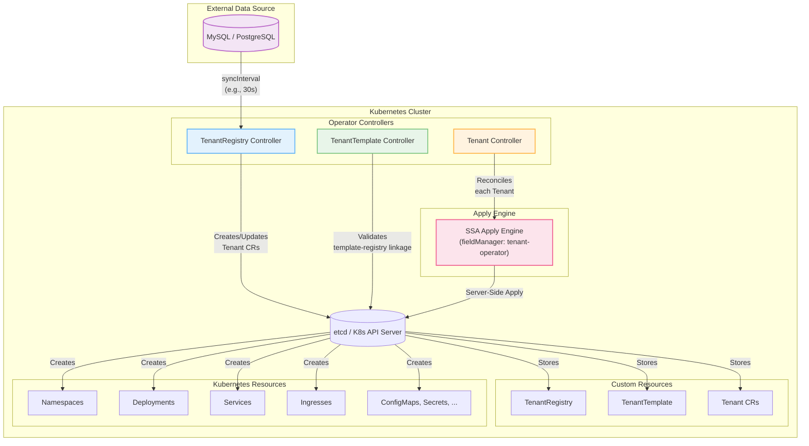

<div align="center">

# Tenant Operator

### Kubernetes-Native Multi-Tenant Application Provisioning

**Automate tenant lifecycle from database to production**

[](https://goreportcard.com/report/github.com/kubernetes-tenants/tenant-operator)
[](https://opensource.org/licenses/Apache-2.0)
[](https://github.com/kubernetes-tenants/tenant-operator/actions/workflows/build-push.yml)
[](https://github.com/kubernetes-tenants/tenant-operator/pkgs/container/tenant-operator)
[](go.mod)

[Features](#-features) • [Quick Start](#-quick-start) • [Documentation](#-documentation) • [Examples](#-examples) • [Contributing](#-contributing)

</div>

---

## 📖 Overview

**Tenant Operator** is a Kubernetes operator that automates the provisioning, configuration, and lifecycle management of multi-tenant applications. It reads tenant data from external data sources (MySQL, PostgreSQL) and dynamically creates, updates, and manages Kubernetes resources using template-based declarative configuration.

### Why Tenant Operator?

Multi-tenant SaaS platforms face common challenges:
- 🔄 **Manual provisioning** is slow and error-prone
- 📊 **State synchronization** between databases and Kubernetes is complex
- 🔧 **Tenant isolation** requires careful resource management
- 📈 **Scaling** to thousands of tenants needs automation

**Tenant Operator solves these problems** by providing:
- ✅ Fully automated tenant provisioning from database records
- ✅ Real-time synchronization between data source and cluster state
- ✅ Policy-driven lifecycle management (creation, updates, deletion)
- ✅ Template-based resource generation with 200+ functions
- ✅ Strong consistency guarantees (desired state = active database rows)

---

## ✨ Features

### 🎯 Core Capabilities

| Feature | Description |
|---------|-------------|
| **🗄️ Database-Driven** | Read tenant configurations from MySQL (PostgreSQL planned) |
| **📝 Declarative Templates** | Go templates with 200+ Sprig functions for dynamic resource generation |
| **🔄 Server-Side Apply** | Kubernetes SSA for conflict-free, efficient resource management |
| **📊 Dependency Management** | DAG-based resource ordering with automatic dependency resolution |
| **⚙️ Policy-Based Lifecycle** | Fine-grained control over creation, updates, and deletion |
| **📈 Strong Consistency** | Guaranteed sync: `desired_count = active_db_rows` |
| **🔍 Observability** | Prometheus metrics, structured logging, Kubernetes events |
| **🚀 Production-Ready** | Battle-tested with webhooks, finalizers, and drift detection |

### 🎛️ Advanced Features

- **Multi-Platform Support**: `linux/amd64`, `linux/arm64` (Apple Silicon)
- **Webhook Validation**: Catch errors at admission time
- **Drift Detection**: Auto-correct manual changes with periodic reconciliation
- **Flexible Patch Strategies**: SSA, Strategic Merge, or Full Replace
- **Template Functions**: `sha1sum`, `fromJson`, `toHost`, `trunc63`, and 200+ Sprig functions
- **Custom Metrics**: Track tenant health, resource counts, reconciliation duration

---

## 🏗️ Architecture

### System Overview



### Reconciliation Flow


**Three-Controller Design:**
1. **TenantRegistry Controller**: Syncs database → Creates/Updates/Deletes Tenant CRs
2. **TenantTemplate Controller**: Validates template-registry linkage and invariants
3. **Tenant Controller**: Renders templates → Resolves dependencies → Applies resources via SSA

---

## 🚀 Quick Start

### Prerequisites

- Kubernetes cluster (v1.11.3+)
- kubectl configured
- (Optional) MySQL database for tenant data

### 1. Install the Operator

```bash
# Install CRDs
kubectl apply -f https://raw.githubusercontent.com/kubernetes-tenants/tenant-operator/main/config/crd/bases/

# Deploy operator
kubectl apply -f https://raw.githubusercontent.com/kubernetes-tenants/tenant-operator/main/config/manager/manager.yaml
```

**Or using Kustomize:**

```bash
kubectl apply -k github.com/kubernetes-tenants/tenant-operator/config/default
```

**Or from source:**

```bash
git clone https://github.com/kubernetes-tenants/tenant-operator.git
cd tenant-operator
make install deploy IMG=ghcr.io/kubernetes-tenants/tenant-operator:latest
```

**For testing without TLS (webhooks remain active):**

```bash
# Deploy with webhooks over HTTP (no cert-manager required)
make install deploy-testing IMG=ghcr.io/kubernetes-tenants/tenant-operator:latest

# Or with kubectl
kubectl apply -k config/testing

# Or locally
make run  # Automatically disables webhook TLS
```

### 2. Create a TenantRegistry

```yaml
apiVersion: operator.kubernetes-tenants.org/v1
kind: TenantRegistry
metadata:
  name: my-saas-registry
spec:
  source:
    type: mysql
    mysql:
      host: mysql.database.svc.cluster.local
      port: 3306
      username: tenant_reader
      passwordRef:
        name: mysql-secret
        key: password
      database: tenants
      table: tenant_configs
    syncInterval: 1m
  valueMappings:
    uid: tenant_id
    hostOrUrl: tenant_url
    activate: is_active
  extraValueMappings:
    planId: subscription_plan
    region: deployment_region
```

### 3. Create a TenantTemplate

```yaml
apiVersion: operator.kubernetes-tenants.org/v1
kind: TenantTemplate
metadata:
  name: saas-app-template
spec:
  registryId: my-saas-registry
  namespaces:
    - id: tenant-ns
      nameTemplate: "tenant-{{ .uid }}"
      spec:
        apiVersion: v1
        kind: Namespace
  deployments:
    - id: app-deploy
      nameTemplate: "{{ .uid }}-app"
      namespaceTemplate: "tenant-{{ .uid }}"
      dependIds: ["tenant-ns"]
      spec:
        apiVersion: apps/v1
        kind: Deployment
        spec:
          replicas: 2
          selector:
            matchLabels:
              app: "{{ .uid }}"
          template:
            metadata:
              labels:
                app: "{{ .uid }}"
            spec:
              containers:
              - name: app
                image: myapp:latest
                env:
                - name: TENANT_ID
                  value: "{{ .uid }}"
                - name: TENANT_HOST
                  value: "{{ .host }}"
  services:
    - id: app-svc
      nameTemplate: "{{ .uid }}-app"
      namespaceTemplate: "tenant-{{ .uid }}"
      dependIds: ["app-deploy"]
      spec:
        apiVersion: v1
        kind: Service
        spec:
          selector:
            app: "{{ .uid }}"
          ports:
          - port: 80
            targetPort: 8080
```

### 4. Verify Tenant Provisioning

```bash
# Watch Tenant CRs being created
kubectl get tenants --watch

# Check tenant status
kubectl get tenant tenant-1 -o yaml

# View operator logs
kubectl logs -n tenant-operator-system deployment/tenant-operator-controller-manager
```

**Result:** Each active database row creates a fully provisioned tenant with all defined resources!

---

## 📚 Examples

### Example 1: Simple SaaS Application

**Database Table:**
```sql
CREATE TABLE tenants (
  tenant_id VARCHAR(64) PRIMARY KEY,
  tenant_url VARCHAR(255),
  is_active BOOLEAN,
  plan VARCHAR(32)
);

INSERT INTO tenants VALUES
  ('acme-corp', 'https://acme.myapp.io', true, 'enterprise'),
  ('startup-inc', 'https://startup.myapp.io', true, 'basic');
```

**Outcome:** Two tenants automatically provisioned with isolated namespaces, deployments, services, and ingresses.

### Example 2: Advanced Multi-Region Setup

```yaml
spec:
  extraValueMappings:
    region: deployment_region
    dbHost: database_host
  # Template can use {{ .region }} and {{ .dbHost }}
```

### Example 3: Using Template Functions

```yaml
# SHA1 hash for unique resource names
nameTemplate: "app-{{ .uid | sha1sum | trunc63 }}"

# Parse JSON configuration
env:
- name: CONFIG
  value: "{{ (.config | fromJson).apiKey }}"

# Extract host from URL
- name: HOST
  value: "{{ .tenantUrl | toHost }}"
```

---

## 🎓 Documentation

### Core Concepts

- [**CRD Reference**](docs/api.md) - Complete API documentation
- [**Template Guide**](docs/templates.md) - Template syntax and functions
- [**Policies**](docs/policies.md) - Creation, deletion, and conflict policies
- [**Dependency Management**](docs/dependencies.md) - Resource ordering and DAGs

### Operations

- [**Installation**](docs/installation.md) - Detailed installation guide
- [**Configuration**](docs/configuration.md) - Operator and datasource configuration
- [**Monitoring**](docs/monitoring.md) - Metrics, logging, and observability
- [**Troubleshooting**](docs/troubleshooting.md) - Common issues and solutions

### Advanced Topics

- [**Security**](docs/security.md) - RBAC, secrets, and multi-tenancy
- [**Performance**](docs/performance.md) - Scaling and optimization
- [**Development**](docs/development.md) - Building and testing

---

## 🛠️ Development

### Building from Source

```bash
# Clone repository
git clone https://github.com/kubernetes-tenants/tenant-operator.git
cd tenant-operator

# Install dependencies
go mod download

# Run tests
make test

# Build binary
make build

# Build and push container
make docker-build docker-push IMG=<your-registry>/tenant-operator:tag
```

### Running Locally

```bash
# Install CRDs
make install

# Run controller locally (uses ~/.kube/config)
make run

# Run with debug logging
LOG_LEVEL=debug make run
```

### Running Tests

```bash
# Unit tests
make test

# Integration tests
make test-integration

# E2E tests (requires kind)
make test-e2e

# Coverage report
make test-coverage
```

---

## 🤝 Contributing

We welcome contributions! Whether it's bug reports, feature requests, documentation improvements, or code contributions.

### How to Contribute

1. **Fork** the repository
2. **Create** a feature branch (`git checkout -b feature/amazing-feature`)
3. **Commit** your changes (`git commit -m 'feat: add amazing feature'`)
4. **Push** to the branch (`git push origin feature/amazing-feature`)
5. **Open** a Pull Request

### Contribution Guidelines

- Follow [Conventional Commits](https://www.conventionalcommits.org/)
- Add tests for new features
- Update documentation
- Run `make lint` before submitting
- Ensure all CI checks pass

See [CONTRIBUTING.md](CONTRIBUTING.md) for detailed guidelines.

---

## 🗺️ Roadmap

### v1.1 (Q2 2025)
- [ ] PostgreSQL data source support
- [ ] REST API data source
- [ ] Helm Chart distribution
- [ ] Enhanced metrics dashboard

### v1.2 (Q3 2025)
- [ ] Webhook-based external data sources
- [ ] Advanced templating (Lua scripts)
- [ ] Multi-registry support
- [ ] Tenant migration tools

### v2.0 (Q4 2025)
- [ ] Multi-cluster support
- [ ] GitOps integration (Flux/ArgoCD)
- [ ] Advanced RBAC policies
- [ ] Tenant cost tracking

See [full roadmap](docs/roadmap.md) for details.

---

## 📊 Status

| Component | Status | Coverage | Notes |
|-----------|--------|----------|-------|
| Core Controllers | ✅ Stable | 93% | Production-ready |
| MySQL Datasource | ✅ Stable | 95% | Well-tested |
| Template Engine | ✅ Stable | 93% | All functions implemented |
| Webhooks | ✅ Stable | 100% | Validation complete |
| PostgreSQL | 🚧 Planned | - | Q2 2025 |
| REST API Source | 🚧 Planned | - | Q2 2025 |

**Current Version:** v1.0.0
**Kubernetes Compatibility:** v1.11.3+
**Production Status:** ✅ Ready

---

## ❓ FAQ

<details>
<summary><b>How does Tenant Operator differ from other multi-tenancy solutions?</b></summary>

Tenant Operator is **database-driven** and **template-based**:
- Traditional: Static manifests or manual Helm installs per tenant
- Tenant Operator: Automatic provisioning from database rows with templates

It's designed for SaaS platforms where tenant data lives in a database, not git repositories.
</details>

<details>
<summary><b>Can I use this with an existing database?</b></summary>

Yes! You just need read-only access and define column mappings:
```yaml
valueMappings:
  uid: your_tenant_id_column
  hostOrUrl: your_url_column
  activate: your_active_flag_column
```
</details>

<details>
<summary><b>How do I handle tenant-specific secrets?</b></summary>

Use template variables and Secret resources:
```yaml
secrets:
  - id: tenant-secret
    spec:
      apiVersion: v1
      kind: Secret
      stringData:
        api_key: "{{ .apiKey }}"
```
</details>

<details>
<summary><b>What happens if I delete a database row?</b></summary>

The Tenant CR is automatically deleted, triggering cleanup:
- `deletionPolicy: Delete` (default): Resources are deleted
- `deletionPolicy: Retain`: Resources kept, owner references removed
</details>

<details>
<summary><b>How does it scale?</b></summary>

Production deployments handle 1000+ tenants:
- Concurrent reconciliation (configurable)
- Efficient Server-Side Apply (SSA)
- Resource-level caching
- Optional sharding support

See [Performance Guide](docs/performance.md) for tuning.
</details>

<details>
<summary><b>How do I run without TLS certificates in test environments?</b></summary>

If you see errors like `open /tmp/k8s-webhook-server/serving-certs/tls.crt: no such file or directory`, webhook TLS certificates are missing.

**Solution 1: Run webhooks without TLS (recommended for testing)**
```bash
# Local development
make run  # Automatically uses --webhook-disable-tls=true

# Or run the binary directly
./bin/manager --webhook-disable-tls=true

# In Kubernetes, add to deployment args:
args:
  - --webhook-disable-tls=true
```

This runs webhooks over HTTP instead of HTTPS. Validation and defaulting still work, but no TLS certificates are required.

**Solution 2: Use TLS with cert-manager (production)**
1. Install cert-manager: `kubectl apply -f https://github.com/cert-manager/cert-manager/releases/download/v1.13.0/cert-manager.yaml`
2. Uncomment webhook sections in `config/default/kustomization.yaml`
3. Deploy: `make deploy`

**Benefits of running without TLS:**
- ✅ Validation and defaulting still active
- ✅ No cert-manager dependency for testing
- ✅ Easier local development
- ✅ HTTP communication within cluster is safe

Note: Always use TLS in production environments.
</details>

---

## 📝 License

Copyright 2025 Tenant Operator Authors

Licensed under the Apache License, Version 2.0 (the "License");
you may not use this file except in compliance with the License.
You may obtain a copy of the License at

    http://www.apache.org/licenses/LICENSE-2.0

Unless required by applicable law or agreed to in writing, software
distributed under the License is distributed on an "AS IS" BASIS,
WITHOUT WARRANTIES OR CONDITIONS OF ANY KIND, either express or implied.
See the License for the specific language governing permissions and
limitations under the License.

---

## 🌟 Acknowledgments

Built with:
- [Kubebuilder](https://kubebuilder.io/) - Kubernetes operator framework
- [controller-runtime](https://github.com/kubernetes-sigs/controller-runtime) - Kubernetes controller library
- [Sprig](https://masterminds.github.io/sprig/) - Template function library

---

## 📬 Contact & Community

- 🐛 **Issues**: [GitHub Issues](https://github.com/kubernetes-tenants/tenant-operator/issues)
- 💬 **Discussions**: [GitHub Discussions](https://github.com/kubernetes-tenants/tenant-operator/discussions)
- 📧 **Email**: maintainers@kubernetes-tenants.org
- 🐦 **Twitter**: [@tenant_operator](https://twitter.com/tenant_operator)

---

<div align="center">

**[⬆ Back to Top](#tenant-operator)**

Made with ❤️ by the Tenant Operator community

</div>
