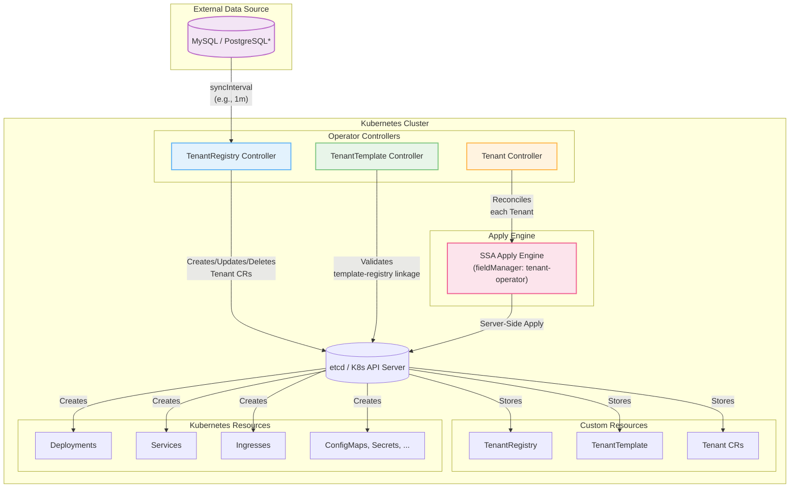
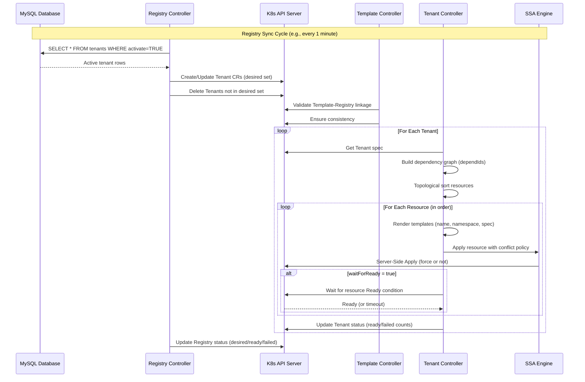

<div align="center">


# Tenant Operator

### Kubernetes-Native Multi-Tenant Application Provisioning

**Automate tenant lifecycle from database to production**

[](https://goreportcard.com/report/github.com/kubernetes-tenants/tenant-operator)
[](https://opensource.org/licenses/Apache-2.0)
[](https://artifacthub.io/packages/search?repo=tenant-operator)
[](https://github.com/kubernetes-tenants/tenant-operator/actions/workflows/build-push.yml)
[](https://github.com/kubernetes-tenants/tenant-operator/pkgs/container/tenant-operator)
[](go.mod)

[Features](#-features) • [Quick Start](#-quick-start) • [Documentation](#-documentation) • [Examples](#-examples) • [Contributing](#-contributing)

</div>

---

## 📖 Overview

**Tenant Operator** is a Kubernetes operator that automates the provisioning, configuration, and lifecycle management of multi-tenant applications. It reads tenant data from external data sources (MySQL, with PostgreSQL planned for v1.2) and dynamically creates, updates, and manages Kubernetes resources using template-based declarative configuration.

### Why Tenant Operator?

Multi-tenant SaaS platforms face common challenges:
- 🔄 **Manual provisioning** is slow and error-prone
- 📊 **State synchronization** between databases and Kubernetes is complex
- 🔧 **Tenant isolation** requires careful resource management
- 📈 **Scaling** to thousands of tenants needs automation

**Tenant Operator solves these problems** by providing:
- ✅ Fully automated tenant provisioning from database records
- ✅ Real-time synchronization between data source and cluster state (30s status reflection)
- ✅ Policy-driven lifecycle management (creation, updates, deletion)
- ✅ Template-based resource generation with 200+ functions
- ✅ Strong consistency guarantees with multi-template support
- ✅ Smart reconciliation with event-driven architecture and watch predicates

---

## ✨ Features

### 🎯 Core Capabilities

| Feature | Description |
|---------|-------------|
| **🗄️ Database-Driven** | Read tenant configurations from MySQL (PostgreSQL planned for v1.2) |
| **📝 Declarative Templates** | Go templates with 200+ Sprig functions for dynamic resource generation |
| **🔄 Server-Side Apply** | Kubernetes SSA for conflict-free, efficient resource management |
| **📊 Dependency Management** | DAG-based resource ordering with automatic dependency resolution |
| **⚙️ Policy-Based Lifecycle** | Fine-grained control over creation, updates, and deletion |
| **📈 Strong Consistency** | Guaranteed sync: `desired = referencingTemplates × activeRows` |
| **🔍 Observability** | Prometheus metrics, structured logging, Kubernetes events |
| **🚀 Production-Ready** | Battle-tested with webhooks, finalizers, and drift detection |

### 🎛️ Advanced Features

- **Multi-Platform Support**: `linux/amd64`, `linux/arm64` (Apple Silicon)
- **Multi-Template Support**: One registry can be referenced by multiple templates
- **Webhook Validation**: Catch errors at admission time
- **Fast Status Reflection**: 30-second reconciliation for rapid child resource status updates
- **Drift Detection**: Auto-correct manual changes with event-driven + periodic reconciliation
- **Smart Watch Predicates**: Filter unnecessary reconciliations (generation/annotation changes only)
- **Namespace Tracking**: Label-based tracking for namespaces (no ownerReference needed)
- **Flexible Patch Strategies**: SSA, Strategic Merge, or Full Replace
- **Template Functions**: `sha1sum`, `fromJson`, `toHost`, `trunc63`, and 200+ Sprig functions
- **Custom Metrics**: Track tenant health, resource counts, reconciliation duration

### 🔌 Integrations

- **ExternalDNS**: Automatic DNS record management (Route53, Cloudflare, Google Cloud DNS)
- **Terraform Operator**: Provision cloud resources per tenant (S3, RDS, CloudFront, etc.)
- **cert-manager**: Automatic TLS certificate provisioning
- **NGINX/Istio/Traefik**: Ingress controller integration
- **Prometheus/Grafana**: Complete monitoring stack with ready-to-use dashboards

---

## 🏗️ Architecture

### System Overview



> \* **MySQL**: Fully supported (v1.0+) | **PostgreSQL**: Planned for v1.2

### Reconciliation Flow



**Three-Controller Design:**
1. **TenantRegistry Controller**: Syncs database (e.g., 1m interval) → Creates/Updates/Deletes Tenant CRs
   - Supports multi-template: One registry can be referenced by multiple templates
   - Desired count = `referencingTemplates × activeRows`
2. **TenantTemplate Controller**: Validates template-registry linkage and invariants
3. **Tenant Controller**: Renders templates → Resolves dependencies → Applies resources via SSA
   - Fast reconciliation (30s requeue) for quick status reflection
   - Smart watch predicates to filter unnecessary reconciliations
   - Event-driven architecture for immediate drift detection

## Supported Kubernetes Versions & Upgrade Policy

- **Compatibility philosophy**: The operator builds on GA/stable Kubernetes APIs and controller-runtime patterns, so it is intentionally decoupled from any single cluster release and targets the upstream version-skew support window.
- **Validated range**: End-to-end tests and production workloads currently cover Kubernetes v1.28 through v1.33, and we operate live production clusters on v1.33 today. Other versions are expected to work, but validate in staging before rolling out broadly.
- **Upgrade guidance**: Review the Helm chart `values.yaml` and release notes, then use `helm upgrade --install` for a rolling upgrade. Breaking changes or API removals are always called out in the release notes and CHANGELOG.

| Kubernetes Version | Status |
|--------------------|--------|
| v1.28              | ✅ Validated |
| v1.29              | ✅ Validated |
| v1.30              | ✅ Validated |
| v1.31              | ✅ Validated |
| v1.32              | ✅ Validated |
| v1.33              | ✅ Validated |
| Other GA releases  | ⚠️ Expected |

---

## 🚀 Quick Start

**Want to try it now?** See [Quick Start with Minikube](docs/quickstart.md) for a 5-minute setup using automated scripts.

### Prerequisites

- **Kubernetes cluster** v1.11.3 or later
- **kubectl** configured to access your cluster
- **cert-manager** v1.13.0+ (for webhook TLS certificate management)
  - Automatically provisions and renews TLS certificates
  - Required for validating/mutating webhooks
  - Installation: `kubectl apply -f https://github.com/cert-manager/cert-manager/releases/download/v1.13.0/cert-manager.yaml`
- **MySQL database** (optional) - for tenant data source (PostgreSQL support planned for v1.2)

### 1. Install the Operator

#### Option A: Install with Helm (Recommended) 🎯

**Prerequisites:** cert-manager must be installed in all environments (including local development)

**For local development (minikube/kind):**

```bash
# Step 1: Install cert-manager (REQUIRED)
kubectl apply -f https://github.com/cert-manager/cert-manager/releases/download/v1.13.0/cert-manager.yaml

# Wait for cert-manager to be ready
kubectl wait --for=condition=Available --timeout=300s -n cert-manager \
  deployment/cert-manager \
  deployment/cert-manager-webhook \
  deployment/cert-manager-cainjector

# Step 2: Add Helm repository
helm repo add tenant-operator https://kubernetes-tenants.github.io/tenant-operator
helm repo update

# Step 3: Install with local development values
helm install tenant-operator tenant-operator/tenant-operator \
  -f https://raw.githubusercontent.com/kubernetes-tenants/tenant-operator/main/chart/values-local.yaml \
  --namespace tenant-operator-system \
  --create-namespace

# or specific alpha version
helm install tenant-operator tenant-operator/tenant-operator \
  -f https://raw.githubusercontent.com/kubernetes-tenants/tenant-operator/v1.1.0-alpha.3/chart/values-local.yaml \
  --version 1.1.0-alpha.3 \
  --devel \
  --namespace tenant-operator-system \
  --create-namespace
```

**For production environments:**

```bash
# Step 1: Install cert-manager (REQUIRED)
kubectl apply -f https://github.com/cert-manager/cert-manager/releases/download/v1.13.0/cert-manager.yaml

# Wait for cert-manager to be ready
kubectl wait --for=condition=Available --timeout=300s -n cert-manager \
  deployment/cert-manager \
  deployment/cert-manager-webhook \
  deployment/cert-manager-cainjector

# Step 2: Install tenant-operator with production values
helm install tenant-operator tenant-operator/tenant-operator \
  -f https://raw.githubusercontent.com/kubernetes-tenants/tenant-operator/main/chart/values-prod.yaml \
  --namespace tenant-operator-system \
  --create-namespace
```

**See [Helm Chart README](chart/README.md) for detailed configuration options.**

#### Option B: Install with Kustomize

**cert-manager is required** for webhook TLS certificate management.

```bash
# Step 1: Install cert-manager
kubectl apply -f https://github.com/cert-manager/cert-manager/releases/download/v1.13.0/cert-manager.yaml

# Wait for cert-manager to be ready
kubectl wait --for=condition=Available --timeout=300s -n cert-manager deployment/cert-manager
kubectl wait --for=condition=Available --timeout=300s -n cert-manager deployment/cert-manager-webhook

# Step 2: Install Tenant Operator CRDs
kubectl apply -f https://raw.githubusercontent.com/kubernetes-tenants/tenant-operator/main/config/crd/bases/

# Step 3: Deploy operator
kubectl apply -k https://github.com/kubernetes-tenants/tenant-operator/config/default
```

#### Option C: Install from Source

```bash
git clone https://github.com/kubernetes-tenants/tenant-operator.git
cd tenant-operator

# Install cert-manager first (if needed)
kubectl apply -f https://github.com/cert-manager/cert-manager/releases/download/v1.13.0/cert-manager.yaml

# Deploy operator
make install deploy IMG=ghcr.io/kubernetes-tenants/tenant-operator:latest
```

### 2. Create a TenantRegistry

```yaml
apiVersion: operator.kubernetes-tenants.org/v1
kind: TenantRegistry
metadata:
  name: my-saas-registry
spec:
  source:
    type: mysql
    mysql:
      host: mysql.database.svc.cluster.local
      port: 3306
      username: tenant_reader
      passwordRef:
        name: mysql-secret
        key: password
      database: tenants
      table: tenant_configs
    syncInterval: 1m
  valueMappings:
    uid: tenant_id              # Unique tenant identifier
    hostOrUrl: tenant_url       # Tenant URL (auto-extracts .host)
    activate: is_active         # ⚠️ Must be truthy: "1", "true", "yes" (see below)
  extraValueMappings:
    planId: subscription_plan   # Custom variable: {{ .planId }}
    region: deployment_region   # Custom variable: {{ .region }}
```

**Important:** The `activate` column must contain one of these **exact** truthy values:
- `"1"`, `"true"`, `"TRUE"`, `"True"`, `"yes"`, `"YES"`, `"Yes"`
- All other values (including `"0"`, `"false"`, `"active"`, empty, NULL) are considered inactive

**Tip:** If your database uses different values (e.g., `"active"`/`"inactive"`), create a MySQL VIEW to transform them:
```sql
CREATE VIEW tenant_configs AS
SELECT id, url, CASE WHEN status='active' THEN '1' ELSE '0' END AS is_active FROM tenants;
```

See [DataSource Guide](docs/datasource.md) for detailed database configuration, column mapping, and VIEW examples.

### 3. Create a TenantTemplate

```yaml
apiVersion: operator.kubernetes-tenants.org/v1
kind: TenantTemplate
metadata:
  name: saas-app-template
spec:
  registryId: my-saas-registry
  deployments:
    - id: app-deploy
      nameTemplate: "{{ .uid }}-app"
      spec:
        apiVersion: apps/v1
        kind: Deployment
        spec:
          replicas: 2
          selector:
            matchLabels:
              app: "{{ .uid }}"
          template:
            metadata:
              labels:
                app: "{{ .uid }}"
            spec:
              containers:
              - name: app
                image: myapp:latest
                env:
                - name: TENANT_ID
                  value: "{{ .uid }}"
                - name: TENANT_HOST
                  value: "{{ .host }}"
  services:
    - id: app-svc
      nameTemplate: "{{ .uid }}-app"
      dependIds: ["app-deploy"]
      spec:
        apiVersion: v1
        kind: Service
        spec:
          selector:
            app: "{{ .uid }}"
          ports:
          - port: 80
            targetPort: 8080
```

### 4. Verify Tenant Provisioning

```bash
# Watch Tenant CRs being created
kubectl get tenants --watch

# Check tenant status
kubectl get tenant tenant-1 -o yaml

# View operator logs
kubectl logs -n tenant-operator-system deployment/tenant-operator-controller-manager
```

**Result:** Each active database row creates a fully provisioned tenant with all defined resources!

### 5. (Optional) Multi-Template Setup

One registry can be referenced by multiple templates for different deployment scenarios:

```yaml
# Template 1: Production deployment
apiVersion: operator.kubernetes-tenants.org/v1
kind: TenantTemplate
metadata:
  name: prod-template
spec:
  registryId: my-saas-registry  # Same registry
  deployments:
    - id: app
      nameTemplate: "{{ .uid }}-prod"
      spec:
        # ... production config (replicas: 3, resource limits, etc.)
---
# Template 2: Staging deployment
apiVersion: operator.kubernetes-tenants.org/v1
kind: TenantTemplate
metadata:
  name: staging-template
spec:
  registryId: my-saas-registry  # Same registry
  deployments:
    - id: app
      nameTemplate: "{{ .uid }}-staging"
      spec:
        # ... staging config (replicas: 1, lower resources)
```

**Result:** Each database row creates TWO Tenant CRs (one per template):
- `tenant-1-prod-template` → Production resources
- `tenant-1-staging-template` → Staging resources

Registry status shows: `desired = 2 (templates) × N (active rows)`

---

## 📚 Examples

### Example 1: Simple SaaS Application

**Database Table:**
```sql
CREATE TABLE tenants (
  tenant_id VARCHAR(64) PRIMARY KEY,
  tenant_url VARCHAR(255),
  is_active BOOLEAN,
  plan VARCHAR(32)
);

INSERT INTO tenants VALUES
  ('acme-corp', 'https://acme.myapp.io', true, 'enterprise'),
  ('startup-inc', 'https://startup.myapp.io', true, 'basic');
```

**Outcome:** Two tenants automatically provisioned with deployments, services, and ingresses.

### Example 2: Advanced Multi-Region Setup

```yaml
spec:
  extraValueMappings:
    region: deployment_region
    dbHost: database_host
  # Template can use {{ .region }} and {{ .dbHost }}
```

### Example 3: Using Template Functions

```yaml
# SHA1 hash for unique resource names
nameTemplate: "app-{{ .uid | sha1sum | trunc63 }}"

# Parse JSON configuration
env:
- name: CONFIG
  value: "{{ (.config | fromJson).apiKey }}"

# Extract host from URL
- name: HOST
  value: "{{ .tenantUrl | toHost }}"
```

---

## 🎓 Documentation

### Getting Started

- [**Quick Start (Minikube)**](docs/quickstart.md) - 5-minute setup with automated scripts

### Core Concepts

- [**Glossary**](docs/glossary.md) - Comprehensive terminology reference
- [**CRD Reference**](docs/api.md) - Complete API documentation
- [**Template Guide**](docs/templates.md) - Template syntax and functions
- [**Policies**](docs/policies.md) - Creation, deletion, and conflict policies
- [**Dependency Management**](docs/dependencies.md) - Resource ordering and DAGs

### Operations

- [**Installation**](docs/installation.md) - Detailed installation guide
- [**DataSource Configuration**](docs/datasource.md) - MySQL setup, column mapping, and VIEWs
- [**Configuration**](docs/configuration.md) - Operator configuration options
- [**Monitoring**](docs/monitoring.md) - Metrics, logging, and observability
- [**Troubleshooting**](docs/troubleshooting.md) - Common issues and solutions

### Advanced Topics

- [**Security**](docs/security.md) - RBAC, secrets, and multi-tenancy
- [**Performance**](docs/performance.md) - Scaling and optimization
- [**Development**](docs/development.md) - Building and testing

### Integrations

- [**ExternalDNS Integration**](docs/integration-external-dns.md) - Automatic DNS record management with Route53, Cloudflare, etc.
- [**Terraform Operator Integration**](docs/integration-terraform-operator.md) - Provision cloud resources (S3, RDS, CDN) per tenant

---

## 🛠️ Development

### Building from Source

```bash
# Clone repository
git clone https://github.com/kubernetes-tenants/tenant-operator.git
cd tenant-operator

# Install dependencies
go mod download

# Run tests
make test

# Build binary
make build

# Build and push container
make docker-build docker-push IMG=<your-registry>/tenant-operator:tag
```

### Running Locally

```bash
# Install CRDs
make install

# Run controller locally (uses ~/.kube/config)
make run

# Run with debug logging
LOG_LEVEL=debug make run
```

### Running Tests

```bash
# Unit tests
make test

# Integration tests
make test-integration

# E2E tests (requires kind)
make test-e2e

# Coverage report
make test-coverage
```

---

## 🤝 Contributing

We welcome contributions! Whether it's bug reports, feature requests, documentation improvements, or code contributions.

### 🌟 Want to Add a New Datasource?

Tenant Operator uses a **pluggable adapter pattern** that makes it easy to add support for new datasources (PostgreSQL, MongoDB, REST APIs, etc.).

**Why contribute a datasource?**
- ✅ Only 2 methods to implement
- ✅ MySQL reference implementation to follow
- ✅ Complete step-by-step guide provided
- ✅ Recognition in release notes

📚 **Full Guide**: [Contributing a New Datasource](docs/contributing-datasource.md)

### How to Contribute

1. **Fork** the repository
2. **Create** a feature branch (`git checkout -b feature/amazing-feature`)
3. **Commit** your changes (`git commit -m 'feat: add amazing feature'`)
4. **Push** to the branch (`git push origin feature/amazing-feature`)
5. **Open** a Pull Request

### Contribution Guidelines

- Follow [Conventional Commits](https://www.conventionalcommits.org/)
- Add tests for new features
- Update documentation
- Run `make lint` before submitting
- Ensure all CI checks pass

See [CONTRIBUTING.md](CONTRIBUTING.md) for detailed guidelines.

---

## 🗺️ Roadmap

See [full roadmap](docs/roadmap.md) for details.

---

## 📊 Status

| Component | Status | Coverage | Notes |
|-----------|--------|----------|-------|
| Core Controllers | ✅ Stable | 93% | Production-ready |
| MySQL Datasource | ✅ Stable | 95% | Well-tested |
| Template Engine | ✅ Stable | 93% | All functions implemented |
| Webhooks | ✅ Stable | 100% | Validation complete |
| Performance Optimizations | ✅ Stable | 100% | Fast reconciliation, smart predicates |
| Multi-Template Support | ✅ Stable | 100% | One registry, multiple templates |
| Cross-Namespace Provisioning | ✅ Stable | 100% | v1.1 - Label-based tracking |
| Orphan Resource Cleanup | ✅ Stable | 100% | v1.1 - Automatic detection & cleanup |
| PostgreSQL | 🚧 Planned | - | v1.2 |
| Enhanced Metrics Dashboard | 🚧 Planned | - | v1.2 |
| REST API Source | 🚧 Planned | - | Future |

**Current Version:** v1.1.0
**Kubernetes Compatibility:** v1.11.3+
**Production Status:** ✅ Ready

---

## ❓ FAQ

<details>
<summary><b>How does Tenant Operator differ from other multi-tenancy solutions?</b></summary>

Tenant Operator is **database-driven** and **template-based**:
- Traditional: Static manifests or manual Helm installs per tenant
- Tenant Operator: Automatic provisioning from database rows with templates

It's designed for SaaS platforms where tenant data lives in a database, not git repositories.
</details>

<details>
<summary><b>Can I use this with an existing database?</b></summary>

Yes! You just need read-only access and define column mappings:
```yaml
valueMappings:
  uid: your_tenant_id_column
  hostOrUrl: your_url_column
  activate: your_active_flag_column  # Must be "1", "true", or "yes"
```

**Important:** If your database schema doesn't match the required format, create a MySQL VIEW to transform the data:
```sql
CREATE VIEW tenant_configs AS
SELECT id, url, CASE WHEN status='active' THEN '1' ELSE '0' END AS is_active FROM your_table;
```

Then use the VIEW name in your registry configuration. See [DataSource Guide](docs/datasource.md) for examples.
</details>

<details>
<summary><b>What values are valid for the `activate` column?</b></summary>

The `activate` column must contain one of these **exact** truthy values (case-sensitive):

✅ **Valid (tenant will be created):**
- `"1"`
- `"true"`, `"TRUE"`, `"True"`
- `"yes"`, `"YES"`, `"Yes"`

❌ **Invalid (tenant will be skipped):**
- `"0"`, `"false"`, `"no"`
- `"active"`, `"enabled"`, `"on"` (common but not valid!)
- Empty string or NULL
- Any other value

**Why is my database value not working?**

Common issues:
- Using `"active"` instead of `"1"` → Create a VIEW to transform
- VARCHAR column with spaces → Trim in VIEW
- NULL values → Use COALESCE in VIEW

**Solution - Create a transformation VIEW:**
```sql
CREATE VIEW tenant_configs AS
SELECT
    tenant_id,
    tenant_url,
    CASE
        WHEN status = 'active' THEN '1'
        WHEN enabled = TRUE THEN '1'
        ELSE '0'
    END AS is_active
FROM tenants;
```

See [DataSource Guide](docs/datasource.md) for more examples.
</details>

<details>
<summary><b>How do I handle tenant-specific secrets?</b></summary>

Use template variables and Secret resources:
```yaml
secrets:
  - id: tenant-secret
    spec:
      apiVersion: v1
      kind: Secret
      stringData:
        api_key: "{{ .apiKey }}"
```
</details>

<details>
<summary><b>What happens if I delete a database row?</b></summary>

The Tenant CR is automatically deleted, triggering cleanup:
- `deletionPolicy: Delete` (default): Resources are deleted (automatic via ownerReference)
- `deletionPolicy: Retain`: Resources kept (no ownerReference set, label-based tracking only)
</details>

<details>
<summary><b>⚠️ What happens if I delete TenantRegistry or TenantTemplate?</b></summary>

**Warning:** Deleting TenantRegistry or TenantTemplate causes cascade deletion of all Tenant CRs and their resources!

```
TenantRegistry (deleted) → Tenant CRs (deleted) → All tenant resources (deleted)
```

**To protect your tenants:**

Set `deletionPolicy: Retain` on all resources in your templates BEFORE deleting:

```yaml
deployments:
  - id: app
    deletionPolicy: Retain  # ✅ Keeps resources even if Tenant CR is deleted
```

**Better approach:** Update in place instead of delete/recreate:
```bash
# ✅ DO: Update (safe)
kubectl apply -f updated-registry.yaml

# ❌ DON'T: Delete and recreate (dangerous)
kubectl delete tenantregistry my-registry
```

See [Policies Guide - Protecting Tenants](docs/policies.md#️-important-protecting-tenants-from-cascade-deletion) for detailed best practices.
</details>

<details>
<summary><b>How does it scale?</b></summary>

Production deployments handle 1000+ tenants:
- Concurrent reconciliation (configurable)
- Efficient Server-Side Apply (SSA)
- Resource-level caching
- Optional sharding support

See [Performance Guide](docs/performance.md) for tuning.
</details>

<details>
<summary><b>How fast does the operator react to changes?</b></summary>

The operator uses a dual-layer reconciliation strategy for optimal responsiveness:

**Event-Driven (Immediate):**
- Child resource changes trigger immediate Tenant reconciliation
- Generation/annotation changes detected via smart watch predicates
- Namespace changes tracked via labels

**Periodic (30 seconds):**
- Regular reconciliation ensures status consistency
- Detects child resource status changes within 30 seconds
- Balances responsiveness with cluster resource usage

**Database Sync (Configurable, e.g., 1 minute):**
- Registry syncs with database at `syncInterval`
- Creates/updates/deletes Tenant CRs based on active rows

This architecture ensures:
- ✅ Immediate drift correction (event-driven)
- ✅ Fast status reflection (30s periodic)
- ✅ Database consistency (configurable sync)
</details>

<details>
<summary><b>Can one registry support multiple deployment environments?</b></summary>

Yes! One registry can be referenced by multiple templates:

```yaml
# Same registry for both templates
- prod-template (registryId: my-registry)
- staging-template (registryId: my-registry)
```

Each active database row will create multiple Tenant CRs (one per template).

**Use cases:**
- Multi-environment deployments (prod, staging, dev)
- A/B testing configurations
- Regional variations
- Different service tiers

Registry status shows: `desired = referencingTemplates × activeRows`
</details>

<details>
<summary><b>How do I reduce unnecessary reconciliations?</b></summary>

The operator already implements several optimizations:

**Built-in optimizations:**
- Smart watch predicates filter status-only updates
- Only Generation and Annotation changes trigger reconciliation
- Namespace tracking uses efficient label-based matching

**Manual tuning:**
- Increase `syncInterval` for less frequent database polling
- Use `CreationPolicy: Once` for immutable resources
- Set `waitForReady: false` for resources that don't need readiness checks

These optimizations significantly reduce reconciliation overhead while maintaining fast response times.
</details>

<details>
<summary><b>How do I set up webhook TLS certificates?</b></summary>

Tenant Operator requires TLS certificates for webhook communication. cert-manager automatically manages these certificates.

**Setup cert-manager:**

```bash
# 1. Install cert-manager
kubectl apply -f https://github.com/cert-manager/cert-manager/releases/download/v1.13.0/cert-manager.yaml

# 2. Wait for cert-manager to be ready
kubectl wait --for=condition=Available --timeout=300s -n cert-manager deployment/cert-manager
kubectl wait --for=condition=Available --timeout=300s -n cert-manager deployment/cert-manager-webhook

# 3. Deploy Tenant Operator (cert-manager will automatically issue certificates)
kubectl apply -k https://github.com/kubernetes-tenants/tenant-operator/config/default
```

**Why cert-manager?**
- ✅ Automatic certificate issuance and renewal
- ✅ No manual certificate management
- ✅ Industry standard for Kubernetes certificate management
- ✅ Required for secure webhook communication

**What cert-manager does:**
- Issues TLS certificates for webhook server
- Automatically renews certificates before expiration
- Injects CA bundle into webhook configurations
- Manages certificate lifecycle

If you see errors like `open /tmp/k8s-webhook-server/serving-certs/tls.crt: no such file or directory`, ensure cert-manager is installed and running.
</details>

---

## 📝 License

Copyright 2025 Tenant Operator Authors

Licensed under the Apache License, Version 2.0 (the "License");
you may not use this file except in compliance with the License.
You may obtain a copy of the License at

    http://www.apache.org/licenses/LICENSE-2.0

Unless required by applicable law or agreed to in writing, software
distributed under the License is distributed on an "AS IS" BASIS,
WITHOUT WARRANTIES OR CONDITIONS OF ANY KIND, either express or implied.
See the License for the specific language governing permissions and
limitations under the License.

---

## 🌟 Acknowledgments

Built with:
- [Kubebuilder](https://kubebuilder.io/) - Kubernetes operator framework
- [Operator SDK](https://sdk.operatorframework.io/) - Operator development toolkit
- [controller-runtime](https://github.com/kubernetes-sigs/controller-runtime) - Kubernetes controller library
- [Sprig](https://masterminds.github.io/sprig/) - Template function library

---

## 📬 Contact & Community

- 🐛 **Issues**: [GitHub Issues](https://github.com/kubernetes-tenants/tenant-operator/issues)
- 💬 **Discussions**: [GitHub Discussions](https://github.com/kubernetes-tenants/tenant-operator/discussions)
- 📧 **Email**: rationlunas@gmail.com

---

<div align="center">

**[⬆ Back to Top](#tenant-operator)**

Made with ❤️ by the Tenant Operator community

</div>
