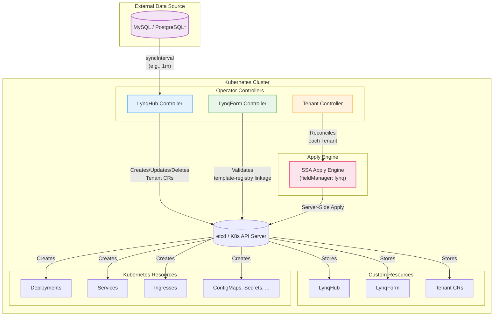
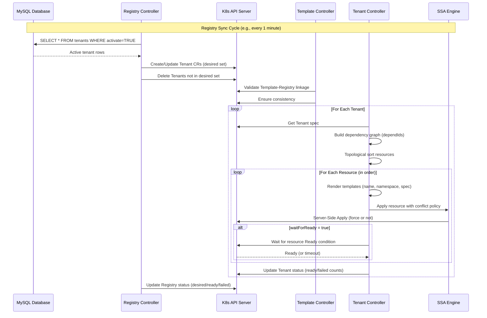

# Architecture

This document provides a detailed overview of the Lynq's architecture, including system components, reconciliation flow, and key design decisions.

## System Overview



::: info Database Support

- **MySQL**: Fully supported (v1.0+)
- **PostgreSQL**: Planned for v1.2
  :::

## Architecture at a Glance

Quick reference for the three main components:

| Component          | Purpose                                 | Example                               |
| ------------------ | --------------------------------------- | ------------------------------------- |
| **LynqHub** | Connects to database, syncs tenant rows | MySQL every 30s → Creates Tenant CRs  |
| **LynqForm** | Defines resource blueprint              | Deployment + Service per tenant       |
| **Tenant**         | Instance of a single tenant             | `acme-corp-web-app` → 5 K8s resources |

**Workflow**: Database row → LynqHub syncs → Creates Tenant CR → Tenant controller applies LynqForm → Kubernetes resources created.

---

## Reconciliation Flow



## Three-Controller Design

The operator uses a three-controller architecture to separate concerns and optimize reconciliation:

### 1. LynqHub Controller

**Purpose**: Syncs database (e.g., 1m interval) → Creates/Updates/Deletes Tenant CRs

**Responsibilities**:

- Periodically queries external datasource at `spec.source.syncInterval`
- Filters active rows where `activate` field is truthy
- Calculates desired Tenant set: `referencingTemplates × activeRows`
- Creates missing Tenant CRs (naming: `{uid}-{template-name}`)
- Updates existing Tenant CRs with fresh data
- Deletes Tenant CRs for inactive/removed rows (garbage collection)
- Updates Registry status with counts

**Key Status Fields**:

```yaml
status:
  referencingTemplates: 2 # Number of templates using this registry
  desired: 6 # referencingTemplates × activeRows
  ready: 5 # Ready Nodes across all templates
  failed: 1 # Failed Nodes across all templates
```

### 2. LynqForm Controller

**Purpose**: Validates template-registry linkage and invariants

**Responsibilities**:

- Validates that `spec.registryId` references an existing LynqHub
- Ensures template syntax is valid (Go text/template)
- Validates resource IDs are unique within template
- Detects dependency cycles in `dependIds`
- Updates template status

### 3. Tenant Controller

**Purpose**: Renders templates → Resolves dependencies → Applies resources via SSA

**Responsibilities**:

- Builds template variables from Tenant spec
- Resolves resource dependencies (DAG + topological sort)
- Renders all templates (names, namespaces, specs)
- Applies resources using Server-Side Apply
- Waits for resource readiness (if `waitForReady=true`)
- Updates Tenant status with resource counts and conditions
- Handles conflicts according to ConflictPolicy
- Manages finalizers for proper cleanup

## CRD Architecture

### LynqHub

Defines external datasource configuration and sync behavior:

```yaml
apiVersion: operator.lynq.sh/v1
kind: LynqHub
metadata:
  name: my-saas-registry
spec:
  source:
    type: mysql
    mysql:
      host: mysql.default.svc.cluster.local
      port: 3306
      database: tenants
      table: tenant_data
      username: tenant_reader
      passwordRef:
        name: mysql-secret
        key: password
    syncInterval: 30s
  valueMappings:
    uid: tenant_id # Required
    hostOrUrl: domain # Required
    activate: is_active # Required
  extraValueMappings:
    planId: subscription_plan
    deployImage: container_image
```

**Multi-Template Support**: One registry can be referenced by multiple LynqForms, creating separate Tenant CRs for each template-row combination.

### LynqForm

Blueprint for resources to create per tenant:

```yaml
apiVersion: operator.lynq.sh/v1
kind: LynqForm
metadata:
  name: web-app
spec:
  registryId: my-saas-registry
  deployments:
    - id: app-deployment
      nameTemplate: "{{ .uid }}-app"
      spec:
        apiVersion: apps/v1
        kind: Deployment
        spec:
          replicas: 2
          # ... deployment spec
```

**Supported Resource Types**:

- `serviceAccounts`
- `deployments`, `statefulSets`, `daemonSets`
- `services`
- `configMaps`, `secrets`
- `persistentVolumeClaims`
- `jobs`, `cronJobs`
- `ingresses`
- `namespaces`
- `manifests` (raw resources)

### Tenant

Instance representing a single tenant:

```yaml
apiVersion: operator.lynq.sh/v1
kind: LynqNode
metadata:
  name: acme-web-app
spec:
  uid: acme
  templateRef: web-app
  registryId: my-saas-registry
  # ... resolved resource arrays
status:
  desiredResources: 10
  readyResources: 10
  failedResources: 0
  appliedResources:
    - "Deployment/default/acme-app@app-deployment"
    - "Service/default/acme-svc@app-service"
  conditions:
    - type: Ready
      status: "True"
      lastTransitionTime: "2024-01-15T10:30:00Z"
```

## Key Design Patterns

### Server-Side Apply (SSA)

All resources are applied using Kubernetes Server-Side Apply with `fieldManager: lynq`. This provides:

- **Conflict-free updates**: Multiple controllers can manage different fields
- **Declarative management**: Operator owns only fields it sets
- **Drift detection**: Automatic detection of manual changes
- **Force mode**: Optional force ownership with `ConflictPolicy: Force`

### Resource Tracking

Two mechanisms based on namespace and deletion policy:

1. **OwnerReference-based** (automatic GC):

   - Same-namespace resources with `DeletionPolicy=Delete`
   - Kubernetes garbage collector handles cleanup

2. **Label-based** (manual lifecycle):
   - Cross-namespace resources
   - Namespace resources
   - Resources with `DeletionPolicy=Retain`
   - Labels: `lynq.sh/node`, `lynq.sh/node-namespace`

### Dependency Management

Resources are applied in order based on `dependIds`:

```yaml
deployments:
  - id: app-deployment
    # ...

services:
  - id: app-service
    dependIds: ["app-deployment"]
    waitForReady: true
    # ...
```

The operator:

1. Builds a Directed Acyclic Graph (DAG)
2. Detects cycles (fails fast if found)
3. Performs topological sort
4. Applies resources in dependency order

### Drift Detection & Auto-Correction

The operator continuously monitors managed resources through:

- **Event-driven watches**: Immediate reconciliation on resource changes
- **Watch predicates**: Only trigger on meaningful changes (Generation/Annotation)
- **Fast requeue**: 30-second periodic requeue for status reflection
- **Auto-correction**: Reverts manual changes to maintain desired state

### Garbage Collection

Automatic cleanup when:

- Database row is deleted
- Row's `activate` field becomes false
- Template no longer references the registry
- Tenant CR is deleted (with finalizer-based cleanup)

Resources respect `DeletionPolicy`:

- `Delete`: Removed from cluster
- `Retain`: Orphaned with labels for manual cleanup

### Orphan Resource Management

When resources are removed from templates:

- Detected via comparison of `status.appliedResources`
- Resource key format: `kind/namespace/name@id`
- DeletionPolicy preserved in annotation: `lynq.sh/deletion-policy`
- Orphaned resources marked with:
  - Label: `lynq.sh/orphaned: "true"`
  - Annotations: `orphaned-at`, `orphaned-reason`
- Re-adoption: Orphan markers removed when resource re-added to template

## Performance Considerations

### Controller Concurrency

Configurable worker pools for each controller:

- `--hub-concurrency=N` (default: 3)
- `--form-concurrency=N` (default: 5)
- `--node-concurrency=N` (default: 10)

### Reconciliation Optimization

- **Fast status reflection**: 30-second requeue interval
- **Smart watch predicates**: Filter status-only updates
- **Event-driven architecture**: Immediate reaction to changes
- **Resource caching**: Frequently accessed resources cached

### Scalability

The operator is designed to scale horizontally:

- Leader election for single-writer pattern
- Optional sharding by namespace or tenant ID
- Resource-type worker pools for parallel processing
- SSA batching for bulk applies

## See Also

- [API Reference](/api) - Complete CRD specification
- [Policies](/policies) - Lifecycle management policies
- [Dependencies](/dependencies) - Dependency graph system
- [Monitoring](/monitoring) - Observability and metrics
