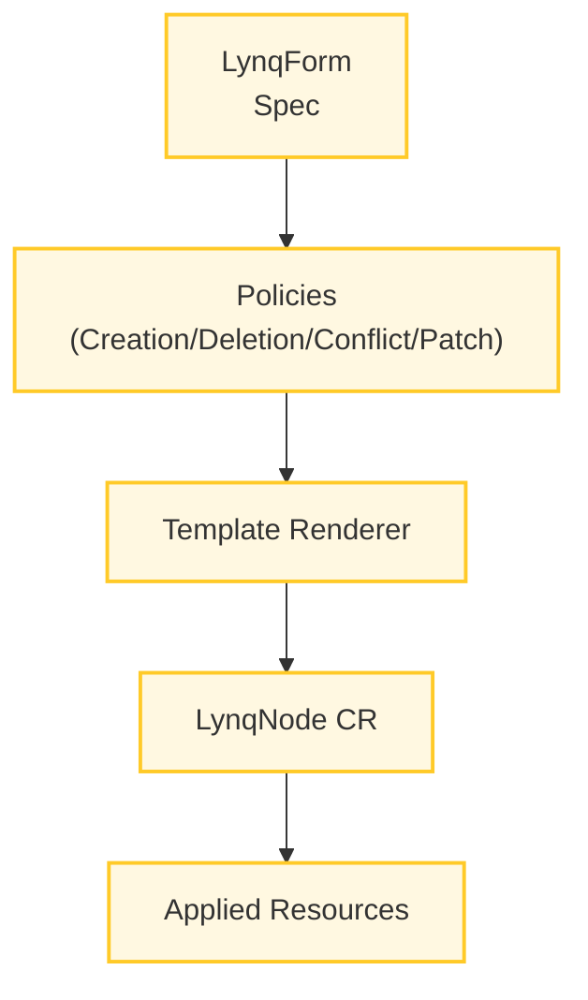

# Configuration Guide

Configure Lynq consistently across environments.

[[toc]]

## Operator Runtime

### Controller Flags

Flags are defined in `config/manager/manager.yaml` and applied to the controller manager deployment.

```yaml
spec:
  template:
    spec:
      containers:
        - name: manager
          args:
            # Leader Election
            - --leader-elect=true                 # Enable leader election (default: false)

            # Metrics & Health
            - --metrics-bind-address=:8443        # Metrics endpoint (default: 0 = disabled)
            - --health-probe-bind-address=:8081   # Health probe endpoint (default: :8081)
            - --metrics-secure=true               # Use HTTPS for metrics (default: true)

            # HTTP/2
            - --enable-http2=false                # Enable HTTP/2 (default: false, disabled for security)

            # TLS Certificates (cert-manager REQUIRED for webhook TLS)
            # cert-manager automatically provisions certificates to these paths
            - --webhook-cert-path=/tmp/k8s-webhook-server/serving-certs
            - --metrics-cert-path=/tmp/k8s-metrics-server/serving-certs

            # Logging (provided by controller-runtime zap)
            - --zap-devel=false                   # Development mode (default: true)
            - --zap-encoder=json                  # Encoder: json, console
            - --zap-log-level=info                # Level: debug, info, error, panic
            - --zap-stacktrace-level=error        # Stacktrace level: info, error, panic
            - --zap-time-encoding=epoch           # Time format: epoch, iso8601, rfc3339, etc.
```

::: tip Recommended practice
Enable leader election in all multi-node clusters and keep metrics on the secure port so that Prometheus can scrape with TLS.
:::

### Resource Requests

```yaml
resources:
  limits:
    cpu: 1000m
    memory: 1Gi
  requests:
    cpu: 200m
    memory: 256Mi
```

::: info Sizing guidance
Requests ensure the controller can start on smaller nodes, while the higher limits accommodate bursts from reconciliation loops and template rendering.
:::

## Hub Configuration

### MySQL Data Source

```yaml
apiVersion: operator.lynq.sh/v1
kind: LynqHub
metadata:
  name: my-hub
spec:
  source:
    type: mysql
    mysql:
      host: mysql.default.svc.cluster.local
      port: 3306
      username: node_reader
      passwordRef:
        name: mysql-credentials
        key: password
      database: nodes
      table: node_configs

    # Sync interval - how often to check database for changes
    syncInterval: 1m

  # Required value mappings (map database columns to node variables)
  valueMappings:
    uid: node_id           # Unique node identifier
    hostOrUrl: node_url    # Node URL/hostname
    activate: is_active      # Activation flag (boolean)

  # Optional extra mappings (custom variables for templates)
  extraValueMappings:
    planId: subscription_plan
    region: deployment_region
```

::: warning Production reminder
Grant the hub user read-only credentials and limit network access between the operator namespace and the database.
:::

## Template Configuration



### Default Policies

```yaml
apiVersion: operator.lynq.sh/v1
kind: LynqForm
metadata:
  name: my-template
spec:
  hubId: my-hub

  deployments:
    - id: app
      # Policies (all optional, shown with defaults)
      creationPolicy: WhenNeeded    # Once | WhenNeeded
      deletionPolicy: Delete        # Delete | Retain
      conflictPolicy: Stuck         # Stuck | Force
      patchStrategy: apply          # apply | merge | replace
      waitForReady: true            # Wait for resource ready
      timeoutSeconds: 300           # Readiness timeout (max 3600)

      # Templates
      nameTemplate: "{{ .uid }}-app"
      labelsTemplate:
        app: "{{ .uid }}"

      spec:
        # Resource spec...
```

::: details Policy cheat sheet
| Policy | Effect | Default |
| --- | --- | --- |
| `creationPolicy` | When `Once`, the controller never recreates deleted resources. `WhenNeeded` reconciles on every sync. | `WhenNeeded` |
| `deletionPolicy` | `Retain` keeps objects (no ownerReference, label-based tracking); `Delete` cleans them up (with ownerReference). | `Delete` |
| `conflictPolicy` | `Force` overwrites conflicting fields; `Stuck` marks the resource as failed for manual intervention. | `Stuck` |
| `patchStrategy` | Determines how the resource spec is applied. Use `merge` for strategic merge resources. | `apply` |
:::

## Security Configuration

### RBAC

Default RBAC is automatically created during installation and includes:
- Full access to LynqHub, LynqForm, LynqNode CRDs
- Management of workload resources (Deployments, Services, etc.)
- Read-only access to Secrets (for database credentials)
- Events and lease management for leader election

RBAC manifests are located in `config/rbac/` and are applied automatically via `make deploy`.

### Network Policies

Network policies are not included by default. If your cluster requires network policies, create them based on your security requirements:
- Allow ingress from Kubernetes API server for **webhooks** (webhooks require cert-manager)
- Allow ingress from cert-manager for certificate provisioning
- Allow egress to database for hub sync
- Allow egress to Kubernetes API for resource management

See `config/network-policy/` for example configurations.

::: info cert-manager Required
Webhooks require cert-manager v1.13.0+ to be installed for TLS certificate management. See the [Installation Guide](installation.md) for setup instructions.
:::

## See Also

- [Installation Guide](installation.md)
- [Security Guide](security.md)
- [Performance Guide](performance.md)
