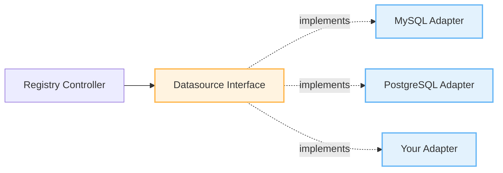

# Contributing a New Datasource

This guide walks you through implementing a new datasource adapter for Tenant Operator. The operator uses an adapter pattern to support multiple data sources, making it easy to add support for new databases or data sources.

[[toc]]

## Overview

Tenant Operator uses a pluggable datasource architecture:



**Key Benefits:**
- ✅ Clean interface - Only 2 methods to implement
- ✅ Reference implementation - MySQL adapter as example
- ✅ Type-safe - Strongly typed configuration
- ✅ Testable - Easy to mock and test
- ✅ Isolated - No changes to core controller logic

## Prerequisites

Before starting:

- **Go 1.22+** installed
- **Familiarity with**:
  - Go interfaces
  - SQL or your target datasource
  - Kubernetes operator patterns (helpful)
- **Development environment** setup ([see Development Guide](development.md))

## Step-by-Step Guide

### Step 1: Understand the Interface

The `Datasource` interface is defined in `internal/datasource/interface.go`:

```go
// Datasource defines the interface that all datasource adapters must implement
type Datasource interface {
    // QueryTenants retrieves active tenant rows from the datasource
    QueryTenants(ctx context.Context, config QueryConfig) ([]TenantRow, error)

    // Close closes the datasource connection
    io.Closer
}
```

**You need to implement:**

1. **`QueryTenants()`** - Query tenant data from your datasource
2. **`Close()`** - Clean up resources (connections, files, etc.)

### Step 2: Study the MySQL Reference Implementation

The MySQL adapter (`internal/datasource/mysql.go`) is a complete reference implementation. Key sections:

```go
// Adapter struct - holds connection
type MySQLAdapter struct {
    db *sql.DB
}

// Constructor - establishes connection
func NewMySQLAdapter(config Config) (*MySQLAdapter, error) {
    // 1. Build connection string
    dsn := fmt.Sprintf("%s:%s@tcp(%s:%d)/%s?parseTime=true", ...)

    // 2. Open connection
    db, err := sql.Open("mysql", dsn)

    // 3. Configure connection pool
    db.SetMaxOpenConns(25)
    db.SetMaxIdleConns(5)
    db.SetConnMaxLifetime(5 * time.Minute)

    // 4. Test connection
    if err := db.PingContext(ctx); err != nil {
        return nil, err
    }

    return &MySQLAdapter{db: db}, nil
}

// QueryTenants - query and map data
func (a *MySQLAdapter) QueryTenants(ctx context.Context, config QueryConfig) ([]TenantRow, error) {
    // 1. Build query
    query := fmt.Sprintf("SELECT %s FROM %s", columns, table)

    // 2. Execute query
    rows, err := a.db.QueryContext(ctx, query)

    // 3. Scan results
    var tenants []TenantRow
    for rows.Next() {
        // Map columns to TenantRow
        // Filter active tenants
    }

    return tenants, nil
}

// Close - cleanup
func (a *MySQLAdapter) Close() error {
    if a.db != nil {
        return a.db.Close()
    }
    return nil
}
```

### Step 3: Create Your Adapter File

Create a new file in `internal/datasource/` for your adapter:

```bash
# Example: PostgreSQL
touch internal/datasource/postgres.go

# Example: MongoDB
touch internal/datasource/mongodb.go

# Example: REST API
touch internal/datasource/rest.go
```

### Step 4: Implement the Adapter

Use this template:

```go
/*
Copyright 2025.

Licensed under the Apache License, Version 2.0 (the "License");
...
*/

package datasource

import (
    "context"
    "fmt"
    // Import your datasource driver
    // _ "github.com/lib/pq" // PostgreSQL
)

// YourAdapter implements the Datasource interface for [YourDatasource]
type YourAdapter struct {
    // Connection handle (e.g., *sql.DB, *mongo.Client, *http.Client)
    conn interface{} // Replace with actual type
}

// NewYourAdapter creates a new [YourDatasource] datasource adapter
func NewYourAdapter(config Config) (*YourAdapter, error) {
    // 1. Build connection string/config
    // 2. Establish connection
    // 3. Configure connection pool/settings
    // 4. Test connection
    // 5. Return adapter

    return &YourAdapter{conn: conn}, nil
}

// QueryTenants queries active tenants from [YourDatasource]
func (a *YourAdapter) QueryTenants(ctx context.Context, config QueryConfig) ([]TenantRow, error) {
    // 1. Build query/request
    //    Use config.Table for table/collection name
    //    Use config.ValueMappings for required columns
    //    Use config.ExtraMappings for extra columns

    // 2. Execute query

    // 3. Scan results into []TenantRow
    var tenants []TenantRow
    for /* iterate results */ {
        row := TenantRow{
            UID:       "", // Required
            HostOrURL: "", // Required
            Activate:  "", // Required
            Extra:     make(map[string]string), // Optional extra fields
        }

        // Map extra columns from config.ExtraMappings
        for key, col := range config.ExtraMappings {
            row.Extra[key] = "" // Get value from result
        }

        // Filter: only include active tenants with valid hostOrUrl
        if isActive(row.Activate) && row.HostOrURL != "" {
            tenants = append(tenants, row)
        }
    }

    return tenants, nil
}

// Close closes the datasource connection
func (a *YourAdapter) Close() error {
    // Cleanup resources
    // Close connections
    // Release handles
    return nil
}

// Helper: check if tenant is active
func isActive(value string) bool {
    switch value {
    case "1", "true", "TRUE", "True", "yes", "YES", "Yes":
        return true
    default:
        return false
    }
}
```

**Important Details:**

::: tip Required Fields
Every `TenantRow` must have:
- `UID` - Unique tenant identifier
- `HostOrURL` - Tenant URL/hostname
- `Activate` - Activation status (truthy/falsy)
- `Extra` - Map for additional fields
:::

::: warning Filtering
Always filter out:
- Inactive tenants (`activate` is false/0)
- Tenants without `hostOrUrl`
:::

### Step 5: Register Your Adapter

Update the factory function in `internal/datasource/interface.go`:

```go
// SourceType represents the type of datasource
type SourceType string

const (
    SourceTypeMySQL      SourceType = "mysql"
    SourceTypePostgreSQL SourceType = "postgresql"
    SourceTypeYours      SourceType = "yourdatasource" // Add your type
)

// NewDatasource creates a new datasource adapter based on the source type
func NewDatasource(sourceType SourceType, config Config) (Datasource, error) {
    switch sourceType {
    case SourceTypeMySQL:
        return NewMySQLAdapter(config)
    case SourceTypePostgreSQL:
        return NewPostgreSQLAdapter(config)
    case SourceTypeYours: // Add your case
        return NewYourAdapter(config)
    default:
        return nil, fmt.Errorf("unsupported datasource type: %s", sourceType)
    }
}
```

### Step 6: Add API Support

Update the CRD API types in `api/v1/tenantregistry_types.go`:

```go
// SourceType defines the type of external data source
type SourceType string

const (
    SourceTypeMySQL      SourceType = "mysql"
    SourceTypePostgreSQL SourceType = "postgresql"
    SourceTypeYours      SourceType = "yourdatasource" // Add
)

// TenantRegistrySourceSpec defines the data source configuration
type TenantRegistrySourceSpec struct {
    // Type of the data source
    // +kubebuilder:validation:Enum=mysql;postgresql;yourdatasource
    // +kubebuilder:validation:Required
    Type SourceType `json:"type"`

    // MySQL database configuration
    // +optional
    MySQL *MySQLSourceSpec `json:"mysql,omitempty"`

    // PostgreSQL database configuration
    // +optional
    PostgreSQL *PostgreSQLSourceSpec `json:"postgresql,omitempty"`

    // Your datasource configuration
    // +optional
    YourDatasource *YourDatasourceSpec `json:"yourdatasource,omitempty"` // Add

    // ... rest of spec
}

// YourDatasourceSpec defines [YourDatasource] configuration
type YourDatasourceSpec struct {
    // Host address
    // +kubebuilder:validation:Required
    Host string `json:"host"`

    // Port number
    // +kubebuilder:default=5432 // Your default port
    // +optional
    Port int32 `json:"port,omitempty"`

    // Add your configuration fields
    // Follow same pattern as MySQLSourceSpec
}
```

### Step 7: Update Controller Logic

The controller (`internal/controller/tenantregistry_controller.go`) may need updates for password extraction:

```go
// buildDatasourceConfig builds datasource configuration from TenantRegistry spec
func (r *TenantRegistryReconciler) buildDatasourceConfig(registry *tenantsv1.TenantRegistry, password string) (datasource.Config, string, error) {
    switch registry.Spec.Source.Type {
    case tenantsv1.SourceTypeMySQL:
        // ... existing MySQL logic

    case tenantsv1.SourceTypeYours: // Add your case
        yours := registry.Spec.Source.YourDatasource
        if yours == nil {
            return datasource.Config{}, "", fmt.Errorf("YourDatasource configuration is nil")
        }

        config := datasource.Config{
            Host:     yours.Host,
            Port:     yours.Port,
            Username: yours.Username,
            Password: password,
            Database: yours.Database,
        }

        return config, yours.Table, nil

    default:
        return datasource.Config{}, "", fmt.Errorf("unsupported source type: %s", registry.Spec.Source.Type)
    }
}
```

If your datasource uses password secrets, update `queryDatabase()`:

```go
// Get password from Secret (MySQL/PostgreSQL/YourDatasource)
password := ""
if registry.Spec.Source.MySQL != nil && registry.Spec.Source.MySQL.PasswordRef != nil {
    // ... MySQL password logic
} else if registry.Spec.Source.YourDatasource != nil && registry.Spec.Source.YourDatasource.PasswordRef != nil {
    // Add your password logic
    secret := &corev1.Secret{}
    if err := r.Get(ctx, types.NamespacedName{
        Name:      registry.Spec.Source.YourDatasource.PasswordRef.Name,
        Namespace: registry.Namespace,
    }, secret); err != nil {
        return nil, fmt.Errorf("failed to get password secret: %w", err)
    }
    password = string(secret.Data[registry.Spec.Source.YourDatasource.PasswordRef.Key])
}
```

### Step 8: Write Tests

Create comprehensive tests in `internal/datasource/your_test.go`:

```go
package datasource

import (
    "context"
    "testing"
)

func TestYourAdapter_QueryTenants(t *testing.T) {
    // Test setup
    adapter, err := NewYourAdapter(Config{
        Host:     "localhost",
        Port:     5432,
        // ... test config
    })
    if err != nil {
        t.Fatalf("Failed to create adapter: %v", err)
    }
    defer adapter.Close()

    // Test query
    tenants, err := adapter.QueryTenants(context.Background(), QueryConfig{
        Table: "tenants",
        ValueMappings: ValueMappings{
            UID:       "id",
            HostOrURL: "url",
            Activate:  "active",
        },
    })

    if err != nil {
        t.Fatalf("QueryTenants failed: %v", err)
    }

    // Verify results
    if len(tenants) == 0 {
        t.Error("Expected tenants, got none")
    }
}

func TestYourAdapter_Close(t *testing.T) {
    adapter, _ := NewYourAdapter(Config{...})

    err := adapter.Close()
    if err != nil {
        t.Errorf("Close failed: %v", err)
    }
}
```

**Test Coverage Goals:**
- ✅ Connection establishment
- ✅ Query execution
- ✅ Result mapping
- ✅ Error handling
- ✅ Filtering logic
- ✅ Resource cleanup

### Step 9: Add Documentation

Create documentation in `docs/datasource-[yours].md`:

```markdown
# [YourDatasource] Datasource Configuration

This guide covers configuring Tenant Operator with [YourDatasource].

## Prerequisites

- [YourDatasource] version X.X+
- Network connectivity from operator to datasource
- Read-only credentials

## Basic Configuration

\```yaml
apiVersion: operator.kubernetes-tenants.org/v1
kind: TenantRegistry
metadata:
  name: my-registry
spec:
  source:
    type: yourdatasource
    yourdatasource:
      host: your-host.example.com
      port: 5432
      username: tenant_reader
      passwordRef:
        name: yourdatasource-credentials
        key: password
      database: tenants_db
      table: tenants
    syncInterval: 1m
  valueMappings:
    uid: tenant_id
    hostOrUrl: tenant_url
    activate: is_active
\```

## Configuration Reference

[Document all configuration options...]
```

Update main datasource docs (`docs/datasource.md`):

```markdown
## Supported Datasources

| Datasource | Status | Version | Guide |
|------------|--------|---------|-------|
| MySQL | ✅ Stable | v1.0+ | [MySQL Guide](#mysql-connection) |
| PostgreSQL | ✅ Stable | v1.2+ | [PostgreSQL Guide](datasource-postgresql.md) |
| [Yours] | ✅ Stable | v1.X+ | [[Yours] Guide](datasource-yours.md) |
```

### Step 10: Update Release Documentation

Update relevant documentation files:

**README.md:**
```markdown
## Supported Datasources

- ✅ MySQL 5.7+ / 8.0+
- ✅ PostgreSQL 12+
- ✅ [YourDatasource] X.X+
```

**docs/roadmap.md:**
```markdown
## v1.X

### New Features
- ✅ **[YourDatasource] Support**
  - Full [YourDatasource] integration
  - Connection pooling
  - SSL/TLS support
```

### Step 11: Create Examples

Add example manifests in `config/samples/`:

```bash
# Create example directory
mkdir -p config/samples/yourdatasource

# Add example files
touch config/samples/yourdatasource/registry.yaml
touch config/samples/yourdatasource/secret.yaml
touch config/samples/yourdatasource/template.yaml
```

**Example files:**

`config/samples/yourdatasource/secret.yaml`:
```yaml
apiVersion: v1
kind: Secret
metadata:
  name: yourdatasource-credentials
  namespace: default
type: Opaque
stringData:
  password: "your-password-here"
```

`config/samples/yourdatasource/registry.yaml`:
```yaml
apiVersion: operator.kubernetes-tenants.org/v1
kind: TenantRegistry
metadata:
  name: yourdatasource-registry
  namespace: default
spec:
  source:
    type: yourdatasource
    yourdatasource:
      host: your-host.example.com
      port: 5432
      username: tenant_reader
      passwordRef:
        name: yourdatasource-credentials
        key: password
      database: tenants_db
      table: tenants
    syncInterval: 1m
  valueMappings:
    uid: id
    hostOrUrl: url
    activate: active
```

### Step 12: Test End-to-End

Test your implementation thoroughly:

```bash
# 1. Build
make build

# 2. Run tests
make test

# 3. Run linter
make lint

# 4. Install CRDs
make install

# 5. Run locally
make run

# 6. Apply examples
kubectl apply -f config/samples/yourdatasource/secret.yaml
kubectl apply -f config/samples/yourdatasource/registry.yaml

# 7. Verify
kubectl get tenantregistries
kubectl describe tenantregistry yourdatasource-registry
kubectl get tenants
```

**Test Checklist:**
- [ ] Connection succeeds
- [ ] Query returns expected rows
- [ ] Active filtering works
- [ ] Extra mappings work
- [ ] Tenant CRs are created
- [ ] Status updates correctly
- [ ] Errors are handled gracefully
- [ ] Resource cleanup works

## Pull Request Checklist

Before submitting your PR:

### Code
- [ ] Adapter implements `Datasource` interface
- [ ] Factory function updated
- [ ] API types added with validation tags
- [ ] Controller logic updated
- [ ] Error handling comprehensive
- [ ] Code follows Go conventions
- [ ] Comments added for exported functions

### Tests
- [ ] Unit tests written (>80% coverage)
- [ ] Integration tests pass
- [ ] Manual testing completed
- [ ] Edge cases covered
- [ ] Error cases tested

### Documentation
- [ ] Datasource guide created
- [ ] Configuration reference complete
- [ ] Examples added
- [ ] README updated
- [ ] Roadmap updated
- [ ] CHANGELOG entry added

### Quality
- [ ] `make test` passes
- [ ] `make lint` passes
- [ ] `make build` succeeds
- [ ] No breaking changes
- [ ] Backwards compatible

## Common Issues and Solutions

### Issue: Connection Fails

**Symptoms:** Adapter returns connection error

**Solutions:**
1. Check network connectivity
2. Verify credentials
3. Test connection outside operator
4. Check firewall rules
5. Review connection string format

### Issue: No Tenants Returned

**Symptoms:** Query succeeds but returns empty array

**Causes:**
1. All rows have `activate=false`
2. Missing `hostOrUrl` values
3. Wrong table name
4. Wrong column mappings

**Debug:**
```go
// Add debug logging
logger.Info("Query results",
    "rowCount", len(rows),
    "activeCount", len(tenants),
    "table", config.Table)
```

### Issue: Extra Mappings Not Working

**Symptoms:** Extra fields not populating in Tenant annotations

**Solution:** Ensure column mapping is stable:
```go
// Build column index map first
colIndex := make(map[string]int)
for i, col := range extraColumns {
    colIndex[col] = i
}

// Then map using stable indices
for key, col := range config.ExtraMappings {
    idx := colIndex[col]
    row.Extra[key] = values[idx]
}
```

## Getting Help

If you need assistance:

1. **Check Examples**: Review MySQL adapter implementation
2. **Ask Questions**: Open a [GitHub Discussion](https://github.com/kubernetes-tenants/tenant-operator/discussions)
3. **Report Issues**: File a [bug report](https://github.com/kubernetes-tenants/tenant-operator/issues)
4. **Contributing**: See [Contributing Guidelines](https://github.com/kubernetes-tenants/tenant-operator/blob/main/CONTRIBUTING.md)

## Recognition

Your contribution will be:
- ✅ Listed in release notes
- ✅ Added to CONTRIBUTORS file
- ✅ Mentioned in README
- ✅ Included in documentation
- ✅ Appreciated by the community! 🎉

## Example: PostgreSQL Adapter

Here's a complete PostgreSQL adapter example for reference:

```go
package datasource

import (
    "context"
    "database/sql"
    "fmt"
    "time"

    _ "github.com/lib/pq" // PostgreSQL driver
)

type PostgreSQLAdapter struct {
    db *sql.DB
}

func NewPostgreSQLAdapter(config Config) (*PostgreSQLAdapter, error) {
    dsn := fmt.Sprintf("host=%s port=%d user=%s password=%s dbname=%s sslmode=disable",
        config.Host, config.Port, config.Username, config.Password, config.Database)

    db, err := sql.Open("postgres", dsn)
    if err != nil {
        return nil, fmt.Errorf("failed to open PostgreSQL connection: %w", err)
    }

    // Configure pool
    db.SetMaxOpenConns(25)
    db.SetMaxIdleConns(5)
    db.SetConnMaxLifetime(5 * time.Minute)

    // Test connection
    ctx, cancel := context.WithTimeout(context.Background(), 5*time.Second)
    defer cancel()

    if err := db.PingContext(ctx); err != nil {
        _ = db.Close()
        return nil, fmt.Errorf("failed to ping PostgreSQL: %w", err)
    }

    return &PostgreSQLAdapter{db: db}, nil
}

func (a *PostgreSQLAdapter) QueryTenants(ctx context.Context, config QueryConfig) ([]TenantRow, error) {
    // Build column list
    columns := []string{
        config.ValueMappings.UID,
        config.ValueMappings.HostOrURL,
        config.ValueMappings.Activate,
    }

    extraColumns := make([]string, 0, len(config.ExtraMappings))
    for _, col := range config.ExtraMappings {
        columns = append(columns, col)
        extraColumns = append(extraColumns, col)
    }

    // Build query (PostgreSQL uses $1, $2 for parameters if needed)
    query := fmt.Sprintf("SELECT %s FROM %s", joinColumnsPostgres(columns), config.Table)

    // Execute
    rows, err := a.db.QueryContext(ctx, query)
    if err != nil {
        return nil, fmt.Errorf("failed to query tenants: %w", err)
    }
    defer rows.Close()

    // Scan results
    var tenants []TenantRow
    for rows.Next() {
        row := TenantRow{Extra: make(map[string]string)}

        scanDest := []interface{}{&row.UID, &row.HostOrURL, &row.Activate}

        extraValues := make([]sql.NullString, len(extraColumns))
        for i := range extraValues {
            scanDest = append(scanDest, &extraValues[i])
        }

        if err := rows.Scan(scanDest...); err != nil {
            return nil, fmt.Errorf("failed to scan row: %w", err)
        }

        // Map extra values
        colIndex := make(map[string]int)
        for i, col := range extraColumns {
            colIndex[col] = i
        }

        for key, col := range config.ExtraMappings {
            if idx, ok := colIndex[col]; ok {
                if extraValues[idx].Valid {
                    row.Extra[key] = extraValues[idx].String
                }
            }
        }

        // Filter
        if isActive(row.Activate) && row.HostOrURL != "" {
            tenants = append(tenants, row)
        }
    }

    return tenants, rows.Err()
}

func (a *PostgreSQLAdapter) Close() error {
    if a.db != nil {
        return a.db.Close()
    }
    return nil
}

func joinColumnsPostgres(columns []string) string {
    result := ""
    for i, col := range columns {
        if i > 0 {
            result += ", "
        }
        result += `"` + col + `"` // PostgreSQL uses double quotes
    }
    return result
}
```

## Next Steps

After your PR is merged:

1. **Announce**: Share your contribution in [discussions](https://github.com/kubernetes-tenants/tenant-operator/discussions)
2. **Blog**: Consider writing a blog post about your datasource
3. **Maintain**: Help maintain and improve your adapter
4. **Support**: Answer questions from users
5. **Evolve**: Propose enhancements

Thank you for contributing to Tenant Operator! Your datasource adapter will help the community build multi-tenant applications with their preferred data sources. 🚀
