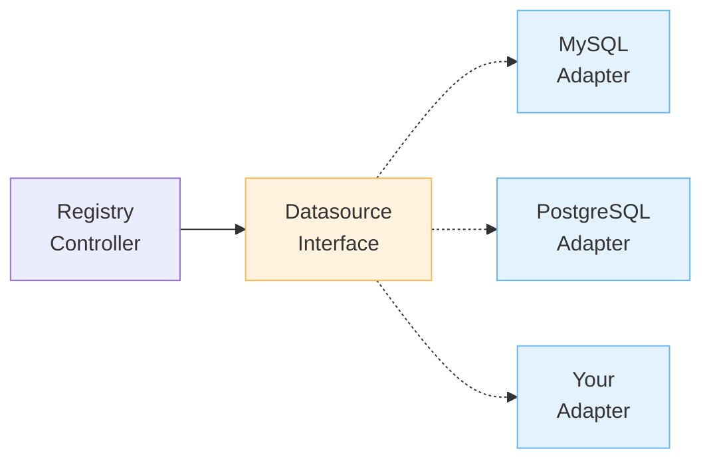

# Development Guide

Guide for developing and contributing to Tenant Operator.

[[toc]]

::: tip First time here?
Start with the [Quick Start guide](quickstart.md) to get familiar with the system before diving into development tooling.
:::

## Setup

### Prerequisites

| Tool | Version / Notes |
| --- | --- |
| Go | 1.22+ |
| kubectl | Matches target cluster |
| kind or minikube | Local cluster for testing |
| Docker | Required for image builds |
| make | Used for build/test helpers |

### Clone Repository

```bash
git clone https://github.com/kubernetes-tenants/tenant-operator.git
cd tenant-operator
```

### Install Dependencies

```bash
go mod download
```

## Local Development

### Running Locally

```bash
# Install CRDs
make install

# Run controller locally (uses ~/.kube/config)
make run

# Run with debug logging
LOG_LEVEL=debug make run
```

::: warning Local Run Limitations
`make run` runs the operator outside the cluster, which means:
- ⚠️ **Webhooks are NOT available** (no TLS certificates)
- ⚠️ **No validation** at admission time (invalid configs will only fail at reconciliation)
- ⚠️ **No defaulting** (all fields must be specified explicitly)

**For complete testing with webhooks**, deploy to cluster with cert-manager:
```bash
# See Local Development with Minikube guide
./scripts/deploy-to-minikube.sh  # Includes cert-manager and webhooks
```

**When to use `make run`**:
- Quick iteration on controller logic
- Testing reconciliation loops
- Debugging without webhook complications

**When to deploy to cluster**:
- Testing webhooks (validation/defaulting)
- Final testing before committing
- Verifying production-like behavior
:::

### Testing Against Local Cluster

```bash
# Create kind cluster
kind create cluster --name tenant-operator-dev

# Install CRDs
make install

# Run operator
make run
```

## Building

### Build Binary

```bash
# Build for current platform
make build

# Binary output: bin/manager
./bin/manager --help
```

### Build Container Image

```bash
# Build image
make docker-build IMG=myregistry/tenant-operator:dev

# Push image
make docker-push IMG=myregistry/tenant-operator:dev

# Build multi-platform
docker buildx build --platform linux/amd64,linux/arm64 \
  -t myregistry/tenant-operator:dev \
  --push .
```

## Testing

### Unit Tests

```bash
# Run all unit tests
make test

# Run with coverage
make test-coverage

# View coverage report
go tool cover -html=cover.out
```

### Integration Tests

```bash
# Run integration tests (requires cluster)
make test-integration
```

::: warning Cluster required
Integration and E2E suites create and mutate Kubernetes resources. Run them against disposable clusters.
:::

### E2E Tests

```bash
# Create test cluster
kind create cluster --name e2e-test

# Run E2E tests
make test-e2e

# Cleanup
kind delete cluster --name e2e-test
```

## Code Quality

### Linting

```bash
# Run linter
make lint

# Auto-fix issues
golangci-lint run --fix
```

### Formatting

```bash
# Format code
go fmt ./...

# Or use goimports
goimports -w .
```

### Generate Code

```bash
# Generate CRD manifests, RBAC, etc.
make generate

# Generate DeepCopy methods
make manifests
```

## Project Structure

```
tenant-operator/
├── api/v1/                    # CRD types
│   ├── tenant_types.go
│   ├── tenantregistry_types.go
│   ├── tenanttemplate_types.go
│   └── common_types.go
├── internal/controller/       # Controllers
│   ├── tenant_controller.go
│   ├── tenantregistry_controller.go
│   └── tenanttemplate_controller.go
├── internal/apply/            # SSA apply engine
├── internal/database/         # Database connectors
├── internal/graph/            # Dependency graph
├── internal/readiness/        # Readiness checks
├── internal/template/         # Template engine
├── internal/metrics/          # Prometheus metrics
├── config/                    # Kustomize configs
│   ├── crd/                   # CRD manifests
│   ├── rbac/                  # RBAC configs
│   ├── manager/               # Deployment configs
│   └── samples/               # Example CRs
├── test/                      # Tests
│   ├── e2e/                   # E2E tests
│   └── utils/                 # Test utilities
├── docs/                      # Documentation
└── cmd/                       # Entry point
```

## Adding Features

### New CRD Field

1. Update API types:
```go
// api/v1/tenant_types.go
type TenantSpec struct {
    NewField string `json:"newField,omitempty"`
}
```

2. Generate code:
```bash
make generate
make manifests
```

3. Update controller logic

4. Add tests

5. Update documentation

### New Controller

1. Create controller file:
```go
// internal/controller/myresource_controller.go
package controller

type MyResourceReconciler struct {
    client.Client
    Scheme *runtime.Scheme
}

func (r *MyResourceReconciler) Reconcile(ctx context.Context, req ctrl.Request) (ctrl.Result, error) {
    // Implementation
}
```

2. Register controller:
```go
// cmd/main.go
if err = (&controller.MyResourceReconciler{
    Client: mgr.GetClient(),
    Scheme: mgr.GetScheme(),
}).SetupWithManager(mgr); err != nil {
    // Handle error
}
```

3. Add tests

## Adding a New Datasource

Tenant Operator uses a pluggable adapter pattern for datasources, making it easy to add support for new databases or data sources.

### Architecture



### Quick Reference

**1. Implement Interface** (`internal/datasource/your_adapter.go`):
```go
package datasource

type YourAdapter struct {
    conn *YourConnection
}

// QueryTenants retrieves tenant data
func (a *YourAdapter) QueryTenants(ctx context.Context, config QueryConfig) ([]TenantRow, error) {
    // 1. Build query using config.Table, config.ValueMappings, config.ExtraMappings
    // 2. Execute query
    // 3. Map results to []TenantRow
    // 4. Filter active tenants
    return tenants, nil
}

// Close cleans up resources
func (a *YourAdapter) Close() error {
    return a.conn.Close()
}
```

**2. Register in Factory** (`internal/datasource/interface.go`):
```go
const SourceTypeYours SourceType = "yourdatasource"

func NewDatasource(sourceType SourceType, config Config) (Datasource, error) {
    switch sourceType {
    case SourceTypeYours:
        return NewYourAdapter(config)
    // ... other cases
    }
}
```

**3. Add API Types** (`api/v1/tenantregistry_types.go`):
```go
const SourceTypeYours SourceType = "yourdatasource"

type TenantRegistrySourceSpec struct {
    // +kubebuilder:validation:Enum=mysql;postgresql;yourdatasource
    Type SourceType `json:"type"`

    YourDatasource *YourDatasourceSpec `json:"yourdatasource,omitempty"`
}
```

**4. Test**:
```bash
make test
make lint
make build
```

### Full Guide

📚 **Detailed Step-by-Step Guide**: [Contributing a New Datasource](contributing-datasource.md)

The full guide includes:
- Interface explanation with examples
- Complete MySQL reference implementation walkthrough
- PostgreSQL adapter example
- Testing strategies
- Documentation templates
- PR checklist

### Key Files

| File | Purpose |
|------|---------|
| `internal/datasource/interface.go` | Interface definition + factory |
| `internal/datasource/mysql.go` | Reference implementation |
| `internal/datasource/your_adapter.go` | Your implementation |
| `api/v1/tenantregistry_types.go` | API types |
| `internal/controller/tenantregistry_controller.go` | Controller integration |

### Example: Study MySQL Adapter

The MySQL adapter (`internal/datasource/mysql.go`) is a complete, production-ready reference:

```bash
# View the implementation
cat internal/datasource/mysql.go

# Key sections:
# - NewMySQLAdapter(): Connection setup
# - QueryTenants(): Query + mapping + filtering
# - Close(): Resource cleanup
# - Helper functions: joinColumns(), isActive()
```

**What to learn:**
- Connection pooling configuration
- Query building with column mappings
- Result scanning and type handling
- Filtering logic (active tenants only)
- Error handling patterns

### Development Workflow

```bash
# 1. Create adapter file
touch internal/datasource/postgres.go

# 2. Implement interface
# (Copy mysql.go as template)

# 3. Register in factory
vim internal/datasource/interface.go

# 4. Add API types
vim api/v1/tenantregistry_types.go

# 5. Generate manifests
make manifests

# 6. Write tests
touch internal/datasource/postgres_test.go

# 7. Test
make test

# 8. Lint
make lint

# 9. Build
make build

# 10. Test locally
make install
make run
kubectl apply -f config/samples/postgres/
```

### Common Patterns

**SQL-based datasources** (MySQL, PostgreSQL):
- Use `database/sql` package
- Build SELECT queries dynamically
- Use parameterized queries for safety
- Handle NULL values with `sql.NullString`

**NoSQL datasources** (MongoDB, DynamoDB):
- Use native client libraries
- Map documents/items to `TenantRow`
- Handle different query syntax
- Consider pagination for large datasets

**REST APIs**:
- Use `net/http` client
- Unmarshal JSON to structs
- Map to `TenantRow`
- Handle authentication

### Tips

1. **Start with MySQL adapter** - Copy it as a template
2. **Focus on QueryTenants()** - This is the core logic
3. **Handle errors gracefully** - Return clear error messages
4. **Filter consistently** - Use the same `isActive()` logic
5. **Test thoroughly** - Unit tests + integration tests
6. **Document well** - Help users configure your datasource

## Contributing

::: tip Contribution checklist
Always include tests, update docs, and run `make lint` before opening a pull request.
:::

### Workflow

1. Fork repository
2. Create feature branch
3. Make changes
4. Add tests
5. Run linter: `make lint`
6. Run tests: `make test`
7. Commit with conventional commits
8. Open Pull Request

### Conventional Commits

```
feat: add new feature
fix: fix bug
docs: update documentation
test: add tests
refactor: refactor code
chore: maintenance tasks
```

### Pull Request Template

```markdown
## Description
Brief description of changes

## Type of Change
- [ ] Bug fix
- [ ] New feature
- [ ] Breaking change
- [ ] Documentation update

## Testing
- [ ] Unit tests added/updated
- [ ] Integration tests added/updated
- [ ] Manual testing performed

## Checklist
- [ ] Code follows style guidelines
- [ ] Self-review completed
- [ ] Documentation updated
- [ ] Tests passing
```

## Release Process

::: info Release automation
Tags trigger the release pipeline. Confirm CI is green before pushing a new tag.
:::

### Version Bump

1. Update version in:
   - `README.md`
   - `config/manager/kustomization.yaml`

2. Generate changelog

3. Create git tag:
```bash
git tag -a v1.1.0 -m "Release v1.1.0"
git push origin v1.1.0
```

4. GitHub Actions builds and publishes release

## Useful Commands

```bash
# Install CRDs
make install

# Uninstall CRDs
make uninstall

# Deploy operator
make deploy IMG=<image>

# Undeploy operator
make undeploy

# Run locally
make run

# Build binary
make build

# Build container
make docker-build IMG=<image>

# Run tests
make test

# Run linter
make lint

# Generate code
make generate manifests
```

## See Also

- [Contributing Guide](https://github.com/kubernetes-tenants/tenant-operator/blob/main/CONTRIBUTING.md)
- [API Reference](api.md)
- [Architecture Overview](index.md)
