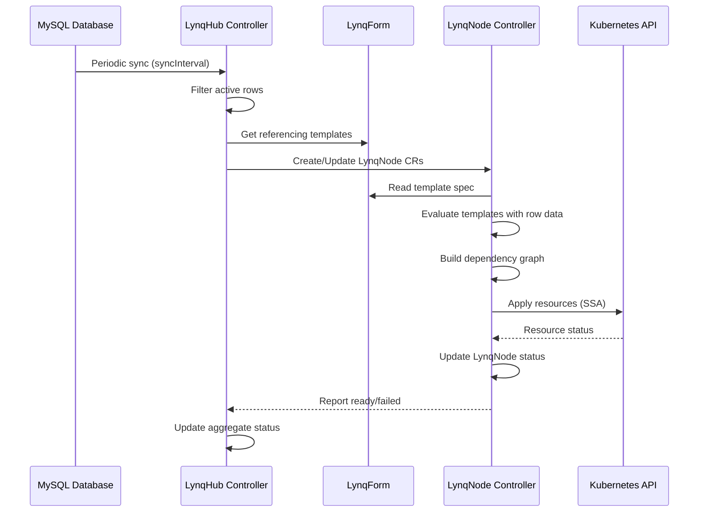

# How Lynq Works

Lynq bridges your database and Kubernetes with a simple three-component architecture that automates infrastructure provisioning based on your data.

[[toc]]

## Architecture Overview

<HowItWorksDiagram />

::: tip 💡 Interactive Demo
Click **LynqHub** and **LynqForm** to see the YAML configuration, or click database rows to toggle nodes on/off. Watch how Lynq automatically synchronizes Kubernetes resources with your database changes.
:::

## Three Simple Steps

Lynq operates through a straightforward three-step process that eliminates manual infrastructure management.

<style scoped>
.step-card {
  position: relative;
  text-align: center;
  padding: 2rem 1.5rem;
  background: var(--vp-c-bg-soft);
  border-radius: 12px;
  border: 1px solid var(--vp-c-divider);
  transition: all 0.3s cubic-bezier(0.4, 0, 0.2, 1);
  overflow: visible;
}

.step-card::before {
  content: '';
  position: absolute;
  inset: 0;
  border-radius: 12px;
  padding: 1px;
  background: linear-gradient(135deg, var(--step-color), transparent 50%, var(--step-color-light));
  -webkit-mask: linear-gradient(#fff 0 0) content-box, linear-gradient(#fff 0 0);
  -webkit-mask-composite: xor;
  mask-composite: exclude;
  opacity: 0;
  transition: opacity 0.3s ease;
  pointer-events: none;
}

.step-card:hover {
  border-color: transparent;
  box-shadow:
    0 8px 32px rgba(0, 0, 0, 0.08),
    0 0 0 1px var(--step-color-alpha);
  transform: translateY(-4px);
  background: var(--vp-c-bg);
}

.step-card:hover::before {
  opacity: 1;
}

.step-icon {
  font-size: 2.5rem;
  margin-bottom: 0.75rem;
  display: block;
  filter: grayscale(0.2);
  transition: all 0.3s ease;
}

.step-card:hover .step-icon {
  filter: grayscale(0);
  transform: scale(1.1);
}

.step-title {
  margin: 0.5rem 0 0.75rem;
  font-size: 1.15rem;
  font-weight: 700;
  color: var(--vp-c-text-1);
}

.step-description {
  margin: 0;
  color: var(--vp-c-text-2);
  font-size: 0.95rem;
  line-height: 1.6;
}
</style>

<div style="display: grid; grid-template-columns: repeat(auto-fit, minmax(280px, 1fr)); gap: 1.5rem; margin: 3rem 0">
  <div class="step-card" style="--step-color: #06b6d4; --step-color-light: #67e8f9; --step-color-alpha: rgba(6, 182, 212, 0.2)">
    <div class="step-icon">1️⃣</div>
    <h3 class="step-title">Connect Your Data</h3>
    <p class="step-description">
      Point to your MySQL database where node information lives. The operator reads active nodes automatically and syncs at your defined interval.
    </p>
  </div>

  <div class="step-card" style="--step-color: #8b5cf6; --step-color-light: #b794f6; --step-color-alpha: rgba(139, 92, 246, 0.2)">
    <div class="step-icon">2️⃣</div>
    <h3 class="step-title">Define Your Template</h3>
    <p class="step-description">
      Write one template describing what each node needs: deployments, services, ingresses, and any custom resources. Use Go templates with 200+ functions for flexibility.
    </p>
  </div>

  <div class="step-card" style="--step-color: #ec4899; --step-color-light: #f9a8d4; --step-color-alpha: rgba(236, 72, 153, 0.2)">
    <div class="step-icon">3️⃣</div>
    <h3 class="step-title">Deploy Automatically</h3>
    <p class="step-description">
      Every active node gets isolated infrastructure. Resources are created, updated, and cleaned up automatically as your data changes. Full drift detection and auto-correction included.
    </p>
  </div>
</div>

## Core Components

### LynqHub: Data Source Connection

**LynqHub** connects to your external database (currently MySQL) and periodically syncs node information.

**Key Features:**
- Configurable sync intervals
- Column-to-variable mappings
- Support for multiple templates per hub
- Automatic garbage collection when nodes are deactivated

**What it does:**
1. Queries your database at regular intervals
2. Filters rows where `activate=true`
3. Creates/updates LynqNode CRs for each active row × template combination
4. Automatically removes LynqNodes when rows are deactivated or deleted

### LynqForm: Resource Templates

**LynqForm** defines the resource blueprint that gets applied to each node.

**Key Features:**
- Support for all standard Kubernetes resources (Deployments, Services, etc.)
- Go template syntax with 200+ Sprig functions
- Fine-grained policies (Creation, Deletion, Conflict)
- Dependency management between resources
- Cross-namespace resource support

**What it does:**
1. Defines the infrastructure pattern for your nodes
2. Uses template variables from database columns
3. Supports custom functions like `toHost()`, `sha1sum()`, `fromJson()`
4. Enables conditional logic and dynamic naming

### LynqNode: Instance Representation

**LynqNode** represents a single node instance with all its resources.

**Key Features:**
- Automatically created by LynqHub controller
- Contains resolved resources (templates already evaluated)
- Tracks resource status (ready/failed/desired)
- Handles dependency ordering via topological sort
- Automatic orphan cleanup when templates change

**What it does:**
1. Applies resources in dependency order
2. Waits for resources to become ready
3. Detects and corrects drift
4. Reports detailed status back to hub
5. Manages resource lifecycle according to policies

## Reconciliation Flow



### Hub Controller

**Triggers:** Periodic sync interval, template changes, manual reconciliation

**Process:**
1. Query database for active nodes
2. Calculate desired LynqNode set (templates × active rows)
3. Create missing LynqNodes
4. Delete LynqNodes for deactivated/deleted rows
5. Update hub status with aggregate metrics

### Node Controller

**Triggers:** LynqNode creation/update, resource changes, periodic requeue (30s)

**Process:**
1. **Finalizer handling** - Clean up resources before deletion
2. **Template evaluation** - Render all templates with node data
3. **Dependency resolution** - Build DAG, detect cycles
4. **Orphan cleanup** - Remove resources deleted from template
5. **Resource application** - Apply in topological order
6. **Readiness check** - Wait for resources with `waitForReady=true`
7. **Status update** - Report ready/failed/desired counts

## Key Features

### Real-Time Synchronization

Changes in your database trigger automatic infrastructure updates within 30 seconds (default hub sync interval).

### Drift Detection & Auto-Correction

Lynq continuously monitors resources and automatically reverts manual changes to maintain desired state.

### Policy-Based Control

Fine-grained control over resource lifecycle:
- **CreationPolicy**: `Once` vs `WhenNeeded`
- **DeletionPolicy**: `Delete` vs `Retain`
- **ConflictPolicy**: `Stuck` vs `Force`
- **PatchStrategy**: `apply` vs `merge` vs `replace`

[Learn more about Policies →](/policies)

### Dependency Management

Define dependencies between resources using `dependIds`. Lynq automatically:
- Builds dependency graph
- Detects cycles (fails fast)
- Applies resources in correct order
- Waits for dependencies to be ready

### Orphan Resource Cleanup

When you remove a resource from a template, Lynq automatically:
- Detects orphaned resources
- Respects `DeletionPolicy` (Delete or Retain)
- Adds orphan markers for retained resources
- Re-adopts resources if added back to template

### Cross-Namespace Support

Create resources in any namespace using `targetNamespace` field. Lynq handles:
- Label-based tracking for cross-namespace resources
- Traditional ownerReferences for same-namespace resources
- Automatic cleanup regardless of namespace

## Performance & Scalability

### Controller Concurrency

Tune performance with concurrent reconciliation:
```bash
--hub-concurrency=3    # Default: 3
--form-concurrency=5   # Default: 5
--node-concurrency=10  # Default: 10
```

### Optimized Watching

- Event-driven architecture with smart predicates
- Only reconciles on meaningful changes (not status-only updates)
- 30-second requeue for fast status reflection
- Separate watches for same-namespace and cross-namespace resources

### Large-Scale Support

- Works with 10 to 10,000+ nodes
- Efficient database queries with column filtering
- SSA for conflict-free updates
- Prometheus metrics for observability

## Next Steps

<div style="display: grid; grid-template-columns: repeat(auto-fit, minmax(250px, 1fr)); gap: 1rem; margin: 2rem 0">
  <div style="padding: 1.5rem; background: var(--vp-c-bg-soft); border-radius: 8px; border: 1px solid var(--vp-c-divider);">
    <strong style="display: block; margin-bottom: 0.5rem;">🚀 Quick Start</strong>
    <p style="margin: 0 0 0.75rem; font-size: 0.9rem; color: var(--vp-c-text-2);">
      Get hands-on with a complete tutorial
    </p>
    <a href="/quickstart" style="color: var(--vp-c-brand);">Start Tutorial →</a>
  </div>

  <div style="padding: 1.5rem; background: var(--vp-c-bg-soft); border-radius: 8px; border: 1px solid var(--vp-c-divider);">
    <strong style="display: block; margin-bottom: 0.5rem;">📐 Architecture</strong>
    <p style="margin: 0 0 0.75rem; font-size: 0.9rem; color: var(--vp-c-text-2);">
      Deep dive into system design
    </p>
    <a href="/architecture" style="color: var(--vp-c-brand);">Read Architecture →</a>
  </div>

  <div style="padding: 1.5rem; background: var(--vp-c-bg-soft); border-radius: 8px; border: 1px solid var(--vp-c-divider);">
    <strong style="display: block; margin-bottom: 0.5rem;">📚 API Reference</strong>
    <p style="margin: 0 0 0.75rem; font-size: 0.9rem; color: var(--vp-c-text-2);">
      Complete CRD specifications
    </p>
    <a href="/api" style="color: var(--vp-c-brand);">View API Docs →</a>
  </div>

  <div style="padding: 1.5rem; background: var(--vp-c-bg-soft); border-radius: 8px; border: 1px solid var(--vp-c-divider);">
    <strong style="display: block; margin-bottom: 0.5rem;">🎯 Use Cases</strong>
    <p style="margin: 0 0 0.75rem; font-size: 0.9rem; color: var(--vp-c-text-2);">
      Real-world examples
    </p>
    <a href="/advanced-use-cases" style="color: var(--vp-c-brand);">Explore Examples →</a>
  </div>
</div>
