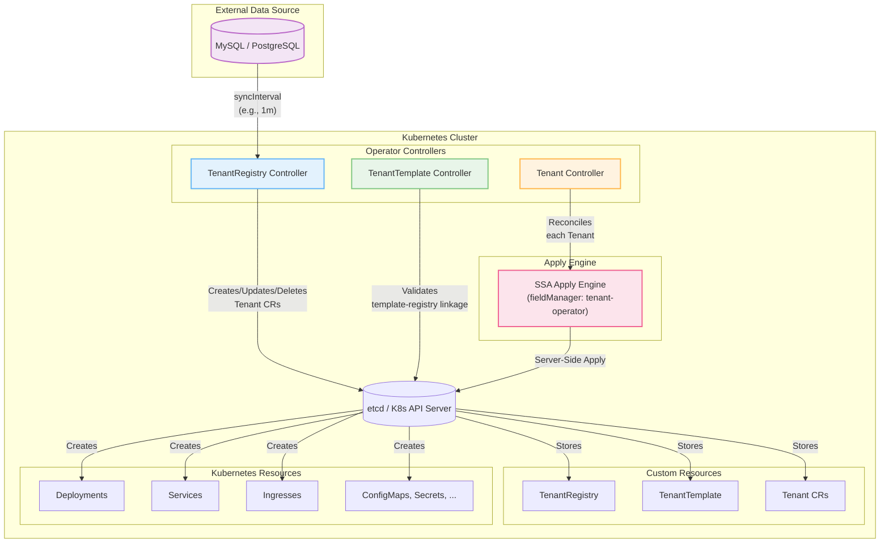
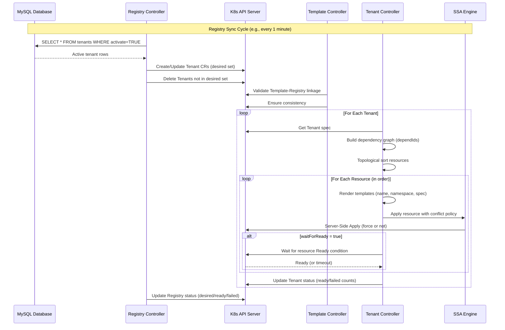

## Quick Example

### 1. Define a Registry (External Datasource)

```yaml
apiVersion: operator.kubernetes-tenants.org/v1
kind: TenantRegistry
metadata:
  name: my-saas-registry
spec:
  source:
    type: mysql
    mysql:
      host: mysql.default.svc.cluster.local
      port: 3306
      database: tenants
      table: tenant_data
      username: tenant_reader
      passwordRef:
        name: mysql-secret
        key: password
    syncInterval: 30s
  valueMappings:
    uid: tenant_id
    hostOrUrl: domain
    activate: is_active
```

### 2. Create a Template

```yaml
apiVersion: operator.kubernetes-tenants.org/v1
kind: TenantTemplate
metadata:
  name: web-app
spec:
  registryId: my-saas-registry
  deployments:
    - id: app-deployment
      nameTemplate: "{{ .uid }}-app"
      spec:
        apiVersion: apps/v1
        kind: Deployment
        spec:
          replicas: 2
          template:
            spec:
              containers:
                - name: app
                  image: "nginx:latest"
                  env:
                    - name: TENANT_ID
                      value: "{{ .uid }}"
                    - name: DOMAIN
                      value: "{{ .host }}"
```

### 3. Automatic Tenant Provisioning

The operator automatically creates Tenant CRs for each active row:

```yaml
apiVersion: operator.kubernetes-tenants.org/v1
kind: Tenant
metadata:
  name: acme-web-app
spec:
  uid: acme
  templateRef: web-app
  registryId: my-saas-registry
  # ... auto-populated resources
status:
  desiredResources: 10
  readyResources: 10
  failedResources: 0
  conditions:
    - type: Ready
      status: "True"
```

## Architecture

### System Overview



### Reconciliation Flow



## Key Features

### 🎯 Three-Controller Design

1. **TenantRegistry Controller**: Syncs database (e.g., 1m interval) → Creates/Updates/Deletes Tenant CRs
2. **TenantTemplate Controller**: Validates template-registry linkage and invariants
3. **Tenant Controller**: Renders templates → Resolves dependencies → Applies resources via SSA

### 📦 CRD Architecture

- **TenantRegistry**: Defines external datasource, sync interval, value mappings
- **TenantTemplate**: Blueprint for resources (Deployments, Services, Ingresses, etc.)
- **Tenant**: Instance representing a single tenant with status tracking

### 🔧 Advanced Capabilities

- **Multi-template support**: One registry → multiple templates
- **Garbage collection**: Auto-delete when rows removed or activate=false
- **Drift detection**: Event-driven watches with auto-correction
- **Smart requeue**: 30-second intervals for fast status reflection
- **Resource readiness**: 11+ resource types with custom checks
- **Finalizers**: Safe cleanup respecting deletion policies

## Documentation

<div class="vp-doc">
  <div class="custom-block tip">
    <p class="custom-block-title">Getting Started</p>
    <ul>
      <li><a href="/installation">Installation Guide</a> - Deploy to your cluster</li>
      <li><a href="/quickstart">Quick Start</a> - Get up and running in 5 minutes</li>
      <li><a href="/local-development-minikube">Local Development</a> - Minikube setup</li>
    </ul>
  </div>

  <div class="custom-block info">
    <p class="custom-block-title">Core Concepts</p>
    <ul>
      <li><a href="/api">API Reference</a> - Complete CRD documentation</li>
      <li><a href="/datasource">Datasources</a> - External data integration</li>
      <li><a href="/templates">Templates</a> - Go template system</li>
      <li><a href="/policies">Policies</a> - Lifecycle management</li>
    </ul>
  </div>

  <div class="custom-block warning">
    <p class="custom-block-title">Operations</p>
    <ul>
      <li><a href="/monitoring">Monitoring</a> - Prometheus metrics & alerts</li>
      <li><a href="/security">Security</a> - RBAC & best practices</li>
      <li><a href="/troubleshooting">Troubleshooting</a> - Common issues</li>
    </ul>
  </div>

  <div class="custom-block note">
    <p class="custom-block-title">Integrations</p>
    <ul>
      <li><a href="/integration-external-dns">ExternalDNS</a> - Automate DNS lifecycle per tenant</li>
      <li><a href="/integration-terraform-operator">Terraform Operator</a> - Provision cloud services via GitOps</li>
      <li><a href="/integration-argocd">Argo CD</a> - 1:1 Tenant ↔ Application GitOps delivery</li>
    </ul>
  </div>
</div>

## Community

- **GitHub**: [kubernetes-tenants/tenant-operator](https://github.com/kubernetes-tenants/tenant-operator)
- **Issues**: [Report bugs or request features](https://github.com/kubernetes-tenants/tenant-operator/issues)
