## Why Tenant Operator?

<p style="font-size: 1.05rem; color: var(--vp-c-text-2); margin: 1.5rem 0">
Managing hundreds or thousands of tenants in Kubernetes shouldn't require custom scripts, manual updates, or rebuilding Helm charts every time your data changes.
</p>

<div style="display: grid; grid-template-columns: repeat(auto-fit, minmax(320px, 1fr)); gap: 2rem; margin: 1.5rem 0;">
<div>

### ❌ Traditional Approaches Fall Short

<div style="padding: 1rem; background: var(--vp-c-bg-soft); border-radius: 8px; margin-bottom: 0.75rem; margin-top: 1rem;">
<strong style="display: block; margin-bottom: 0.5rem;">Helm Charts</strong>
<p style="margin: 0; font-size: 0.9rem; color: var(--vp-c-text-2);">
Static values files. Adding 10 new tenants? Manually create 10 new releases and track them separately.
</p>
</div>

<div style="padding: 1rem; background: var(--vp-c-bg-soft); border-radius: 8px; margin-bottom: 0.75rem;">
<strong style="display: block; margin-bottom: 0.5rem;">GitOps Only</strong>
<p style="margin: 0; font-size: 0.9rem; color: var(--vp-c-text-2);">
New customer signs up? Commit YAML, wait for CI/CD, manually sync. Not dynamic enough for real-time provisioning.
</p>
</div>

<div style="padding: 1rem; background: var(--vp-c-bg-soft); border-radius: 8px;">
<strong style="display: block; margin-bottom: 0.5rem;">Custom Scripts</strong>
<p style="margin: 0; font-size: 0.9rem; color: var(--vp-c-text-2);">
kubectl apply in bash loops. Works until you need drift detection, conflict handling, or dependency ordering.
</p>
</div>

</div>
<div>

### ✅ Tenant Operator Solves This

<div style="padding: 1rem; background: var(--vp-c-bg-soft); border-radius: 8px; margin-bottom: 0.75rem; margin-top: 1rem; border-left: 3px solid var(--vp-c-brand);">
<strong style="display: block; margin-bottom: 0.5rem;">Database-Driven Automation</strong>
<p style="margin: 0; font-size: 0.9rem; color: var(--vp-c-text-2);">
Your existing database is the source of truth. No YAML commits, no manual kubectl commands.
</p>
</div>

<div style="padding: 1rem; background: var(--vp-c-bg-soft); border-radius: 8px; margin-bottom: 0.75rem; border-left: 3px solid var(--vp-c-brand);">
<strong style="display: block; margin-bottom: 0.5rem;">Real-Time Synchronization</strong>
<p style="margin: 0; font-size: 0.9rem; color: var(--vp-c-text-2);">
Add a tenant → resources created in 30 seconds. Deactivate a tenant → everything cleaned up automatically.
</p>
</div>

<div style="padding: 1rem; background: var(--vp-c-bg-soft); border-radius: 8px; border-left: 3px solid var(--vp-c-brand);">
<strong style="display: block; margin-bottom: 0.5rem;">Production-Grade Control</strong>
<p style="margin: 0; font-size: 0.9rem; color: var(--vp-c-text-2);">
Built-in policies, drift detection, conflict resolution, dependency management, and comprehensive observability.
</p>
</div>

</div>
</div>

<div style="margin: 2.5rem 0; padding: 2rem; background: var(--vp-c-bg-soft); border-radius: 12px; border: 1px solid var(--vp-c-divider);">

<h3 style="margin: 0">Perfect For</h3>

<div style="display: grid; grid-template-columns: repeat(auto-fit, minmax(250px, 1fr)); gap: 1.5rem; margin-top: 1.5rem;">
<div style="text-align: center;">
<div style="font-size: 2.5rem; margin-bottom: 0.75rem;">🏢</div>
<strong style="display: block; margin-bottom: 0.5rem;">SaaS Platforms</strong>
<p style="margin: 0; font-size: 0.9rem; color: var(--vp-c-text-2);">
Each customer gets isolated infrastructure provisioned from your user database
</p>
</div>

<div style="text-align: center;">
<div style="font-size: 2.5rem; margin-bottom: 0.75rem;">🌍</div>
<strong style="display: block; margin-bottom: 0.5rem;">Multi-Environment Apps</strong>
<p style="margin: 0; font-size: 0.9rem; color: var(--vp-c-text-2);">
Spin up dev/staging/prod environments dynamically per team or feature branch
</p>
</div>

<div style="text-align: center;">
<div style="font-size: 2.5rem; margin-bottom: 0.75rem;">🔧</div>
<strong style="display: block; margin-bottom: 0.5rem;">Internal Platforms</strong>
<p style="margin: 0; font-size: 0.9rem; color: var(--vp-c-text-2);">
Self-service infrastructure for teams without manual ticket workflows
</p>
</div>
</div>

</div>

<div style="text-align: center; padding: 2rem; background: linear-gradient(135deg, #42b883 0%, #35495e 100%); border-radius: 12px; margin: 2.5rem 0;">
<div style="color: white;">
<div style="font-size: clamp(1.25rem, 3vw, 1.75rem); font-weight: bold; margin-bottom: 0.75rem;">
Stop Managing Tenants Manually
</div>
<p style="font-size: clamp(0.9rem, 2vw, 1.05rem); opacity: 0.95; margin: 0 0 1.5rem; line-height: 1.5;">
Let your database drive your infrastructure. Focus on your product, not kubectl commands.
</p>
<a href="/quickstart" style="display: inline-block; padding: 0.75rem 2rem; background: white; color: #42b883; border-radius: 8px; text-decoration: none; font-weight: 600; font-size: 1rem;">
Get Started in 5 Minutes →
</a>
</div>
</div>

## See It In Action

<p style="font-size: 1.05rem; color: var(--vp-c-text-2); margin-bottom: 2rem">
Define your tenant data source and resource templates, then let the operator handle the rest.
</p>

<div style="display: grid; grid-template-columns: 1fr; gap: 1rem; margin: 2rem 0">

```yaml
# Connect to your tenant database
apiVersion: operator.kubernetes-tenants.org/v1
kind: TenantRegistry
metadata:
  name: production-tenants
spec:
  source:
    type: mysql
    syncInterval: 30s
  valueMappings:
    uid: tenant_id
    hostOrUrl: domain
    activate: is_active
```

```yaml
# Define what to create per tenant
apiVersion: operator.kubernetes-tenants.org/v1
kind: TenantTemplate
metadata:
  name: saas-stack
spec:
  registryId: production-tenants
  deployments:
    - nameTemplate: "{{ .uid }}-api"
      spec:
        # ... Deployment configuration with {{ .uid }}, {{ .host }} templating
  services:
    - nameTemplate: "{{ .uid }}-svc"
      # ... Service configuration
  ingresses:
    - nameTemplate: "{{ .uid }}-ingress"
      # ... Ingress with {{ .host }} routing
```

</div>

<div style="padding: 1.25rem; background: var(--vp-c-bg-soft); border-radius: 8px; border-left: 3px solid var(--vp-c-brand); margin: 1.5rem 0">
  <p style="margin: 0; font-size: 1rem">
    <strong>Result:</strong> For each active tenant row, the operator automatically provisions a complete isolated stack with proper naming, configuration, and lifecycle management.
  </p>
</div>

::: tip Ready to try it?
Follow the [Quick Start Guide](/quickstart) for a complete walkthrough with a working example in 5 minutes.
:::

## How It Works

<p style="font-size: 1.15rem; color: var(--vp-c-text-2); margin-bottom: 2rem">
Turn database rows into production-ready tenant infrastructure, automatically.

```mermaid
%%{init: {'theme':'base', 'themeVariables': { 'fontSize':'16px'}}}%%
flowchart LR
    DB[("📊<br/><b>Database</b><br/><br/>tenant_id<br/>domain<br/>is_active")]

    Operator["⚙️<br/><b>Tenant Operator</b><br/><br/>Sync every 1m<br/>Apply templates<br/>Manage lifecycle"]

    Resources["☸️<br/><b>Kubernetes</b><br/><br/>Deployments<br/>Services<br/>Ingresses"]

    DB -->|"Read active tenants"| Operator
    Operator -->|"Create & sync resources"| Resources

    style DB fill:#e3f2fd,stroke:#1976d2,stroke-width:2px,color:#000
    style Operator fill:#fff3e0,stroke:#f57c00,stroke-width:2px,color:#000
    style Resources fill:#e8f5e9,stroke:#388e3c,stroke-width:2px,color:#000
```

</p>

<div style="margin: 2.5rem auto; text-align: center; max-width: 900px">



</div>

<div style="display: grid; grid-template-columns: repeat(auto-fit, minmax(280px, 1fr)); gap: 1.5rem; margin: 3rem 0">
  <div style="text-align: center; padding: 2rem 1.5rem; background: var(--vp-c-bg-soft); border-radius: 12px">
    <div style="font-size: 2.5rem; margin-bottom: 0.75rem">1️⃣</div>
    <h3 style="margin: 0.5rem 0 0.75rem">Connect Your Data</h3>
    <p style="margin: 0; color: var(--vp-c-text-2); font-size: 0.95rem; line-height: 1.6">
      Point to your MySQL database where tenant information lives. The operator reads active tenants automatically.
    </p>
  </div>

  <div style="text-align: center; padding: 2rem 1.5rem; background: var(--vp-c-bg-soft); border-radius: 12px">
    <div style="font-size: 2.5rem; margin-bottom: 0.75rem">2️⃣</div>
    <h3 style="margin: 0.5rem 0 0.75rem">Define Your Template</h3>
    <p style="margin: 0; color: var(--vp-c-text-2); font-size: 0.95rem; line-height: 1.6">
      Write one template describing what each tenant needs: deployments, services, ingresses, and any custom resources.
    </p>
  </div>

  <div style="text-align: center; padding: 2rem 1.5rem; background: var(--vp-c-bg-soft); border-radius: 12px">
    <div style="font-size: 2.5rem; margin-bottom: 0.75rem">3️⃣</div>
    <h3 style="margin: 0.5rem 0 0.75rem">Deploy Automatically</h3>
    <p style="margin: 0; color: var(--vp-c-text-2); font-size: 0.95rem; line-height: 1.6">
      Every active tenant gets isolated infrastructure. Resources are created, updated, and cleaned up automatically as your data changes.
    </p>
  </div>
</div>

<div style="text-align: center; padding: 2.5rem 2rem; background: linear-gradient(135deg, #667eea 0%, #764ba2 100%); border-radius: 12px; margin: 3rem 0">
  <div style="color: white;">
    <div style="font-size: clamp(1.5rem, 4vw, 2.25rem); font-weight: bold; margin-bottom: 0.75rem; line-height: 1.2">
      1 Database Row = 1 Complete Stack
    </div>
    <p style="font-size: clamp(0.95rem, 2vw, 1.1rem); opacity: 0.95; margin: 0; line-height: 1.5">
      Add a tenant to your database → Get Deployment + Service + Ingress + DNS + whatever you need
    </p>
  </div>
</div>

::: tip Start in 5 minutes
Follow the [Quick Start Guide](/quickstart) to see this in action with a working MySQL database and sample templates.
:::

## Kubernetes Compatibility

<div style="display: flex; align-items: center; gap: 1rem; padding: 1.25rem; background: var(--vp-c-bg-soft); border-radius: 8px; margin: 2.5rem 0">
  <div style="font-size: 2rem">✅</div>
  <div>
    <strong style="font-size: 1.05rem">Validated on Kubernetes v1.28 – v1.33</strong>
    <p style="margin: 0.5rem 0 0; font-size: 0.9rem; color: var(--vp-c-text-2)">
      Production-tested across multiple versions • See <a href="/installation#kubernetes-compatibility">compatibility details</a>
    </p>
  </div>
</div>

## Documentation

<div style="display: grid; grid-template-columns: repeat(auto-fit, minmax(300px, 1fr)); gap: 1.5rem; margin: 2.5rem 0">
  <div style="padding: 1.5rem; background: var(--vp-c-bg-soft); border-radius: 8px; border-left: 4px solid #42b883">
    <h3 style="margin: 0 0 1rem">🚀 Getting Started</h3>
    <ul style="list-style: none; padding: 0; margin: 0">
      <li style="margin: 0.75rem 0">
        <a href="/installation"><strong>Installation</strong></a><br/>
        <span style="font-size: 0.9rem; color: var(--vp-c-text-2)">Deploy the operator to your cluster</span>
      </li>
      <li style="margin: 0.75rem 0">
        <a href="/quickstart"><strong>Quick Start</strong></a><br/>
        <span style="font-size: 0.9rem; color: var(--vp-c-text-2)">Complete tutorial in 5 minutes</span>
      </li>
      <li style="margin: 0.75rem 0">
        <a href="/local-development-minikube"><strong>Local Development</strong></a><br/>
        <span style="font-size: 0.9rem; color: var(--vp-c-text-2)">Set up with Minikube</span>
      </li>
    </ul>
  </div>

  <div style="padding: 1.5rem; background: var(--vp-c-bg-soft); border-radius: 8px; border-left: 4px solid #3b82f6">
    <h3 style="margin: 0 0 1rem">📚 Core Concepts</h3>
    <ul style="list-style: none; padding: 0; margin: 0">
      <li style="margin: 0.75rem 0">
        <a href="/architecture"><strong>Architecture</strong></a><br/>
        <span style="font-size: 0.9rem; color: var(--vp-c-text-2)">System design and reconciliation flow</span>
      </li>
      <li style="margin: 0.75rem 0">
        <a href="/api"><strong>API Reference</strong></a><br/>
        <span style="font-size: 0.9rem; color: var(--vp-c-text-2)">Complete CRD specification</span>
      </li>
      <li style="margin: 0.75rem 0">
        <a href="/templates"><strong>Templates</strong></a><br/>
        <span style="font-size: 0.9rem; color: var(--vp-c-text-2)">Go templates with 200+ functions</span>
      </li>
      <li style="margin: 0.75rem 0">
        <a href="/policies"><strong>Policies</strong></a><br/>
        <span style="font-size: 0.9rem; color: var(--vp-c-text-2)">Lifecycle and conflict management</span>
      </li>
      <li style="margin: 0.75rem 0">
        <a href="/datasource"><strong>Datasources</strong></a><br/>
        <span style="font-size: 0.9rem; color: var(--vp-c-text-2)">External data integration (MySQL)</span>
      </li>
    </ul>
  </div>

  <div style="padding: 1.5rem; background: var(--vp-c-bg-soft); border-radius: 8px; border-left: 4px solid #f59e0b">
    <h3 style="margin: 0 0 1rem">⚙️ Operations</h3>
    <ul style="list-style: none; padding: 0; margin: 0">
      <li style="margin: 0.75rem 0">
        <a href="/monitoring"><strong>Monitoring</strong></a><br/>
        <span style="font-size: 0.9rem; color: var(--vp-c-text-2)">Prometheus metrics, alerts, and Grafana</span>
      </li>
      <li style="margin: 0.75rem 0">
        <a href="/performance"><strong>Performance</strong></a><br/>
        <span style="font-size: 0.9rem; color: var(--vp-c-text-2)">Tuning and scalability</span>
      </li>
      <li style="margin: 0.75rem 0">
        <a href="/security"><strong>Security</strong></a><br/>
        <span style="font-size: 0.9rem; color: var(--vp-c-text-2)">RBAC, credentials, and best practices</span>
      </li>
      <li style="margin: 0.75rem 0">
        <a href="/troubleshooting"><strong>Troubleshooting</strong></a><br/>
        <span style="font-size: 0.9rem; color: var(--vp-c-text-2)">Common issues and solutions</span>
      </li>
    </ul>
  </div>

  <div style="padding: 1.5rem; background: var(--vp-c-bg-soft); border-radius: 8px; border-left: 4px solid #8b5cf6">
    <h3 style="margin: 0 0 1rem">🔌 Integrations</h3>
    <ul style="list-style: none; padding: 0; margin: 0">
      <li style="margin: 0.75rem 0">
        <a href="/integration-external-dns"><strong>External DNS</strong></a><br/>
        <span style="font-size: 0.9rem; color: var(--vp-c-text-2)">Automatic DNS per tenant</span>
      </li>
      <li style="margin: 0.75rem 0">
        <a href="/integration-terraform-operator"><strong>Terraform Operator</strong></a><br/>
        <span style="font-size: 0.9rem; color: var(--vp-c-text-2)">Cloud resource provisioning</span>
      </li>
      <li style="margin: 0.75rem 0">
        <a href="/integration-argocd"><strong>Argo CD</strong></a><br/>
        <span style="font-size: 0.9rem; color: var(--vp-c-text-2)">GitOps delivery pipeline</span>
      </li>
    </ul>
  </div>
</div>

## Resources & Community

<div style="display: grid; grid-template-columns: repeat(auto-fit, minmax(250px, 1fr)); gap: 1.5rem; margin: 2.5rem 0 0">
  <div style="padding: 1.5rem; background: var(--vp-c-bg-soft); border-radius: 8px">
    <h3 style="margin: 0 0 0.75rem">📦 GitHub Repository</h3>
    <p style="margin: 0 0 0.5rem">
      <a href="https://github.com/kubernetes-tenants/tenant-operator">kubernetes-tenants/tenant-operator</a>
    </p>
    <p style="margin: 0; font-size: 0.9rem; color: var(--vp-c-text-2)">
      Source code, releases, and project roadmap
    </p>
  </div>

  <div style="padding: 1.5rem; background: var(--vp-c-bg-soft); border-radius: 8px">
    <h3 style="margin: 0 0 0.75rem">🐛 Issue Tracker</h3>
    <p style="margin: 0 0 0.5rem">
      <a href="https://github.com/kubernetes-tenants/tenant-operator/issues">Report Issues</a>
    </p>
    <p style="margin: 0; font-size: 0.9rem; color: var(--vp-c-text-2)">
      Bug reports, feature requests, and discussions
    </p>
  </div>

  <div style="padding: 1.5rem; background: var(--vp-c-bg-soft); border-radius: 8px">
    <h3 style="margin: 0 0 0.75rem">📖 Documentation</h3>
    <p style="margin: 0 0 0.5rem">
      <a href="/installation">Get Started →</a>
    </p>
    <p style="margin: 0; font-size: 0.9rem; color: var(--vp-c-text-2)">
      Comprehensive guides and API reference
    </p>
  </div>
</div>
