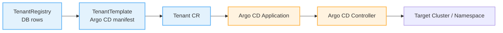
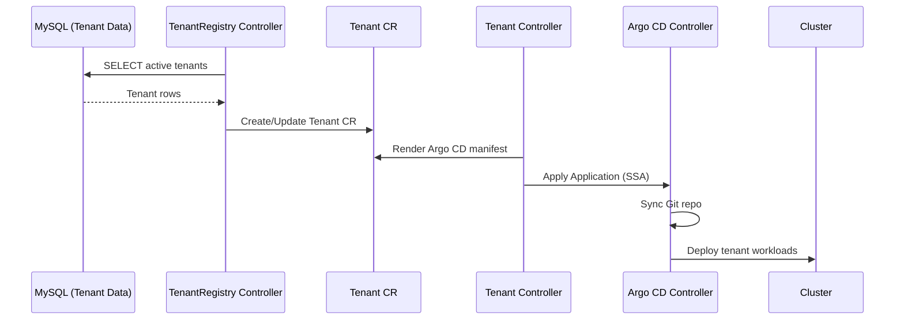
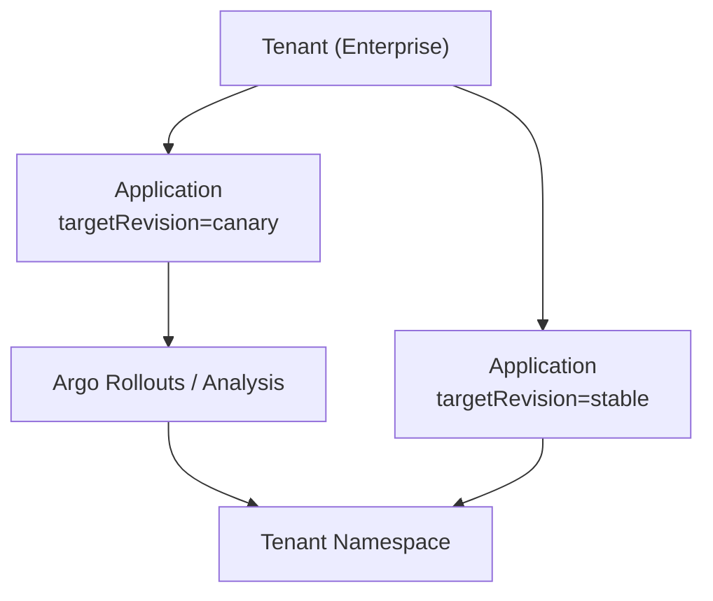

# Argo CD Integration Guide

Deliver GitOps-driven tenant environments by mapping each **Tenant** to an **Argo CD Application**.

[[toc]]

## Overview

Tenant Operator can render Argo CD `Application` manifests for every active tenant row. Each Tenant becomes the canonical source of truth for a corresponding Argo CD Application, enabling GitOps workflows, progressive delivery, and automated cleanup.



### Core Benefits

- **1:1 Mapping** – Every Tenant owns exactly one Argo CD Application (`Tenant` ↔️ `Application`).
- **Automatic Sync** – Application source paths follow tenant metadata (UID, plan, region).
- **Declarative Cleanup** – When a Tenant is deleted (or deactivated), the Argo CD Application and downstream workloads are removed.
- **GitOps Alignment** – Teams keep delivery pipelines in Git, while Tenant Operator handles orchestration and lifecycle.

## Prerequisites

- Argo CD installed (v2.8+ recommended) and accessible from the tenant namespace.
- ServiceAccount and RBAC granting Tenant Operator permission to create Argo CD `Application` objects in the Argo CD namespace (often `argocd`).
- Tenant Operator chart deployed with namespace permissions covering the Argo CD API group.
- Git repository that hosts tenant application configuration.

## Baseline Template (1 Tenant ➝ 1 Application)

The following template renders an Argo CD Application per Tenant. Each `Application` points to a unique Git path derived from tenant metadata.

::: v-pre
```yaml
apiVersion: operator.kubernetes-tenants.org/v1
kind: TenantTemplate
metadata:
  name: argocd-app-template
spec:
  registryId: saas-registry

  manifests:
    - id: argocd-app
      nameTemplate: "{{ printf \"%s-app\" (.uid | trunc63) }}"
      spec:
        apiVersion: argoproj.io/v1alpha1
        kind: Application
        metadata:
          namespace: argocd
          labels:
            tenant.kubernetes-tenants.org/uid: "{{ .uid }}"
            tenant.kubernetes-tenants.org/region: "{{ .region | default \"global\" }}"
        spec:
          project: tenants
          source:
            repoURL: https://github.com/your-org/tenant-configs.git
            targetRevision: main
            path: "tenants/{{ .uid }}"
          destination:
            server: https://kubernetes.default.svc
            namespace: "{{ .uid }}-workspace"
          syncPolicy:
            automated:
              prune: true
              selfHeal: true
            syncOptions:
              - CreateNamespace=true
              - ApplyOutOfSyncOnly=true
```
:::

### Flow



## Advanced Sync Patterns

::: v-pre
| Pattern | Description | Tenant Template Hints |
| --- | --- | --- |
| **Environment Branching** | Target different Git branches per region or plan (`targetRevision: "{{ ternary \"main\" \"staging\" (eq .planId \"enterprise\") }}"`). | Use extra value mappings for `planId`, `region`. |
| **Dynamic Paths** | Compose repo paths from UID segments (`path: "tenants/{{ .region }}/{{ .uid }}"`). | Use Sprig `splitList`, `join`, `default`. |
| **App-of-Apps** | Point each tenant to an `Application` that references tenant-specific sub-apps. | Render Application with `path: tenants/{{ .uid }}/apps`. |
| **Multi-Cluster Delivery** | Route tenants to dedicated clusters using Argo CD credentials (`destination.server`). | Map datasource columns to `clusterServer`, `clusterName`. |
| **Progressive Rollouts** | Annotate Applications for Argo Rollouts or Progressive Sync plugins. | Add `metadata.annotations` via templates. |
:::

## Additional Use Cases

### 1. AppSet Fan-Out per Tenant Plan

- Combine Tenant Operator with Argo CD ApplicationSet.
- Tenant Operator renders a control-plane Application that references an ApplicationSet generator.
- Generator reads tenant metadata (via ConfigMap/Secret) to produce feature-specific Applications per plan tier.

### 2. Multi-Cluster Tenants with Cluster Secrets

- Add `extraValueMappings` for cluster credentials.
- Tenant template creates:
  1. An Argo CD `ClusterSecret` (with kubeconfig) in the Argo CD namespace.
  2. An `Application` targeting that cluster secret.
- Enables dedicated clusters per enterprise tenant.

### 3. Canary and Blue/Green Releases

- Render two Applications per tenant (`tenant-app-canary`, `tenant-app-stable`) with different `targetRevision`.
- Use `creationPolicy: Once` on the stable Application and `WhenNeeded` on the canary for rapid rollback.
- Combine with Argo Rollouts by templating `analysis` and promotion hooks.



## Operational Tips

- Label Applications with tenant metadata for quick filtering (`tenant.kubernetes-tenants.org/uid`).
- Grant the operator service account access to `argoproj.io` API group via ClusterRole.
- Monitor Argo CD sync status alongside Tenant status; both must be healthy for end-to-end readiness.
- Use the `Retain` deletion policy when you need to keep Applications for post-mortem analysis.

## What to Read Next

- [Templates Guide](templates.md) – Advanced templating and function usage.
- [Policies Guide](policies.md) – Control resource lifecycle (Retain vs. Delete).
- [Monitoring Guide](monitoring.md) – Capture Argo CD and Tenant Operator metrics together.
