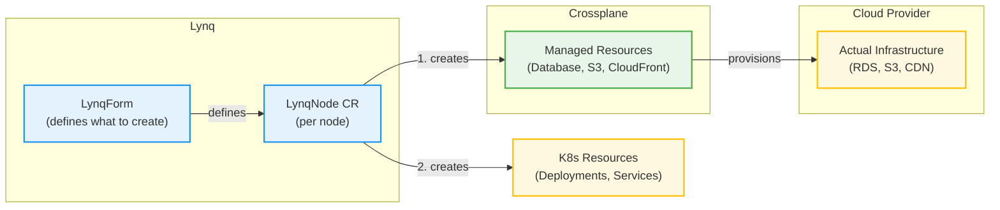
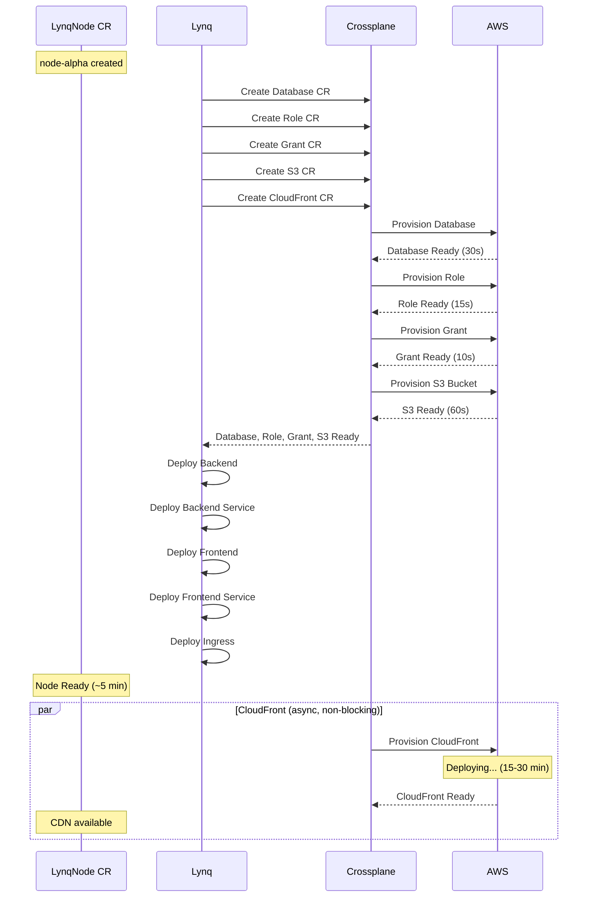

# Crossplane Integration Guide

This guide shows how to integrate Lynq with Crossplane for provisioning cloud resources (AWS, GCP, Azure) per node using a Kubernetes-native approach.

[[toc]]

## Overview

**Crossplane** is a CNCF project that extends Kubernetes to provision and manage cloud infrastructure as Kubernetes Custom Resources. When integrated with Lynq, each node can automatically provision **declarative cloud resources** using the Kubernetes API.

## How It Works

### Operator Relationship



**Key Points:**
- **Lynq** manages LynqNode CRs (one per node)
- **LynqNode CR** creates both Crossplane Managed Resources AND native K8s resources
- **Crossplane** watches Managed Resources and provisions actual cloud infrastructure
- **Two operators work independently**: Lynq orchestrates, Crossplane provisions

### Example Flow



### Key Benefits

- ☸️ **Kubernetes-Native**: Manage infrastructure using standard Kubernetes workflows (GitOps-friendly)
- 🔄 **Declarative**: Desired state defined in YAML, Crossplane handles reconciliation
- 📦 **Rich Ecosystem**: AWS, GCP, Azure providers with 80+ cloud services
- 🔍 **Observable**: Standard Kubernetes tools (kubectl, k9s) work out of the box

### Common Use Cases

- **Full-Stack Apps**: Frontend (S3 + CloudFront) + Backend + Database (RDS) + Object Storage
- **Database Isolation**: Shared RDS with isolated databases/schemas per node
- **Multi-Cloud**: Resources across AWS, GCP, Azure with unified management

## Prerequisites

::: info Requirements
- Kubernetes cluster v1.20+
- Lynq installed
- Crossplane v1.14+ installed
- AWS/GCP/Azure account with credentials
:::

## Installation

### 1. Install Crossplane

```bash
# Install Crossplane via Helm
helm repo add crossplane-stable https://charts.crossplane.io/stable
helm repo update
helm install crossplane crossplane-stable/crossplane \
  --namespace crossplane-system \
  --create-namespace \
  --wait
```

### 2. Install Required Providers

```bash
# Install AWS providers
cat <<EOF | kubectl apply -f -
apiVersion: pkg.crossplane.io/v1
kind: Provider
metadata:
  name: provider-aws-s3
spec:
  package: xpkg.upbound.io/upbound/provider-aws-s3:v1.1.0
---
apiVersion: pkg.crossplane.io/v1
kind: Provider
metadata:
  name: provider-aws-rds
spec:
  package: xpkg.upbound.io/upbound/provider-aws-rds:v1.1.0
---
apiVersion: pkg.crossplane.io/v1
kind: Provider
metadata:
  name: provider-aws-cloudfront
spec:
  package: xpkg.upbound.io/upbound/provider-aws-cloudfront:v1.1.0
---
apiVersion: pkg.crossplane.io/v1
kind: Provider
metadata:
  name: provider-sql
spec:
  package: xpkg.upbound.io/crossplane-contrib/provider-sql:v0.9.0
EOF

# Wait for providers
kubectl wait --for=condition=Healthy provider.pkg.crossplane.io --all --timeout=5m
```

### 3. Configure Credentials

```bash
# Create AWS credentials
cat > aws-creds.txt <<EOF
[default]
aws_access_key_id = YOUR_ACCESS_KEY
aws_secret_access_key = YOUR_SECRET_KEY
EOF

kubectl create secret generic aws-credentials \
  --namespace crossplane-system \
  --from-file=credentials=aws-creds.txt

rm aws-creds.txt

# Create ProviderConfig
cat <<EOF | kubectl apply -f -
apiVersion: aws.upbound.io/v1beta1
kind: ProviderConfig
metadata:
  name: default
spec:
  credentials:
    source: Secret
    secretRef:
      namespace: crossplane-system
      name: aws-credentials
      key: credentials
EOF
```

## Complete Example: Production Full-Stack Application

This example deploys a complete production-ready application with:
- **CloudFront CDN**: Global content delivery for frontend assets
- **S3 Bucket**: Static asset storage with origin for CloudFront
- **PostgreSQL Database**: Shared RDS with isolated database per node
- **Backend API**: Deployment with database and S3 access
- **Frontend**: Nginx serving static content with CDN acceleration

### Step 1: Setup Shared RDS Instance

```yaml
apiVersion: rds.aws.upbound.io/v1beta1
kind: Instance
metadata:
  name: shared-postgres
  namespace: default
spec:
  forProvider:
    region: us-east-1
    allocatedStorage: 100
    engine: postgres
    engineVersion: "15.4"
    instanceClass: db.t3.medium
    dbName: postgres
    username: postgres
    masterUserPasswordSecretRef:
      key: password
      name: postgres-master-password
      namespace: default
    publiclyAccessible: false
    skipFinalSnapshot: true
    backupRetentionPeriod: 7
    storageEncrypted: true
  providerConfigRef:
    name: default
  writeConnectionSecretToRef:
    name: shared-postgres-connection
    namespace: default
---
apiVersion: v1
kind: Secret
metadata:
  name: postgres-master-password
  namespace: default
type: Opaque
stringData:
  password: "CHANGE_ME"  # Use strong password!
---
apiVersion: postgresql.sql.crossplane.io/v1alpha1
kind: ProviderConfig
metadata:
  name: postgres-provider
spec:
  credentials:
    source: PostgreSQLConnectionSecret
    connectionSecretRef:
      name: shared-postgres-connection
      namespace: default
  sslMode: require
```

### Step 2: LynqForm with Full Infrastructure

```yaml
apiVersion: operator.lynq.sh/v1
kind: LynqForm
metadata:
  name: production-app
  namespace: default
spec:
  hubId: my-hub

  manifests:
  # 1. PostgreSQL Database
  - id: postgres-database
    nameTemplate: "{{ .uid }}-db"
    spec:
      apiVersion: postgresql.sql.crossplane.io/v1alpha1
      kind: Database
      metadata:
        annotations:
          crossplane.io/external-name: "{{ .uid | replace \"-\" \"_\" }}"
      spec:
        forProvider: {}
        providerConfigRef:
          name: postgres-provider
    waitForReady: true
    timeoutSeconds: 300

  # 2. PostgreSQL Role (User)
  - id: postgres-role
    nameTemplate: "{{ .uid }}-role"
    dependIds: ["postgres-database"]
    spec:
      apiVersion: postgresql.sql.crossplane.io/v1alpha1
      kind: Role
      metadata:
        annotations:
          crossplane.io/external-name: "{{ .uid | replace \"-\" \"_\" }}"
      spec:
        forProvider:
          privileges:
            login: true
        writeConnectionSecretToRef:
          name: "{{ .uid }}-db-creds"
          namespace: default
        providerConfigRef:
          name: postgres-provider
    waitForReady: true
    timeoutSeconds: 300

  # 3. PostgreSQL Grant
  - id: postgres-grant
    nameTemplate: "{{ .uid }}-grant"
    dependIds: ["postgres-database", "postgres-role"]
    spec:
      apiVersion: postgresql.sql.crossplane.io/v1alpha1
      kind: Grant
      spec:
        forProvider:
          privileges: ["ALL"]
          database: "{{ .uid | replace \"-\" \"_\" }}"
          role: "{{ .uid | replace \"-\" \"_\" }}"
          withOption: GRANT
        providerConfigRef:
          name: postgres-provider
    waitForReady: true
    timeoutSeconds: 300

  # 4. S3 Bucket for static assets
  - id: s3-bucket
    nameTemplate: "{{ .uid }}-s3"
    spec:
      apiVersion: s3.aws.upbound.io/v1beta1
      kind: Bucket
      metadata:
        annotations:
          crossplane.io/external-name: "{{ .uid }}-assets-{{ sha256sum .uid | trunc 8 }}"
      spec:
        forProvider:
          region: us-east-1
        providerConfigRef:
          name: default
    waitForReady: true
    timeoutSeconds: 300

  # 5. S3 Bucket Public Access Block
  - id: s3-public-access-block
    nameTemplate: "{{ .uid }}-s3-pab"
    dependIds: ["s3-bucket"]
    spec:
      apiVersion: s3.aws.upbound.io/v1beta1
      kind: BucketPublicAccessBlock
      spec:
        forProvider:
          blockPublicAcls: false
          blockPublicPolicy: false
          ignorePublicAcls: false
          restrictPublicBuckets: false
          bucketRef:
            name: "{{ .uid }}-s3"
        providerConfigRef:
          name: default

  # 6. S3 Bucket Policy (allow CloudFront access)
  - id: s3-bucket-policy
    nameTemplate: "{{ .uid }}-s3-policy"
    dependIds: ["s3-bucket", "cloudfront-oai"]
    spec:
      apiVersion: s3.aws.upbound.io/v1beta1
      kind: BucketPolicy
      spec:
        forProvider:
          bucketRef:
            name: "{{ .uid }}-s3"
          policy: |
            {
              "Version": "2012-10-17",
              "Statement": [{
                "Sid": "AllowCloudFrontOAI",
                "Effect": "Allow",
                "Principal": {
                  "AWS": "arn:aws:iam::cloudfront:user/CloudFront Origin Access Identity {{ .uid }}-oai"
                },
                "Action": "s3:GetObject",
                "Resource": "arn:aws:s3:::{{ .uid }}-assets-{{ sha256sum .uid | trunc 8 }}/*"
              }]
            }
        providerConfigRef:
          name: default

  # 7. CloudFront Origin Access Identity
  - id: cloudfront-oai
    nameTemplate: "{{ .uid }}-oai"
    dependIds: ["s3-bucket"]
    spec:
      apiVersion: cloudfront.aws.upbound.io/v1beta1
      kind: OriginAccessIdentity
      spec:
        forProvider:
          comment: "OAI for node {{ .uid }}"
        providerConfigRef:
          name: default
    waitForReady: true
    timeoutSeconds: 300

  # 8. CloudFront Distribution
  - id: cloudfront-distribution
    nameTemplate: "{{ .uid }}-cdn"
    dependIds: ["s3-bucket", "cloudfront-oai"]
    spec:
      apiVersion: cloudfront.aws.upbound.io/v1beta1
      kind: Distribution
      spec:
        forProvider:
          enabled: true
          defaultRootObject: "index.html"
          priceClass: "PriceClass_100"  # US, Canada, Europe
          origin:
          - originId: "S3-{{ .uid }}"
            domainName: "{{ .uid }}-assets-{{ sha256sum .uid | trunc 8 }}.s3.amazonaws.com"
            s3OriginConfig:
              originAccessIdentity: "origin-access-identity/cloudfront/{{ .uid }}-oai"
          defaultCacheBehavior:
            targetOriginId: "S3-{{ .uid }}"
            viewerProtocolPolicy: "redirect-to-https"
            allowedMethods: ["GET", "HEAD", "OPTIONS"]
            cachedMethods: ["GET", "HEAD"]
            compress: true
            forwardedValues:
              queryString: false
              cookies:
                forward: "none"
            minTtl: 0
            defaultTtl: 3600
            maxTtl: 86400
          viewerCertificate:
            cloudfrontDefaultCertificate: true
          restrictions:
            geoRestriction:
              restrictionType: "none"
        providerConfigRef:
          name: default
      writeConnectionSecretToRef:
        name: "{{ .uid }}-cdn-outputs"
        namespace: default
    # IMPORTANT: waitForReady=false to avoid blocking node provisioning
    # CloudFront distributions take 15-30 minutes to deploy, making them the
    # biggest bottleneck in node provisioning. By setting waitForReady=false:
    #
    # Benefits:
    # - Other resources (backend, frontend) can be provisioned immediately
    # - Node becomes "Ready" in ~5 minutes instead of 30+ minutes
    # - Better user experience for rapid node onboarding
    #
    # Considerations:
    # - Frontend will deploy before CDN is ready (uses temporary CloudFront URL)
    # - Application must handle CDN_URL being unavailable initially
    # - CloudFront will eventually become available (monitor with: kubectl get distribution)
    #
    # Production Recommendations:
    # 1. Application should fallback to direct S3 URLs if CDN is unavailable
    # 2. Implement CDN health checks and auto-reload when ready
    # 3. Or use waitForReady=true if you prefer fully-ready nodes (longer wait)
    # 4. Monitor CloudFront status: kubectl describe distribution {{ .uid }}-cdn
    waitForReady: false
    timeoutSeconds: 1800  # Max wait time if changed to waitForReady=true

  # 9. Backend Deployment
  deployments:
  - id: backend
    nameTemplate: "{{ .uid }}-backend"
    dependIds: ["postgres-grant", "s3-bucket"]
    spec:
      apiVersion: apps/v1
      kind: Deployment
      spec:
        replicas: 2
        selector:
          matchLabels:
            app: "{{ .uid }}-backend"
        template:
          metadata:
            labels:
              app: "{{ .uid }}-backend"
          spec:
            containers:
            - name: api
              image: mycompany/backend-api:v1.0.0
              ports:
              - containerPort: 8080
              env:
              - name: NODE_ID
                value: "{{ .uid }}"
              - name: DB_HOST
                valueFrom:
                  secretKeyRef:
                    name: shared-postgres-connection
                    key: endpoint
              - name: DB_PORT
                value: "5432"
              - name: DB_NAME
                value: "{{ .uid | replace \"-\" \"_\" }}"
              - name: DB_USER
                valueFrom:
                  secretKeyRef:
                    name: "{{ .uid }}-db-creds"
                    key: username
              - name: DB_PASSWORD
                valueFrom:
                  secretKeyRef:
                    name: "{{ .uid }}-db-creds"
                    key: password
              - name: S3_BUCKET
                value: "{{ .uid }}-assets-{{ sha256sum .uid | trunc 8 }}"
              - name: AWS_REGION
                value: "us-east-1"
              envFrom:
              - secretRef:
                  name: aws-credentials
              resources:
                requests:
                  memory: "256Mi"
                  cpu: "250m"
                limits:
                  memory: "512Mi"
                  cpu: "500m"
    waitForReady: true

  # 10. Backend Service
  services:
  - id: backend-service
    nameTemplate: "{{ .uid }}-backend"
    dependIds: ["backend"]
    spec:
      apiVersion: v1
      kind: Service
      spec:
        type: ClusterIP
        selector:
          app: "{{ .uid }}-backend"
        ports:
        - port: 8080
          targetPort: 8080

  # 11. Frontend Deployment
  # NOTE: Frontend does NOT depend on cloudfront-distribution to avoid blocking
  # The application must handle CDN being unavailable during initial deployment
  deployments:
  - id: frontend
    nameTemplate: "{{ .uid }}-frontend"
    dependIds: ["backend-service"]  # Removed cloudfront-distribution dependency
    spec:
      apiVersion: apps/v1
      kind: Deployment
      spec:
        replicas: 2
        selector:
          matchLabels:
            app: "{{ .uid }}-frontend"
        template:
          metadata:
            labels:
              app: "{{ .uid }}-frontend"
          spec:
            containers:
            - name: nginx
              image: mycompany/frontend:v1.0.0
              ports:
              - containerPort: 80
              env:
              - name: NODE_ID
                value: "{{ .uid }}"
              - name: API_URL
                value: "http://{{ .uid }}-backend:8080"
              # CDN_URL: Initially empty, populated once CloudFront is ready
              # Application should check if CDN_URL exists and fallback to S3 direct access
              # Example JS: const cdnUrl = process.env.CDN_URL || `https://{{ .uid }}-assets.s3.amazonaws.com`
              - name: CDN_URL
                valueFrom:
                  secretKeyRef:
                    name: "{{ .uid }}-cdn-outputs"
                    key: domain_name
                    optional: true  # Don't fail pod if secret doesn't exist yet
              - name: S3_FALLBACK_URL
                value: "https://{{ .uid }}-assets-{{ sha256sum .uid | trunc 8 }}.s3.amazonaws.com"
              resources:
                requests:
                  memory: "128Mi"
                  cpu: "100m"
                limits:
                  memory: "256Mi"
                  cpu: "200m"
    waitForReady: true

  # 12. Frontend Service
  services:
  - id: frontend-service
    nameTemplate: "{{ .uid }}-frontend"
    dependIds: ["frontend"]
    spec:
      apiVersion: v1
      kind: Service
      spec:
        type: LoadBalancer
        selector:
          app: "{{ .uid }}-frontend"
        ports:
        - port: 80
          targetPort: 80

  # 13. Ingress (Optional)
  ingresses:
  - id: ingress
    nameTemplate: "{{ .uid }}-ingress"
    dependIds: ["frontend-service"]
    spec:
      apiVersion: networking.k8s.io/v1
      kind: Ingress
      metadata:
        annotations:
          kubernetes.io/ingress.class: "nginx"
          cert-manager.io/cluster-issuer: "letsencrypt-prod"
      spec:
        tls:
        - hosts:
          - "{{ .host }}"
          secretName: "{{ .uid }}-tls"
        rules:
        - host: "{{ .host }}"
          http:
            paths:
            - path: /
              pathType: Prefix
              backend:
                service:
                  name: "{{ .uid }}-frontend"
                  port:
                    number: 80
```

### What Gets Provisioned

When a node is created, the following resources are automatically provisioned:

**Sequential (Blocking) Resources:**
1. **PostgreSQL Database** (30s): Isolated database in shared RDS instance
2. **PostgreSQL Role** (15s): Dedicated user with secure password
3. **Database Grant** (10s): ALL privileges on node database
4. **S3 Bucket** (60s): Object storage for static assets
5. **CloudFront OAI** (30s): Secure access identity for S3
6. **Backend Deployment** (2 min): API pods with database connections
7. **Frontend Deployment** (1 min): Nginx pods with S3 fallback
8. **Services & Ingress** (30s): Load balancers and routing

**Asynchronous (Non-Blocking) Resources:**
9. **CloudFront Distribution** (15-30 min): Global CDN with edge caching
   - Provisioning happens in background (waitForReady=false)
   - Frontend uses S3 direct access initially
   - Switches to CDN once available

**Node Ready Time**: ~5 minutes (Database + Backend + Frontend)
**Full Infrastructure Ready**: ~20-35 minutes (including CloudFront)

::: tip Fast Node Onboarding
With `waitForReady=false` on CloudFront, nodes become operational in ~5 minutes instead of 30+ minutes. The CDN deploys asynchronously in the background and automatically becomes available when ready.
:::

### Verify Deployment

```bash
# 1. Check LynqNode status (should be Ready in ~5 minutes)
kubectl get lynqnode node-alpha -o jsonpath='{.status.conditions[?(@.type=="Ready")].status}'

# 2. Check all Crossplane resources
kubectl get database,role,grant,bucket,cloudfront -l lynq.lynq.sh/node-id=node-alpha

# 3. Check CloudFront distribution status (takes 15-30 min)
kubectl get distribution node-alpha-cdn -o jsonpath='{.status.atProvider.status}'
# Expected: "InProgress" -> "Deployed" (when ready)

# 4. Monitor CloudFront deployment progress
kubectl describe distribution node-alpha-cdn | grep -A 5 "Status:"

# 5. Get CDN URL (available once CloudFront is deployed)
kubectl get secret node-alpha-cdn-outputs -o jsonpath='{.data.domain_name}' | base64 -d 2>/dev/null || echo "CDN not ready yet"

# 6. Check deployments (should be running immediately)
kubectl get deployment -l app=node-alpha-backend
kubectl get deployment -l app=node-alpha-frontend

# 7. Check database credentials
kubectl get secret node-alpha-db-creds

# 8. Test application (works immediately with S3 fallback)
curl https://$(kubectl get ingress node-alpha-ingress -o jsonpath='{.spec.rules[0].host}')

# 9. Watch CloudFront status until ready (optional)
kubectl get distribution node-alpha-cdn -w
```

::: info CloudFront Deployment Timeline
- **Immediate**: Database, S3, Backend, Frontend are ready
- **15-30 minutes**: CloudFront distribution becomes available
- **Application Impact**: Frontend works immediately using S3 direct access, automatically switches to CDN when ready
:::

## Advanced Examples

### Example 1: Schema-Based Multi-Tenancy (Cost-Effective)

Create isolated schemas within a single database for maximum resource efficiency:

```yaml
manifests:
- id: postgres-schema
  nameTemplate: "{{ .uid }}-schema"
  spec:
    apiVersion: postgresql.sql.crossplane.io/v1alpha1
    kind: Schema
    metadata:
      annotations:
        crossplane.io/external-name: "node_{{ .uid | replace \"-\" \"_\" }}"
    spec:
      forProvider:
        database: "shared_db"
      providerConfigRef:
        name: postgres-provider
  waitForReady: true

- id: schema-grant
  nameTemplate: "{{ .uid }}-schema-grant"
  dependIds: ["postgres-schema"]
  spec:
    apiVersion: postgresql.sql.crossplane.io/v1alpha1
    kind: Grant
    spec:
      forProvider:
        privileges: ["ALL"]
        schema: "node_{{ .uid | replace \"-\" \"_\" }}"
        database: "shared_db"
        role: "{{ .uid }}_user"
      providerConfigRef:
        name: postgres-provider
```

**Benefits**: Single database, fast provisioning (seconds), minimal cost

### Example 2: Dedicated RDS Instance (Premium Nodes)

For high-value nodes requiring full database isolation:

```yaml
manifests:
- id: dedicated-rds
  nameTemplate: "{{ .uid }}-rds"
  spec:
    apiVersion: rds.aws.upbound.io/v1beta1
    kind: Instance
    spec:
      forProvider:
        region: us-east-1
        allocatedStorage: 50
        engine: postgres
        engineVersion: "15.4"
        instanceClass: db.t3.small
        dbName: "{{ .uid | replace \"-\" \"_\" }}"
        username: postgres
        masterUserPasswordSecretRef:
          key: password
          name: "{{ .uid }}-rds-password"
          namespace: default
        storageEncrypted: true
        backupRetentionPeriod: 30
      providerConfigRef:
        name: default
      writeConnectionSecretToRef:
        name: "{{ .uid }}-rds-connection"
        namespace: default
  waitForReady: true
  timeoutSeconds: 1200
  deletionPolicy: Retain  # Keep database when node deleted
```

**Use Case**: Premium tier, compliance requirements, guaranteed performance

### Example 3: MySQL with User Management

```yaml
manifests:
- id: mysql-database
  nameTemplate: "{{ .uid }}-mysql-db"
  spec:
    apiVersion: mysql.sql.crossplane.io/v1alpha1
    kind: Database
    metadata:
      annotations:
        crossplane.io/external-name: "{{ .uid | replace \"-\" \"_\" }}"
    spec:
      forProvider:
        charset: utf8mb4
        collation: utf8mb4_unicode_ci
      providerConfigRef:
        name: mysql-provider
  waitForReady: true

- id: mysql-user
  nameTemplate: "{{ .uid }}-mysql-user"
  dependIds: ["mysql-database"]
  spec:
    apiVersion: mysql.sql.crossplane.io/v1alpha1
    kind: User
    spec:
      forProvider:
        passwordSecretRef:
          key: password
          name: "{{ .uid }}-mysql-password"
      writeConnectionSecretToRef:
        name: "{{ .uid }}-mysql-creds"
        namespace: default
      providerConfigRef:
        name: mysql-provider

- id: mysql-grant
  nameTemplate: "{{ .uid }}-mysql-grant"
  dependIds: ["mysql-database", "mysql-user"]
  spec:
    apiVersion: mysql.sql.crossplane.io/v1alpha1
    kind: Grant
    spec:
      forProvider:
        privileges: ["ALL"]
        database: "{{ .uid | replace \"-\" \"_\" }}"
        user: "{{ .uid | replace \"-\" \"_\" }}"
      providerConfigRef:
        name: mysql-provider
```

## Best Practices

### 1. Use Appropriate Timeouts and waitForReady Settings

| Resource Type | Typical Time | Recommended Timeout | waitForReady |
|---------------|--------------|---------------------|--------------|
| Database/Schema | 10-30s | 300s | ✅ true |
| S3 Bucket | 30-60s | 300s | ✅ true |
| RDS Instance | 10-20 min | 1500s | ✅ true |
| **CloudFront** | **15-30 min** | **1800s** | **❌ false** (recommended) |

::: tip CloudFront waitForReady Strategy
Set `waitForReady: false` for CloudFront to enable fast node onboarding (~5 min vs 30+ min). Your application should implement S3 fallback URLs and gracefully upgrade to CDN when available.
:::

### 2. Implement CDN Fallback in Applications

Your frontend should handle CDN being unavailable:

```javascript
// Example: React/Next.js
const cdnUrl = process.env.CDN_URL || process.env.S3_FALLBACK_URL;
const assetUrl = `${cdnUrl}/static/logo.png`;

// Example: Environment variable injection
CDN_URL: optional from secret (may not exist initially)
S3_FALLBACK_URL: always available immediately
```

### 3. Secure Credentials

Always use `writeConnectionSecretToRef` to store database credentials:

```yaml
writeConnectionSecretToRef:
  name: "{{ .uid }}-db-creds"
  namespace: default
```

Reference in deployments:

```yaml
env:
- name: DB_PASSWORD
  valueFrom:
    secretKeyRef:
      name: "{{ .uid }}-db-creds"
      key: password
```

### 3. Use DeletionPolicy for Critical Resources

```yaml
deletionPolicy: Retain  # Keep database when node deleted
```

### 4. Tag All Cloud Resources

```yaml
spec:
  forProvider:
    tags:
      node-id: "{{ .uid }}"
      managed-by: "lynq"
      environment: "production"
```

### 5. Cost Optimization

**Shared Infrastructure** (Lowest Cost):
- Shared RDS with schema isolation
- Shared CloudFront distribution with path routing

**Isolated Infrastructure** (Medium Cost):
- Shared RDS with database isolation
- Dedicated CloudFront per node

**Dedicated Infrastructure** (Highest Cost):
- Dedicated RDS per node
- Dedicated CloudFront per node

## Troubleshooting

### CloudFront Distribution Taking Too Long

**Problem**: CloudFront deployment exceeds 30 minutes or node is waiting for CDN.

**Solution**:

With `waitForReady=false`, this should NOT block node provisioning. If it does:

1. Verify CloudFront resource has `waitForReady: false`:
   ```bash
   kubectl get lynqnode node-alpha -o yaml | grep -A 10 cloudfront-distribution
   ```

2. Check CloudFront status (should be "InProgress"):
   ```bash
   kubectl get distribution node-alpha-cdn -o jsonpath='{.status.atProvider.status}'
   ```

3. Monitor deployment progress:
   ```bash
   kubectl describe distribution node-alpha-cdn | grep -A 10 "Status"
   ```

4. Check AWS CloudFront console if stuck for >45 minutes

::: warning Normal Behavior
CloudFront takes 15-30 minutes. Your application should work immediately using S3 fallback URL. CDN becomes available automatically when ready - no action required.
:::

### Database Connection Errors

**Problem**: Backend cannot connect to PostgreSQL.

**Solution**:

1. Verify database created:
   ```bash
   kubectl get database node-alpha-db
   ```

2. Check credentials secret:
   ```bash
   kubectl get secret node-alpha-db-creds -o yaml
   ```

3. Test connection from backend pod:
   ```bash
   kubectl exec -it deploy/node-alpha-backend -- \
     psql -h $DB_HOST -U $DB_USER -d $DB_NAME
   ```

### S3 Access Denied Errors

**Problem**: Application cannot access S3 bucket.

**Solution**:

1. Verify bucket policy allows CloudFront OAI
2. Check AWS credentials secret:
   ```bash
   kubectl get secret aws-credentials -n crossplane-system
   ```

3. Test S3 access:
   ```bash
   aws s3 ls s3://node-alpha-assets-xyz
   ```

### Crossplane Provider Not Healthy

**Problem**: Provider stuck in unhealthy state.

**Solution**:

```bash
# Check provider status
kubectl get provider

# Check provider logs
kubectl logs -n crossplane-system -l pkg.crossplane.io/provider=provider-aws-s3

# Restart provider
kubectl delete pod -n crossplane-system -l pkg.crossplane.io/provider=provider-aws-s3
```

## Comparison: Crossplane vs Terraform Operator

| Feature | Crossplane | Terraform Operator |
|---------|------------|-------------------|
| **API Style** | Kubernetes-native CRs | HCL in YAML |
| **GitOps** | Native support | Requires abstraction |
| **Observability** | kubectl, k9s, lens | External tools |
| **State** | Kubernetes etcd | Separate backend |
| **Learning Curve** | K8s experts | Terraform experts |
| **Providers** | 80+ (growing) | 3000+ (mature) |
| **Composition** | Built-in XRDs | Terraform modules |
| **Best For** | K8s-native teams | Terraform-heavy orgs |

**Choose Crossplane when:**
- You prefer Kubernetes-native workflows
- GitOps is critical
- Team is Kubernetes-expert
- Want built-in composition

**Choose Terraform Operator when:**
- You have existing Terraform modules
- Need niche providers
- Team is Terraform-expert
- Complex provisioning logic exists

## See Also

- [Crossplane Documentation](https://docs.crossplane.io/)
- [Upbound Provider Marketplace](https://marketplace.upbound.io/)
- [Flux Integration](integration-flux.md)
- [ExternalDNS Integration](integration-external-dns.md)
- [Lynq Templates Guide](templates.md)
