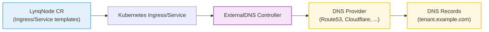
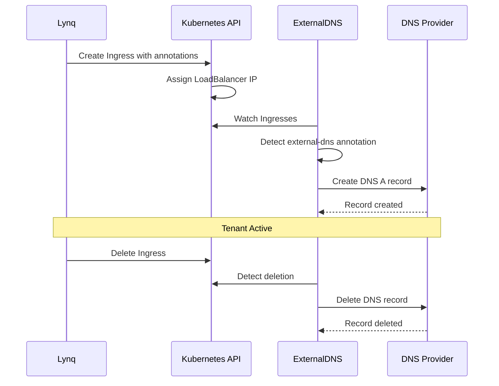

# ExternalDNS Integration Guide

This guide shows how to integrate Lynq with ExternalDNS for automatic DNS record management.

[[toc]]

## Overview

**ExternalDNS** synchronizes exposed Kubernetes Services and Ingresses with DNS providers like AWS Route53, Google Cloud DNS, Cloudflare, and more. When integrated with Lynq, each node's DNS records are automatically created and deleted as nodes are provisioned.



### Use Cases

- **Multi-tenant SaaS**: Automatic subdomain creation per tenant (e.g., `tenant-a.example.com`, `tenant-b.example.com`)
- **Dynamic environments**: DNS records follow tenant lifecycle (created/deleted with tenant)
- **Multiple domains**: Different nodes on different domains or subdomains
- **SSL/TLS automation**: Combined with cert-manager for automatic certificate provisioning

## Prerequisites

::: info Requirements
- Kubernetes cluster v1.11+
- Lynq installed and reconciling
- DNS provider account (AWS Route53, Cloudflare, etc.)
- DNS zone created in your provider
:::

## Installation

### 1. Install ExternalDNS

#### Using Helm (Recommended)

```bash
# Add bitnami repo
helm repo add bitnami https://charts.bitnami.com/bitnami
helm repo update

# Install ExternalDNS for AWS Route53
helm install external-dns bitnami/external-dns \
  --namespace kube-system \
  --set provider=aws \
  --set aws.zoneType=public \
  --set domainFilters[0]=example.com \
  --set policy=upsert-only \
  --set txtOwnerId=my-cluster-id

# Or for Cloudflare
helm install external-dns bitnami/external-dns \
  --namespace kube-system \
  --set provider=cloudflare \
  --set cloudflare.apiToken=<your-api-token> \
  --set domainFilters[0]=example.com
```

#### Using Manifests

For detailed YAML manifests and provider-specific configurations, see:
- [ExternalDNS AWS Setup](https://github.com/kubernetes-sigs/external-dns/blob/master/docs/tutorials/aws.md)
- [ExternalDNS Cloudflare Setup](https://github.com/kubernetes-sigs/external-dns/blob/master/docs/tutorials/cloudflare.md)
- [ExternalDNS GCP Setup](https://github.com/kubernetes-sigs/external-dns/blob/master/docs/tutorials/gcp.md)

### 2. Verify Installation

```bash
# Check ExternalDNS pod
kubectl get pods -n kube-system -l app.kubernetes.io/name=external-dns

# Check logs
kubectl logs -n kube-system -l app.kubernetes.io/name=external-dns
```

## Integration with Lynq

### Basic Example: Ingress with Automatic DNS

**LynqForm with ExternalDNS annotations:**

```yaml
apiVersion: operator.lynq.sh/v1
kind: LynqForm
metadata:
  name: web-app-with-dns
  namespace: default
spec:
  registryId: my-registry

  # Deployment
  deployments:
  - id: app
    nameTemplate: "{{ .uid }}-app"
    spec:
      apiVersion: apps/v1
      kind: Deployment
      spec:
        replicas: 2
        selector:
          matchLabels:
            app: "{{ .uid }}"
        template:
          metadata:
            labels:
              app: "{{ .uid }}"
          spec:
            containers:
            - name: app
              image: nginx:alpine
              ports:
              - containerPort: 80

  # Service
  services:
  - id: app-service
    nameTemplate: "{{ .uid }}-svc"
    spec:
      apiVersion: v1
      kind: Service
      spec:
        selector:
          app: "{{ .uid }}"
        ports:
        - port: 80
          targetPort: 80

  # Ingress with ExternalDNS annotation
  ingresses:
  - id: web-ingress
    nameTemplate: "{{ .uid }}-ingress"
    annotationsTemplate:
      external-dns.alpha.kubernetes.io/hostname: "{{ .host }}"
      external-dns.alpha.kubernetes.io/ttl: "300"
    spec:
      apiVersion: networking.k8s.io/v1
      kind: Ingress
      spec:
        ingressClassName: nginx
        rules:
        - host: "{{ .host }}"
          http:
            paths:
            - path: /
              pathType: Prefix
              backend:
                service:
                  name: "{{ .uid }}-svc"
                  port:
                    number: 80
```

**What happens:**
1. Lynq creates Ingress for each node (e.g., `acme-corp-ingress`)
2. ExternalDNS detects Ingress with `external-dns.alpha.kubernetes.io/hostname` annotation
3. ExternalDNS creates DNS A/AAAA record pointing to Ingress LoadBalancer IP
4. When tenant is deleted, DNS record is automatically removed

**Result:** Each tenant gets automatic DNS:
- `acme-corp.example.com` → 1.2.3.4
- `beta-inc.example.com` → 1.2.3.4

### LoadBalancer Service Example

For LoadBalancer Services (instead of Ingress):

```yaml
services:
- id: lb-service
  nameTemplate: "{{ .uid }}-lb"
  annotationsTemplate:
    external-dns.alpha.kubernetes.io/hostname: "{{ .host }}"
    external-dns.alpha.kubernetes.io/ttl: "300"
  spec:
    apiVersion: v1
    kind: Service
    type: LoadBalancer
    spec:
      selector:
        app: "{{ .uid }}"
      ports:
      - port: 80
        targetPort: 80
```

## How It Works

### Workflow

1. **Tenant Created**: LynqHub creates LynqNode CR from database
2. **Resources Applied**: LynqNode controller creates Ingress/Service with ExternalDNS annotations
3. **IP Assignment**: Kubernetes assigns LoadBalancer IP or Ingress IP
4. **DNS Sync**: ExternalDNS detects annotated resource and creates DNS record
5. **Propagation**: DNS record propagates through provider (seconds to minutes)
6. **Tenant Deleted**: LynqNode resources deleted → ExternalDNS removes DNS record

### DNS Record Lifecycle



## Common Annotations

### Required

| Annotation | Description | Example |
|------------|-------------|---------|
| `external-dns.alpha.kubernetes.io/hostname` | DNS hostname to create | `tenant.example.com` |

### Optional

| Annotation | Description | Default | Example |
|------------|-------------|---------|---------|
| `external-dns.alpha.kubernetes.io/ttl` | DNS TTL in seconds | `300` | `600` |
| `external-dns.alpha.kubernetes.io/target` | Override target IP/CNAME | Auto-detected | `1.2.3.4` |
| `external-dns.alpha.kubernetes.io/alias` | Use DNS alias (AWS Route53) | `false` | `true` |

### Provider-Specific

**AWS Route53:**
```yaml
annotations:
  external-dns.alpha.kubernetes.io/aws-weight: "100"
  external-dns.alpha.kubernetes.io/set-identifier: "primary"
```

**Cloudflare:**
```yaml
annotations:
  external-dns.alpha.kubernetes.io/cloudflare-proxied: "true"
```

## Multi-Domain Example

Support different domains per tenant using template variables:

```yaml
apiVersion: operator.lynq.sh/v1
kind: LynqForm
metadata:
  name: multi-domain-template
spec:
  registryId: my-registry

  ingresses:
  - id: tenant-ingress
    nameTemplate: "{{ .uid }}-ingress"
    annotationsTemplate:
      # Use .host which is auto-extracted from .hostOrUrl
      external-dns.alpha.kubernetes.io/hostname: "{{ .host }}"
    spec:
      apiVersion: networking.k8s.io/v1
      kind: Ingress
      spec:
        ingressClassName: nginx
        rules:
        - host: "{{ .host }}"
          http:
            paths:
            - path: /
              pathType: Prefix
              backend:
                service:
                  name: "{{ .uid }}-svc"
                  port:
                    number: 80
```

**Database rows:**
```sql
tenant_id    tenant_url                     is_active
---------    --------------------------     ---------
acme-corp    https://acme.example.com       1
beta-inc     https://beta.example.io        1
gamma-co     https://custom.domain.net      1
```

**Result:**
- `acme.example.com` → acme-corp tenant
- `beta.example.io` → beta-inc tenant
- `custom.domain.net` → gamma-co tenant

## Troubleshooting

### DNS Records Not Created

**Problem:** DNS records don't appear in provider.

**Solution:**

1. **Check ExternalDNS logs:**
   ```bash
   kubectl logs -n kube-system -l app.kubernetes.io/name=external-dns
   ```

2. **Verify Ingress has IP:**
   ```bash
   kubectl get ingress <lynqnode-ingress> -o jsonpath='{.status.loadBalancer.ingress[0].ip}'
   ```

3. **Check annotation syntax:**
   ```bash
   kubectl get ingress <lynqnode-ingress> -o yaml | grep external-dns
   ```

4. **Verify domain filter:**
   ```bash
   kubectl get deployment external-dns -n kube-system -o yaml | grep domain-filter
   ```

### DNS Records Not Deleted

**Problem:** DNS records remain after tenant deletion.

**Solution:**

1. **Check ExternalDNS policy:**
   - `policy=upsert-only` prevents deletion (change to `policy=sync`)
   - `policy=sync` allows ExternalDNS to delete records

2. **Check TXT records:**
   ```bash
   dig TXT <tenant-domain>
   ```
   TXT records track ownership - if owner doesn't match, record won't be deleted.

### DNS Propagation Delays

**Problem:** DNS changes take too long to propagate.

**Solution:**

1. **Reduce TTL:**
   ```yaml
   annotations:
     external-dns.alpha.kubernetes.io/ttl: "60"  # 1 minute
   ```

2. **Check DNS propagation:**
   ```bash
   dig <tenant-domain> @8.8.8.8
   dig <tenant-domain> @1.1.1.1
   ```

3. **Use DNS checker:**
   - https://dnschecker.org
   - https://www.whatsmydns.net

## Best Practices

### 1. Use Separate Hosted Zones

Use dedicated DNS zones for tenant subdomains:

```bash
# Production nodes
--domain-filter=example.com

# Staging nodes
--domain-filter=staging.example.com
```

### 2. Set Appropriate TTLs

```yaml
annotations:
  external-dns.alpha.kubernetes.io/ttl: "300"  # 5 minutes (good for production)
  # external-dns.alpha.kubernetes.io/ttl: "60"  # 1 minute (good for testing)
```

### 3. Use Policy: upsert-only for Safety

Prevent ExternalDNS from deleting existing records:

```bash
helm install external-dns bitnami/external-dns \
  --set policy=upsert-only
```

### 4. Monitor ExternalDNS Logs

```bash
kubectl logs -n kube-system -l app.kubernetes.io/name=external-dns -f
```

### 5. Combine with cert-manager

Auto-provision SSL certificates with DNS challenge:

```yaml
ingresses:
- id: secure-ingress
  nameTemplate: "{{ .uid }}-ingress"
  annotationsTemplate:
    external-dns.alpha.kubernetes.io/hostname: "{{ .host }}"
    cert-manager.io/cluster-issuer: "letsencrypt-prod"
  spec:
    apiVersion: networking.k8s.io/v1
    kind: Ingress
    spec:
      tls:
      - hosts:
        - "{{ .host }}"
        secretName: "{{ .uid }}-tls"
      rules:
      - host: "{{ .host }}"
        http:
          paths:
          - path: /
            pathType: Prefix
            backend:
              service:
                name: "{{ .uid }}-svc"
                port:
                  number: 80
```

## See Also

- [ExternalDNS Documentation](https://github.com/kubernetes-sigs/external-dns)
- [ExternalDNS Provider List](https://github.com/kubernetes-sigs/external-dns#status-of-providers)
- [Lynq Templates Guide](templates.md)
- [cert-manager Integration](https://cert-manager.io/docs/)
- [Integration with Terraform Operator](integration-terraform-operator.md)
