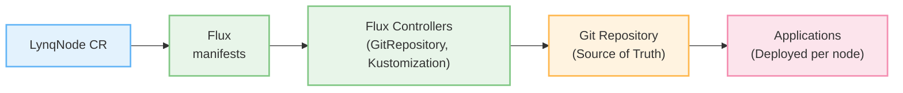
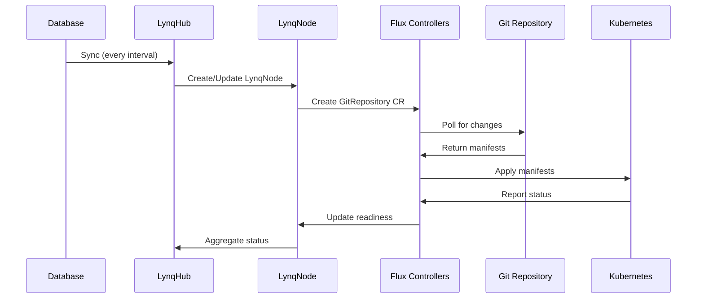

# Flux Integration Guide

::: info Multi-Tenancy Example
This guide uses **Multi-Tenancy** (SaaS application with multiple customers/nodes) as an example, which is the most common use case for Lynq. The pattern shown here can be adapted for any GitOps-driven multi-node deployment scenario.
:::

This guide shows how to integrate Lynq with Flux for GitOps-based application deployment per node.

[[toc]]

## Overview

**Flux** is a GitOps toolkit for Kubernetes that keeps clusters in sync with configuration sources (Git repositories, Helm repositories, OCI artifacts). When integrated with Lynq, each node can automatically deploy and manage its own set of applications and configurations using GitOps principles.



### Key Benefits

**GitOps-Driven Deployment**:
- 🔄 **Single Source of Truth**: All configuration stored in Git
- 🚀 **Automated Sync**: Flux continuously reconciles desired state
- 📜 **Audit Trail**: Git history provides complete deployment history
- 🔒 **Security**: Git-based access control and approval workflows
- ⚡ **Fast Rollback**: Git revert for instant rollback

**Per-Node Isolation**:
- 🎯 **Isolated GitRepository**: Each node can track different branches/paths
- 📦 **Independent Kustomizations**: Node-specific overlays and patches
- 🔐 **Separate Secrets**: Node-specific secret management
- 🎨 **Custom Helm Values**: Per-node Helm chart customization

**Flux Resource Types**:
- **GitRepository**: Track Git repositories as deployment sources
- **OCIRepository**: Use OCI artifacts (container images) as sources
- **HelmRepository**: Track Helm chart repositories
- **HelmRelease**: Deploy Helm charts with custom values
- **Kustomization**: Apply Kustomize overlays and transformations
- **ImageRepository/ImagePolicy**: Automate image updates

### Use Cases

#### Multi-Tenant SaaS Application
- **Separate Git Branches**: Each node deploys from its own branch (e.g., `customers/acme`, `customers/beta`)
- **Kustomize Overlays**: Base configuration + per-node overlays
- **Feature Flags**: Node-specific feature toggles via ConfigMaps
- **Progressive Rollouts**: Deploy to staging nodes first, then production

#### Microservices Architecture
- **Service Mesh per Node**: Istio/Linkerd configurations per node
- **API Gateway**: Node-specific ingress routing
- **Service Discovery**: Consul/Eureka per node
- **Monitoring Stack**: Prometheus + Grafana per node

#### Multi-Region Deployment
- **Region-Specific Configurations**: Different configs per region
- **Compliance Requirements**: GDPR, HIPAA per node
- **Geo-Distributed Applications**: Edge deployments
- **Disaster Recovery**: Multi-region failover configurations

#### Development Environments
- **Developer Sandboxes**: Isolated environments per developer
- **PR Previews**: Ephemeral environments per pull request
- **Testing Environments**: Integration test environments per feature branch

## Prerequisites

::: info Requirements
- Kubernetes cluster v1.20+
- Lynq installed
- Git repository for storing manifests
- Flux CLI v2.0+ (optional, for installation)
:::

## Installation

### 1. Install Flux

Flux provides multiple installation methods. Choose the one that fits your workflow.

#### Installation via Flux CLI (Recommended)

```bash
# Install Flux CLI
curl -s https://fluxcd.io/install.sh | sudo bash

# Bootstrap Flux (creates GitOps repository structure)
flux bootstrap github \
  --owner=myorg \
  --repository=fleet-infra \
  --branch=main \
  --path=clusters/my-cluster \
  --personal

# Or bootstrap with GitLab
flux bootstrap gitlab \
  --owner=myorg \
  --repository=fleet-infra \
  --branch=main \
  --path=clusters/my-cluster \
  --personal
```

#### Installation via Manifests

```bash
# Install Flux controllers directly
kubectl apply -f https://github.com/fluxcd/flux2/releases/latest/download/install.yaml
```

#### Verify Installation

```bash
# Check Flux controllers
kubectl get pods -n flux-system

# Check Flux CRDs
kubectl get crd | grep fluxcd

# Check Flux version
flux --version

# Check cluster status
flux check
```

### 2. Prepare Git Repository

Create a Git repository structure for your node configurations:

```bash
my-fleet/
├── base/                    # Shared base configurations
│   ├── deployment.yaml
│   ├── service.yaml
│   └── kustomization.yaml
├── nodes/                   # Per-node overlays
│   ├── node-alpha/
│   │   ├── kustomization.yaml
│   │   └── patches.yaml
│   ├── node-beta/
│   │   ├── kustomization.yaml
│   │   └── patches.yaml
└── README.md
```

### 3. Create Git Credentials (if private repository)

```bash
# Create Git credentials secret
kubectl create secret generic git-credentials \
  --namespace default \
  --from-literal=username=git \
  --from-literal=password=your-personal-access-token

# Or use SSH key
kubectl create secret generic git-ssh-credentials \
  --namespace default \
  --from-file=identity=/path/to/private-key \
  --from-file=identity.pub=/path/to/public-key \
  --from-literal=known_hosts="$(ssh-keyscan github.com)"
```

## Basic Example: GitOps Deployment per Node

Here's a complete example showing how to deploy applications using GitOps for each node:

```yaml
apiVersion: operator.lynq.sh/v1
kind: LynqForm
metadata:
  name: node-with-gitops
  namespace: default
spec:
  hubId: my-hub

  # Flux GitRepository for source
  manifests:
  - id: git-source
    nameTemplate: "{{ .uid }}-gitrepo"
    spec:
      apiVersion: source.toolkit.fluxcd.io/v1
      kind: GitRepository
      metadata:
        annotations:
          lynq.sh/node-id: "{{ .uid }}"
      spec:
        interval: 1m
        url: https://github.com/myorg/my-fleet
        ref:
          branch: main
        secretRef:
          name: git-credentials  # Optional, for private repos

  # Flux Kustomization for deployment
  - id: kustomization
    nameTemplate: "{{ .uid }}-kustomization"
    dependIds: ["git-source"]
    waitForReady: true
    timeoutSeconds: 600
    spec:
      apiVersion: kustomize.toolkit.fluxcd.io/v1
      kind: Kustomization
      metadata:
        annotations:
          lynq.sh/node-id: "{{ .uid }}"
      spec:
        interval: 5m
        path: "./nodes/{{ .uid }}"  # Node-specific path
        prune: true
        wait: true
        timeout: 5m
        sourceRef:
          kind: GitRepository
          name: "{{ .uid }}-gitrepo"

        # Post-build variable substitution
        postBuild:
          substitute:
            NODE_ID: "{{ .uid }}"
            # Use extraValueMappings for custom variables
            NODE_URL: "{{ index . \"nodeUrl\" }}"
            PLAN_ID: "{{ index . \"planId\" | default \"basic\" }}"

        # Health checks
        healthChecks:
        - apiVersion: apps/v1
          kind: Deployment
          name: "{{ .uid }}-app"
          namespace: default
```

**What happens:**
1. Lynq creates GitRepository CR for each active node
2. Flux syncs from Git repository at specified interval
3. Kustomization applies manifests from node-specific path
4. Variables substituted via `postBuild.substitute`
5. Flux monitors health checks and reports readiness
6. When node is deleted, Flux resources are cleaned up automatically

::: tip More Examples
Additional examples including Helm charts, OCI artifacts, and multi-source deployments are provided throughout this guide below.
:::

## Advanced Examples

### Example 1: Helm Chart Deployment per Node

Deploy Helm charts with per-node custom values:

```yaml
apiVersion: operator.lynq.sh/v1
kind: LynqForm
metadata:
  name: node-with-helm
  namespace: default
spec:
  hubId: my-hub

  # Helm repository source
  manifests:
  - id: helm-repo
    nameTemplate: "{{ .uid }}-helmrepo"
    spec:
      apiVersion: source.toolkit.fluxcd.io/v1beta2
      kind: HelmRepository
      spec:
        interval: 10m
        url: https://charts.bitnami.com/bitnami

  # Helm release with custom values
  - id: helm-release
    nameTemplate: "{{ .uid }}-app-release"
    dependIds: ["helm-repo"]
    waitForReady: true
    timeoutSeconds: 900
    spec:
      apiVersion: helm.toolkit.fluxcd.io/v2beta1
      kind: HelmRelease
      spec:
        interval: 5m
        chart:
          spec:
            chart: postgresql
            version: "12.x.x"
            sourceRef:
              kind: HelmRepository
              name: "{{ .uid }}-helmrepo"

        # Per-node values
        values:
          auth:
            username: "{{ .uid }}"
            database: "{{ .uid }}_db"
          primary:
            persistence:
              size: 10Gi
          metrics:
            enabled: true

        # Override with ConfigMap/Secret
        valuesFrom:
        - kind: ConfigMap
          name: "{{ .uid }}-helm-values"
          optional: true
```

### Example 2: Multi-Source Kustomization

Combine base configuration from one repository with overlays from another:

```yaml
apiVersion: operator.lynq.sh/v1
kind: LynqForm
metadata:
  name: node-multi-source
  namespace: default
spec:
  hubId: my-hub

  manifests:
  # Base configuration source
  - id: base-source
    nameTemplate: "{{ .uid }}-base-gitrepo"
    spec:
      apiVersion: source.toolkit.fluxcd.io/v1
      kind: GitRepository
      spec:
        interval: 5m
        url: https://github.com/myorg/app-base
        ref:
          tag: v1.0.0

  # Node-specific overlays source
  - id: overlay-source
    nameTemplate: "{{ .uid }}-overlay-gitrepo"
    spec:
      apiVersion: source.toolkit.fluxcd.io/v1
      kind: GitRepository
      spec:
        interval: 1m
        url: https://github.com/myorg/node-configs
        ref:
          branch: "nodes/{{ .uid }}"

  # Kustomization combining both sources
  - id: multi-kustomization
    nameTemplate: "{{ .uid }}-multi-kustomization"
    dependIds: ["base-source", "overlay-source"]
    spec:
      apiVersion: kustomize.toolkit.fluxcd.io/v1
      kind: Kustomization
      spec:
        interval: 5m
        path: "./base"
        sourceRef:
          kind: GitRepository
          name: "{{ .uid }}-base-gitrepo"

        # Apply overlays from second source
        patches:
        - patch: |
            apiVersion: apps/v1
            kind: Deployment
            metadata:
              name: app
            spec:
              template:
                metadata:
                  labels:
                    node-id: "{{ .uid }}"
          target:
            kind: Deployment
```

### Example 3: OCI Artifact Deployment

Deploy from OCI registry (container registry as artifact storage):

```yaml
apiVersion: operator.lynq.sh/v1
kind: LynqForm
metadata:
  name: node-with-oci
  namespace: default
spec:
  hubId: my-hub

  manifests:
  - id: oci-source
    nameTemplate: "{{ .uid }}-oci-repo"
    spec:
      apiVersion: source.toolkit.fluxcd.io/v1beta2
      kind: OCIRepository
      spec:
        interval: 5m
        url: oci://ghcr.io/myorg/manifests
        ref:
          tag: latest
        secretRef:
          name: oci-credentials

  - id: oci-kustomization
    nameTemplate: "{{ .uid }}-oci-kustomization"
    dependIds: ["oci-source"]
    spec:
      apiVersion: kustomize.toolkit.fluxcd.io/v1
      kind: Kustomization
      spec:
        interval: 5m
        path: "./deploy"
        sourceRef:
          kind: OCIRepository
          name: "{{ .uid }}-oci-repo"
        postBuild:
          substitute:
            NODE_ID: "{{ .uid }}"
```

### Example 4: Image Automation

Automatically update images when new versions are pushed:

```yaml
apiVersion: operator.lynq.sh/v1
kind: LynqForm
metadata:
  name: node-with-image-automation
  namespace: default
spec:
  hubId: my-hub

  manifests:
  # Git source with write access
  - id: git-source
    nameTemplate: "{{ .uid }}-gitrepo"
    spec:
      apiVersion: source.toolkit.fluxcd.io/v1
      kind: GitRepository
      spec:
        interval: 1m
        url: https://github.com/myorg/my-fleet
        ref:
          branch: "nodes/{{ .uid }}"
        secretRef:
          name: git-write-credentials

  # Image repository to scan
  - id: image-repo
    nameTemplate: "{{ .uid }}-imagerepo"
    spec:
      apiVersion: image.toolkit.fluxcd.io/v1beta2
      kind: ImageRepository
      spec:
        interval: 1m
        image: ghcr.io/myorg/myapp
        secretRef:
          name: registry-credentials

  # Image policy (semver, alphabetical, etc.)
  - id: image-policy
    nameTemplate: "{{ .uid }}-imagepolicy"
    dependIds: ["image-repo"]
    spec:
      apiVersion: image.toolkit.fluxcd.io/v1beta2
      kind: ImagePolicy
      spec:
        imageRepositoryRef:
          name: "{{ .uid }}-imagerepo"
        policy:
          semver:
            range: ">=1.0.0 <2.0.0"

  # Image update automation
  - id: image-update
    nameTemplate: "{{ .uid }}-imageupdate"
    dependIds: ["git-source", "image-policy"]
    spec:
      apiVersion: image.toolkit.fluxcd.io/v1beta1
      kind: ImageUpdateAutomation
      spec:
        interval: 1m
        sourceRef:
          kind: GitRepository
          name: "{{ .uid }}-gitrepo"
        git:
          checkout:
            ref:
              branch: "nodes/{{ .uid }}"
          commit:
            author:
              email: fluxcdbot@users.noreply.github.com
              name: fluxcdbot
            messageTemplate: "[{{ .uid }}] Update image"
        update:
          path: "./deploy"
          strategy: Setters

  # Kustomization to deploy
  - id: kustomization
    nameTemplate: "{{ .uid }}-kustomization"
    dependIds: ["git-source"]
    spec:
      apiVersion: kustomize.toolkit.fluxcd.io/v1
      kind: Kustomization
      spec:
        interval: 5m
        path: "./deploy"
        sourceRef:
          kind: GitRepository
          name: "{{ .uid }}-gitrepo"
```

## How It Works

### Workflow

1. **Node Created**: LynqHub creates LynqNode CR from database
2. **Flux Sources Created**: LynqNode controller creates GitRepository/HelmRepository/OCIRepository CRs
3. **Flux Controllers Process**: Source controllers fetch artifacts, Kustomize/Helm controllers apply
4. **Applications Deployed**: Kubernetes resources created from Git/Helm/OCI sources
5. **Continuous Sync**: Flux polls sources at `interval` and reconciles drift
6. **Health Monitoring**: Flux health checks ensure resources are ready
7. **Node Deleted**: Flux resources deleted (if `deletionPolicy=Delete`)

### Reconciliation Loop



### State Management

- **Git as Source of Truth**: All configuration stored in Git
- **Flux State**: Stored in Kubernetes CRs (GitRepository, Kustomization status)
- **No Local State**: Flux is stateless, can be redeployed without data loss

## Best Practices

### 1. Use Branch-per-Node Strategy

Isolate node configurations in separate branches:

```yaml
spec:
  manifests:
  - id: git-source
    spec:
      apiVersion: source.toolkit.fluxcd.io/v1
      kind: GitRepository
      spec:
        ref:
          branch: "nodes/{{ .uid }}"  # Per-node branch
```

### 2. Implement Progressive Rollouts

Deploy to staging nodes first, then production:

```yaml
# LynqForm for staging nodes
apiVersion: operator.lynq.sh/v1
kind: LynqForm
metadata:
  name: staging-nodes
spec:
  hubId: my-hub
  manifests:
  - id: git-source
    spec:
      apiVersion: source.toolkit.fluxcd.io/v1
      kind: GitRepository
      spec:
        ref:
          branch: staging  # Staging branch

---
# LynqForm for production nodes
apiVersion: operator.lynq.sh/v1
kind: LynqForm
metadata:
  name: production-nodes
spec:
  hubId: my-hub
  manifests:
  - id: git-source
    spec:
      apiVersion: source.toolkit.fluxcd.io/v1
      kind: GitRepository
      spec:
        ref:
          branch: production  # Production branch (stable)
```

### 3. Use Kustomize for Environment-Specific Configuration

Structure your repository with base + overlays:

```
my-fleet/
├── base/
│   ├── deployment.yaml
│   ├── service.yaml
│   └── kustomization.yaml
└── overlays/
    ├── staging/
    │   ├── kustomization.yaml
    │   └── patches.yaml
    └── production/
        ├── kustomization.yaml
        └── patches.yaml
```

### 4. Set Appropriate Sync Intervals

Balance freshness vs. load:

```yaml
spec:
  manifests:
  - id: git-source
    spec:
      apiVersion: source.toolkit.fluxcd.io/v1
      kind: GitRepository
      spec:
        interval: 1m  # Fast sync for development
        # interval: 10m  # Slower sync for production (reduce API calls)
```

### 5. Use Health Checks

Ensure resources are truly ready before marking complete:

```yaml
spec:
  manifests:
  - id: kustomization
    spec:
      apiVersion: kustomize.toolkit.fluxcd.io/v1
      kind: Kustomization
      spec:
        wait: true  # Wait for resources to be ready
        timeout: 5m
        healthChecks:
        - apiVersion: apps/v1
          kind: Deployment
          name: app
          namespace: default
```

### 6. Use Webhook Receivers for Instant Updates

Avoid polling delays with Git webhooks:

```bash
# Install Flux webhook receiver
flux create receiver github-receiver \
  --type github \
  --event ping \
  --event push \
  --secret-ref webhook-token \
  --resource GitRepository/my-gitrepo

# Configure GitHub webhook to POST to receiver URL
```

### 7. Monitor Flux Resources

```bash
# Check Flux sources
kubectl get gitrepositories,helmrepositories,ocirepositories -A

# Check Flux deployments
kubectl get kustomizations,helmreleases -A

# Check specific node's Flux resources
kubectl get gitrepository,kustomization -l lynq.sh/node-id=node-alpha

# View Flux events
flux events --for Kustomization/node-alpha-kustomization

# View Flux logs
flux logs --follow --level=info
```

## Troubleshooting

### GitRepository Sync Fails

**Problem:** Flux fails to sync from Git repository.

**Solution:**

1. **Check GitRepository status:**
   ```bash
   kubectl describe gitrepository node-alpha-gitrepo
   ```

2. **Verify Git credentials:**
   ```bash
   kubectl get secret git-credentials -o yaml
   ```

3. **Test Git connectivity:**
   ```bash
   flux reconcile source git node-alpha-gitrepo --with-source
   ```

4. **Check Flux logs:**
   ```bash
   kubectl logs -n flux-system deploy/source-controller
   ```

### Kustomization Apply Fails

**Problem:** Flux fails to apply manifests from Git.

**Solution:**

1. **Check Kustomization status:**
   ```bash
   kubectl describe kustomization node-alpha-kustomization
   ```

2. **View last applied revision:**
   ```bash
   flux get kustomizations node-alpha-kustomization
   ```

3. **Manually reconcile:**
   ```bash
   flux reconcile kustomization node-alpha-kustomization --with-source
   ```

4. **Check for invalid manifests:**
   ```bash
   # Clone repo and validate
   kustomize build ./path/to/manifests
   ```

### Health Check Timeout

**Problem:** Kustomization fails with health check timeout.

**Solution:**

1. **Check resource status directly:**
   ```bash
   kubectl get deployment node-alpha-app -o wide
   kubectl describe deployment node-alpha-app
   ```

2. **Increase timeout:**
   ```yaml
   spec:
     timeout: 10m  # Increase from 5m
   ```

3. **Disable wait for troubleshooting:**
   ```yaml
   spec:
     wait: false  # Temporarily disable
   ```

### Suspended Flux Resources

**Problem:** Flux resources are suspended and not reconciling.

**Solution:**

```bash
# Check if suspended
flux get sources git
flux get kustomizations

# Resume reconciliation
flux resume source git node-alpha-gitrepo
flux resume kustomization node-alpha-kustomization
```

### Post-Build Substitution Fails

**Problem:** Variables not substituted in manifests.

**Solution:**

1. **Check variable syntax in manifests:**
   ```yaml
   # Correct syntax
   value: ${NODE_ID}

   # NOT this
   value: {{ .NODE_ID }}
   ```

2. **Verify substitution config:**
   ```yaml
   spec:
     postBuild:
       substitute:
         NODE_ID: "node-alpha"
       substituteFrom:  # Optional: Load from ConfigMap/Secret
       - kind: ConfigMap
         name: cluster-vars
   ```

3. **Check Kustomization logs:**
   ```bash
   kubectl logs -n flux-system deploy/kustomize-controller | grep node-alpha
   ```

## Integration with Other Tools

### Sealed Secrets

Encrypt secrets before committing to Git:

```yaml
apiVersion: operator.lynq.sh/v1
kind: LynqForm
metadata:
  name: node-with-sealed-secrets
spec:
  hubId: my-hub
  manifests:
  - id: git-source
    nameTemplate: "{{ .uid }}-gitrepo"
    spec:
      apiVersion: source.toolkit.fluxcd.io/v1
      kind: GitRepository
      spec:
        url: https://github.com/myorg/my-fleet
        ref:
          branch: main

  - id: kustomization
    nameTemplate: "{{ .uid }}-kustomization"
    dependIds: ["git-source"]
    spec:
      apiVersion: kustomize.toolkit.fluxcd.io/v1
      kind: Kustomization
      spec:
        path: "./nodes/{{ .uid }}"
        sourceRef:
          kind: GitRepository
          name: "{{ .uid }}-gitrepo"

        # Decrypt SealedSecrets
        decryption:
          provider: sops
          secretRef:
            name: sops-gpg
```

### External Secrets Operator

Sync secrets from external vaults:

```yaml
# In your Git repository
apiVersion: external-secrets.io/v1beta1
kind: ExternalSecret
metadata:
  name: ${NODE_ID}-db-credentials
spec:
  refreshInterval: 1h
  secretStoreRef:
    name: vault-backend
    kind: SecretStore
  target:
    name: ${NODE_ID}-db-credentials
  data:
  - secretKey: password
    remoteRef:
      key: nodes/${NODE_ID}/db-password
```

### Prometheus Monitoring

Monitor Flux resources with Prometheus:

```bash
# Flux exports metrics on :8080/metrics
kubectl port-forward -n flux-system deploy/source-controller 8080:8080

# Sample metrics
gotk_reconcile_duration_seconds_bucket
gotk_reconcile_condition{type="Ready",status="True"}
```

## Performance Considerations

### Optimize Git Repository Structure

- **Use shallow clones**: Flux automatically uses shallow clones
- **Split large repositories**: Use multiple GitRepository CRs for large monorepos
- **Use sparse checkout** (Flux v2.2+): Only clone specific paths

### Reduce API Load

- **Increase sync intervals** for stable environments
- **Use webhook receivers** instead of polling
- **Enable persistent storage** for source-controller cache:
  ```yaml
  source-controller:
    persistence:
      enabled: true
      size: 10Gi
  ```

### Scale Flux Controllers

```yaml
# Increase controller replicas (requires leader election)
kustomize-controller:
  replicas: 2
  resources:
    requests:
      cpu: 200m
      memory: 256Mi
    limits:
      cpu: 1000m
      memory: 1Gi
```

## See Also

- [Flux Documentation](https://fluxcd.io/docs/)
- [Flux GitOps Toolkit](https://toolkit.fluxcd.io/)
- [Kustomize Documentation](https://kustomize.io/)
- [Helm Documentation](https://helm.sh/docs/)
- [Lynq Templates Guide](templates.md)
- [ExternalDNS Integration](integration-external-dns.md)
