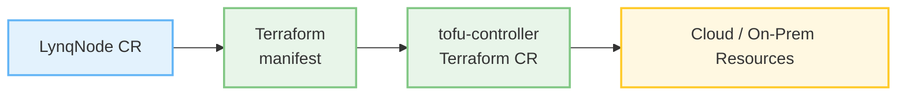

# Terraform Operator Integration Guide

::: info Multi-Tenancy Example
This guide uses **Multi-Tenancy** (SaaS application with multiple customers/nodes) as an example, which is the most common use case for Lynq. The pattern shown here can be adapted for any database-driven infrastructure automation scenario.
:::

This guide shows how to integrate Lynq with Terraform Operator for provisioning external cloud resources (AWS, GCP, Azure) per node.

[[toc]]

## Overview

**Terraform Operator** allows you to manage Terraform resources as Kubernetes Custom Resources. When integrated with Lynq, each node can automatically provision **any infrastructure resource** that Terraform supports - from cloud services to on-premises systems.



### Key Benefits

**Universal Resource Provisioning**: Terraform supports 3,000+ providers, enabling you to provision virtually any infrastructure:
- ☁️ **Cloud Resources**: AWS, GCP, Azure, DigitalOcean, Alibaba Cloud
- 📦 **Databases**: PostgreSQL, MySQL, MongoDB, Cassandra, DynamoDB
- 📬 **Messaging Systems**: Kafka, RabbitMQ, Pulsar, ActiveMQ, AWS SQS/SNS
- 🔍 **Search & Analytics**: Elasticsearch, OpenSearch, Splunk
- 🗄️ **Caching**: Redis, Memcached, AWS ElastiCache
- 🌐 **DNS & CDN**: Route53, Cloudflare, Akamai, Fastly
- 🔐 **Security**: Vault, Auth0, Keycloak, AWS IAM
- 📊 **Monitoring**: Datadog, New Relic, PagerDuty
- 🏢 **On-Premises**: VMware vSphere, Proxmox, Bare Metal

**Automatic Lifecycle Management**:
- ✅ **Provisioning**: Resources created when node is activated (`activate=1`)
- 🔄 **Drift Detection**: Terraform ensures desired state matches actual state
- 🗑️ **Cleanup**: Resources automatically destroyed when node is deleted
- 📦 **Consistent State**: All node infrastructure managed declaratively

### Use Cases

#### Cloud Services (AWS, GCP, Azure)
- **S3/GCS/Blob Storage**: Isolated storage per node
- **RDS/Cloud SQL**: Dedicated databases per node
- **CloudFront/Cloud CDN**: Node-specific CDN distributions
- **IAM Roles/Policies**: Node-specific access control
- **VPCs/Subnets**: Network isolation
- **ElastiCache/Memorystore**: Per-node caching layers
- **Lambda/Cloud Functions**: Serverless functions per node

#### Messaging & Streaming
- **Kafka Topics**: Dedicated topics and ACLs per node
- **RabbitMQ VHosts**: Virtual hosts and users per node
- **AWS SQS/SNS**: Queue and topic isolation
- **Pulsar Namespaces**: Node-isolated messaging
- **NATS Accounts**: Multi-node streaming

#### Databases (Self-Managed & Managed)
- **PostgreSQL Schemas**: Isolated schemas in shared cluster
- **MongoDB Databases**: Dedicated databases with authentication
- **Redis Databases**: Separate database indexes per node
- **Elasticsearch Indices**: Node-specific indices with ILM policies
- **InfluxDB Organizations**: Time-series data isolation

#### On-Premises & Hybrid
- **VMware VMs**: Provision VMs per node
- **Proxmox Containers**: Lightweight node isolation
- **F5 Load Balancer**: Per-node virtual servers
- **NetBox IPAM**: IP address allocation per node

## Prerequisites

::: info Requirements
- Kubernetes cluster v1.16+
- Lynq installed
- Cloud provider account (AWS, GCP, or Azure)
- Terraform ≥ 1.0
- Cloud provider credentials (stored as Secrets)
:::

## Installation

### 1. Install Tofu Controller

We'll use **tofu-controller** (formerly tf-controller), which is the production-ready Flux controller for managing Terraform/OpenTofu resources.

::: info Project evolution
The original Weave tf-controller has evolved into tofu-controller, now maintained by the Flux community: https://github.com/flux-iac/tofu-controller
:::

#### Installation via Helm (Recommended)

```bash
# Install Flux (required)
flux install

# Add tofu-controller Helm repository
helm repo add tofu-controller https://flux-iac.github.io/tofu-controller
helm repo update

# Install tofu-controller
helm install tofu-controller tofu-controller/tofu-controller \
  --namespace flux-system \
  --create-namespace
```

#### Installation via Manifests

```bash
# Install Flux
flux install

# Install tofu-controller CRDs and controller
kubectl apply -f https://raw.githubusercontent.com/flux-iac/tofu-controller/main/config/crd/bases/infra.contrib.fluxcd.io_terraforms.yaml
kubectl apply -f https://raw.githubusercontent.com/flux-iac/tofu-controller/main/config/rbac/role.yaml
kubectl apply -f https://raw.githubusercontent.com/flux-iac/tofu-controller/main/config/rbac/role_binding.yaml
kubectl apply -f https://raw.githubusercontent.com/flux-iac/tofu-controller/main/config/manager/deployment.yaml
```

#### Verify Installation

```bash
# Check tofu-controller pod
kubectl get pods -n flux-system -l app=tofu-controller

# Check CRD
kubectl get crd terraforms.infra.contrib.fluxcd.io

# Check controller logs
kubectl logs -n flux-system -l app=tofu-controller
```

### 2. Create Cloud Provider Credentials

#### AWS Credentials

```bash
# Create AWS credentials secret
kubectl create secret generic aws-credentials \
  --namespace default \
  --from-literal=AWS_ACCESS_KEY_ID=your-access-key \
  --from-literal=AWS_SECRET_ACCESS_KEY=your-secret-key \
  --from-literal=AWS_DEFAULT_REGION=us-east-1
```

#### GCP Credentials

```bash
# Create GCP service account key secret
kubectl create secret generic gcp-credentials \
  --namespace default \
  --from-file=credentials.json=path/to/your-service-account-key.json
```

#### Azure Credentials

```bash
# Create Azure credentials secret
kubectl create secret generic azure-credentials \
  --namespace default \
  --from-literal=ARM_CLIENT_ID=your-client-id \
  --from-literal=ARM_CLIENT_SECRET=your-client-secret \
  --from-literal=ARM_TENANT_ID=your-tenant-id \
  --from-literal=ARM_SUBSCRIPTION_ID=your-subscription-id
```

## Basic Example: S3 Bucket per Node

Here's a complete example showing how to provision an S3 bucket for each node:

```yaml
apiVersion: operator.lynq.sh/v1
kind: LynqForm
metadata:
  name: node-with-s3
  namespace: default
spec:
  hubId: my-hub

  # Terraform resource for S3 bucket
  manifests:
  - id: s3-bucket
    nameTemplate: "{{ .uid }}-s3"
    spec:
      apiVersion: infra.contrib.fluxcd.io/v1alpha2
      kind: Terraform
      metadata:
        annotations:
          lynq.lynq.sh/node-id: "{{ .uid }}"
      spec:
        interval: 5m
        retryInterval: 30s

        # Inline Terraform HCL
        values:
          hcl: |
            terraform {
              required_providers {
                aws = {
                  source  = "hashicorp/aws"
                  version = "~> 5.0"
                }
              }
              backend "kubernetes" {
                secret_suffix = "{{ .uid }}-s3"
                namespace     = "default"
              }
            }

            provider "aws" {
              region = var.aws_region
            }

            variable "node_id" { type = string }
            variable "aws_region" { type = string default = "us-east-1" }

            resource "aws_s3_bucket" "node_bucket" {
              bucket = "node-${var.node_id}-bucket"
              tags = {
                NodeId = var.node_id
                ManagedBy = "lynq"
              }
            }

            output "bucket_name" { value = aws_s3_bucket.node_bucket.id }
            output "bucket_arn" { value = aws_s3_bucket.node_bucket.arn }

        # Variables passed to Terraform
        vars:
        - name: node_id
          value: "{{ .uid }}"
        - name: aws_region
          value: "us-east-1"

        # Use AWS credentials from secret
        varsFrom:
        - kind: Secret
          name: aws-credentials

        # Write Terraform outputs to Secret
        writeOutputsToSecret:
          name: "{{ .uid }}-s3-outputs"

  # Application using S3 bucket
  deployments:
  - id: app-deploy
    nameTemplate: "{{ .uid }}-app"
    dependIds: ["s3-bucket"]
    waitForReady: true
    timeoutSeconds: 600  # Wait up to 10 minutes for Terraform
    spec:
      apiVersion: apps/v1
      kind: Deployment
      spec:
        replicas: 1
        selector:
          matchLabels:
            app: "{{ .uid }}"
        template:
          metadata:
            labels:
              app: "{{ .uid }}"
          spec:
            containers:
            - name: app
              image: mycompany/app:latest
              env:
              - name: NODE_ID
                value: "{{ .uid }}"
              # S3 bucket name from Terraform output
              - name: S3_BUCKET_NAME
                valueFrom:
                  secretKeyRef:
                    name: "{{ .uid }}-s3-outputs"
                    key: bucket_name
              envFrom:
              - secretRef:
                  name: aws-credentials
```

**What happens:**
1. Lynq creates Terraform CR for each active node
2. Tofu controller runs `terraform apply` to provision S3 bucket
3. Outputs (bucket name, ARN) written to Secret
4. Application Deployment references outputs via Secret
5. When node is deleted, `terraform destroy` runs automatically

::: tip More Examples
Additional examples including RDS databases, CloudFront CDN, Kafka topics, RabbitMQ, and Redis are provided throughout this guide below.
:::

## How It Works

### Workflow

1. **Node Created**: LynqHub creates LynqNode CR from database
2. **Terraform Applied**: LynqNode controller creates Terraform CR
3. **tf-controller Processes**: Runs terraform init/plan/apply
4. **Resources Provisioned**: Cloud resources created (S3, RDS, etc.)
5. **Outputs Saved**: Terraform outputs written to Kubernetes Secret
6. **App Deployed**: Application uses infrastructure via Secret references
7. **Node Deleted**: Terraform runs destroy (if deletionPolicy=Delete)

### State Management

Terraform state is stored in Kubernetes Secrets by default:

```
Secret: tfstate-default-{node-id}-{resource-name}
Namespace: default
Data: tfstate (gzipped)
```

## Best Practices

### 1. Use CreationPolicy: Once for Immutable Infrastructure

```yaml
manifests:
- id: rds-database
  creationPolicy: Once  # Create once, never update
  deletionPolicy: Retain  # Keep on node deletion
```

### 2. Set Appropriate Timeouts

Terraform provisioning can take 10-30 minutes:

```yaml
deployments:
- id: app
  dependIds: ["terraform-resources"]
  timeoutSeconds: 1800  # 30 minutes
```

### 3. Use Remote State Backend (Production)

For production, use S3 backend instead of Kubernetes:

```hcl
terraform {
  backend "s3" {
    bucket = "my-terraform-state"
    key    = "nodes/${var.node_id}/terraform.tfstate"
    region = "us-east-1"
    encrypt = true
    dynamodb_table = "terraform-locks"
  }
}
```

### 4. Secure Sensitive Outputs

Mark sensitive outputs:

```hcl
output "db_password" {
  value     = random_password.db_password.result
  sensitive = true
}
```

### 5. Use Dependency Ordering

Ensure proper resource creation order:

```yaml
deployments:
- id: app
  dependIds: ["node-infrastructure"]  # Wait for Terraform
  waitForReady: true
```

### 6. Monitor Terraform Resources

```bash
# Check Terraform resources
kubectl get terraform -n default

# Check specific node's Terraform
kubectl get terraform -n default -l lynq.lynq.sh/node-id=node-alpha

# View Terraform plan
kubectl describe terraform node-alpha-infrastructure

# View Terraform outputs
kubectl get secret node-alpha-infrastructure -o yaml
```

## Troubleshooting

### Terraform Apply Fails

**Problem:** Terraform fails to apply resources.

**Solution:**

1. **Check Terraform logs:**
   ```bash
   kubectl logs -n flux-system -l app=tf-controller
   ```

2. **Check Terraform CR status:**
   ```bash
   kubectl describe terraform node-alpha-infrastructure
   ```

3. **View Terraform plan output:**
   ```bash
   kubectl get terraform node-alpha-infrastructure -o jsonpath='{.status.plan.pending}'
   ```

4. **Check credentials:**
   ```bash
   kubectl get secret aws-credentials -o yaml
   ```

### State Lock Issues

**Problem:** Terraform state locked.

**Solution:**

```bash
# Force unlock (use with caution!)
# This requires accessing the Terraform pod
kubectl exec -it -n flux-system tf-controller-xxx -- sh
terraform force-unlock <lock-id>
```

### Outputs Not Available

**Problem:** Terraform outputs not written to secret.

**Solution:**

1. **Verify writeOutputsToSecret is set:**
   ```yaml
   writeOutputsToSecret:
     name: "{{ .uid }}-outputs"
   ```

2. **Check if Terraform apply completed:**
   ```bash
   kubectl get terraform node-alpha-infra -o jsonpath='{.status.conditions[?(@.type=="Ready")].status}'
   ```

3. **Check secret exists:**
   ```bash
   kubectl get secret node-alpha-outputs
   ```

### Resource Already Exists

**Problem:** Terraform fails because resource already exists.

**Solution:**

Use `terraform import` or recreate with different name:

```hcl
resource "aws_s3_bucket" "node_bucket" {
  bucket = "node-${var.node_id}-bucket-v2"  # Add suffix
}
```

## Cost Optimization

### 1. Use Appropriate Instance Sizes

```hcl
variable "db_instance_class" {
  type = string
  default = "db.t3.micro"  # ~$15/month
}
```

### 2. Enable Auto-Scaling

```hcl
resource "aws_appautoscaling_target" "rds_target" {
  max_capacity       = 10
  min_capacity       = 1
  resource_id        = "cluster:${aws_rds_cluster.node_db.cluster_identifier}"
  scalable_dimension = "rds:cluster:ReadReplicaCount"
  service_namespace  = "rds"
}
```

### 3. Use Lifecycle Policies

```hcl
resource "aws_s3_bucket_lifecycle_configuration" "node_bucket_lifecycle" {
  bucket = aws_s3_bucket.node_bucket.id

  rule {
    id     = "archive-old-data"
    status = "Enabled"

    transition {
      days          = 90
      storage_class = "GLACIER"
    }

    expiration {
      days = 365
    }
  }
}
```

## See Also

- [Tofu Controller (OpenTofu/Terraform)](https://github.com/flux-iac/tofu-controller)
- [Flux Documentation](https://fluxcd.io/docs/)
- [Terraform Registry - All Providers](https://registry.terraform.io/browse/providers)
- [ExternalDNS Integration](integration-external-dns.md)
- [Lynq Templates Guide](templates.md)
