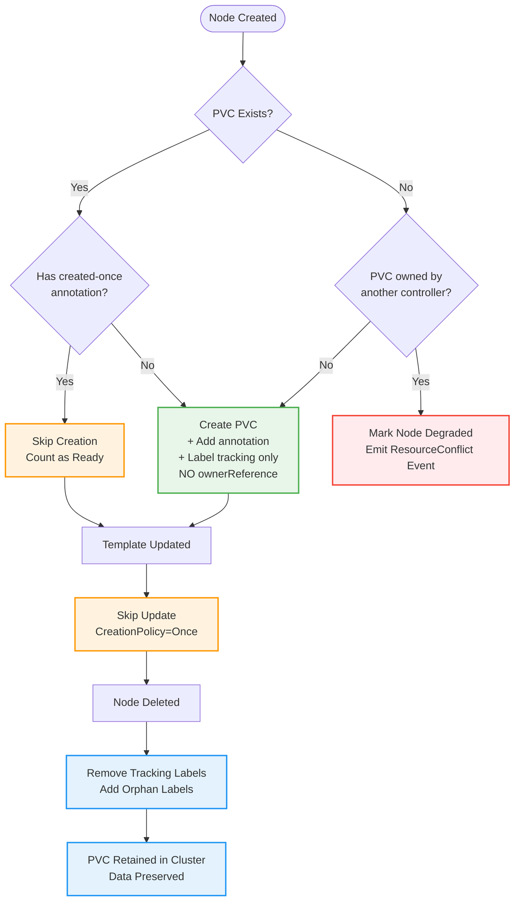
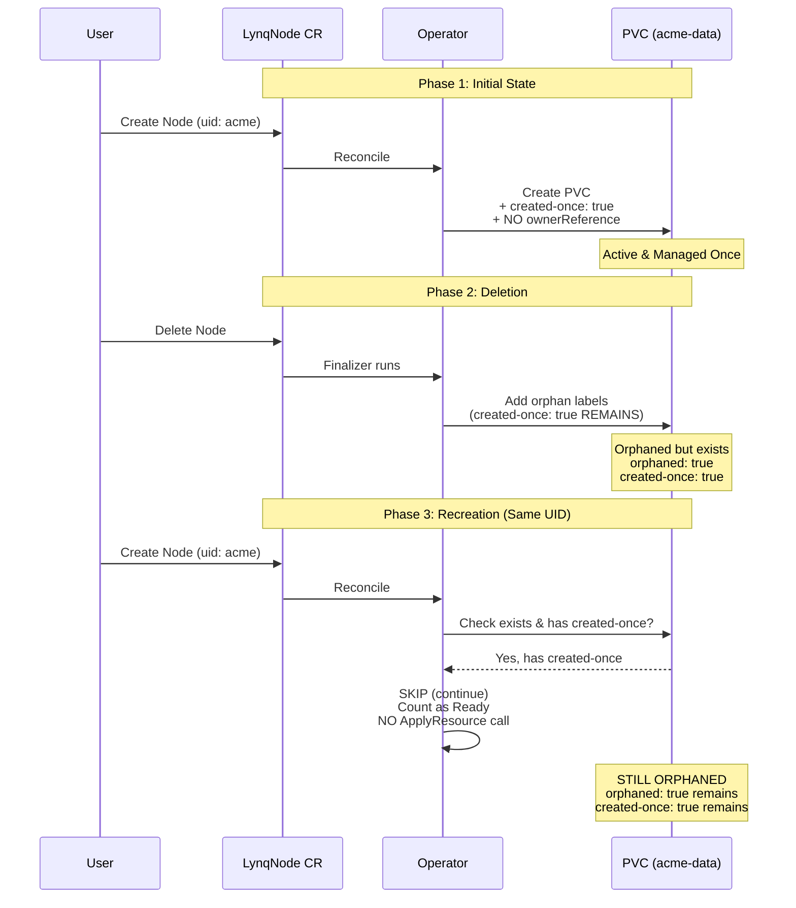
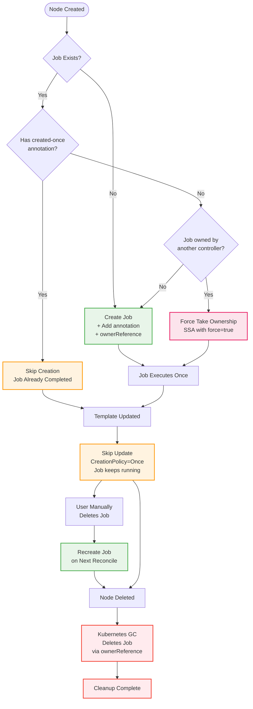
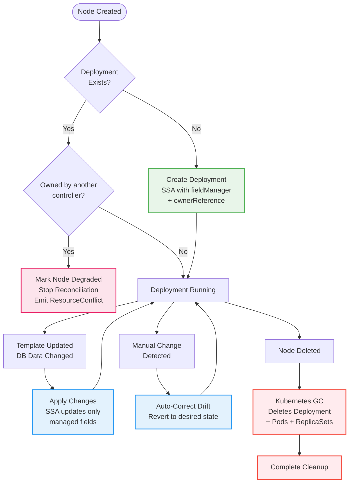
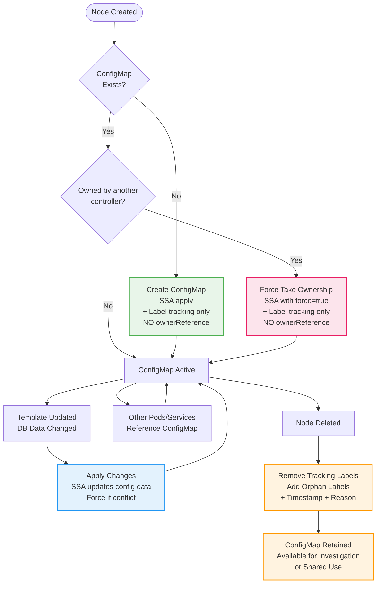
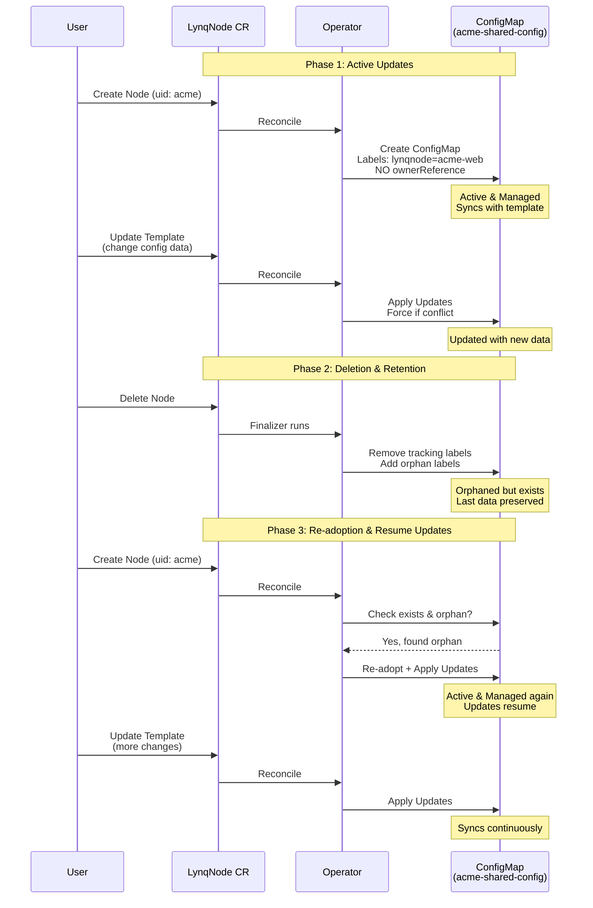
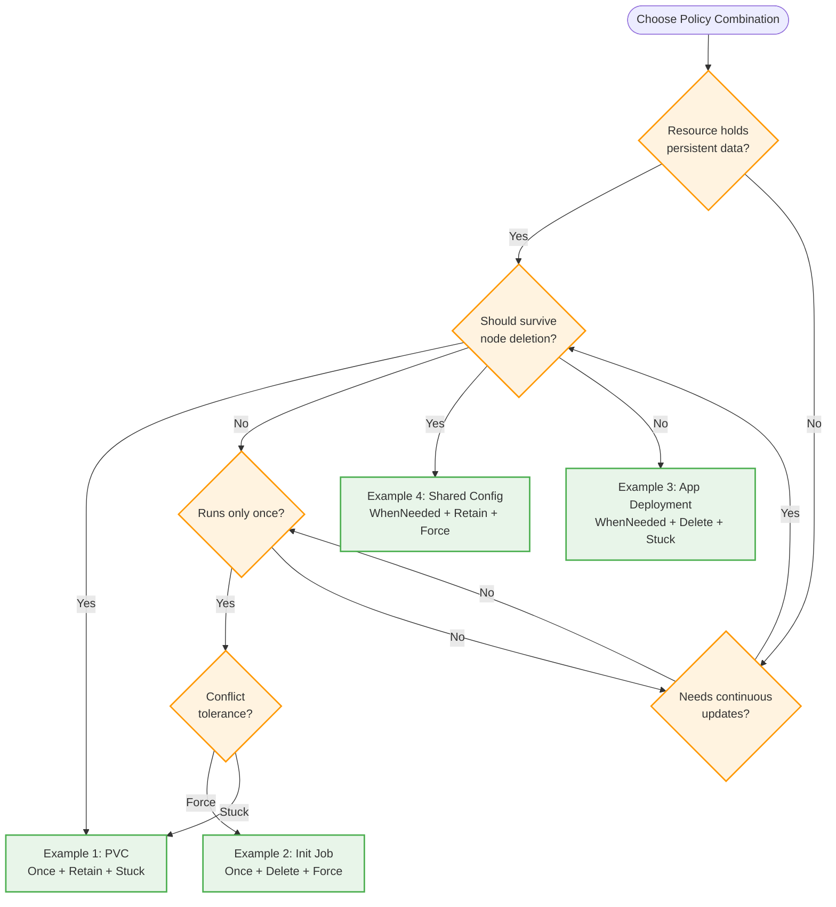

# Policy Combinations - Practical Examples

Real-world examples showing how to combine CreationPolicy, DeletionPolicy, ConflictPolicy, and PatchStrategy for different resource types.

[[toc]]

::: tip Core Concepts First
If you're new to policies, start with the [Policies Guide](policies.md) to understand each policy type before diving into these examples.
:::

## Overview

This guide demonstrates how policies work together through four common scenarios:

| Example | Use Case | Key Pattern | Policies |
|---------|----------|-------------|----------|
| [Example 1](#example-1-stateful-data-pvc) | Persistent Data | Immutable + Retained | `Once + Retain + Stuck` |
| [Example 2](#example-2-init-job) | One-time Setup | Run Once + Cleanup | `Once + Delete + Force` |
| [Example 3](#example-3-application-deployment) | Main Application | Sync + Cleanup | `WhenNeeded + Delete + Stuck` |
| [Example 4](#example-4-shared-infrastructure) | Shared Config | Sync + Retained | `WhenNeeded + Retain + Force` |

## Example 1: Stateful Data (PVC)

**Use Case:** Persistent storage that must survive node lifecycle changes and never lose data.

### Configuration

```yaml
persistentVolumeClaims:
  - id: data
    creationPolicy: Once        # Create only once
    deletionPolicy: Retain      # Keep data after tenant deletion
    conflictPolicy: Stuck       # Don't overwrite existing PVCs
    patchStrategy: apply        # Standard SSA
    nameTemplate: "{{ .uid }}-data"
    spec:
      apiVersion: v1
      kind: PersistentVolumeClaim
      spec:
        accessModes: ["ReadWriteOnce"]
        resources:
          requests:
            storage: 10Gi
```

### Lifecycle Flow



### Rationale

- **`Once`**: PVC spec shouldn't change (size immutable in many storage classes)
- **`Retain`**: Data survives node deletion - **NO ownerReference** set to prevent automatic deletion
- **`Stuck`**: Safety - don't overwrite someone else's PVC on initial creation
- **`apply`**: Standard SSA for declarative management

### Key Behaviors

- ✅ Created once, never updated (even if template changes)
- ✅ Survives node deletion (label-based tracking)
- ✅ Safe conflict detection on initial creation
- 📊 Data persists indefinitely
- ⚠️ **Important**: Once `created-once` annotation is set, `ApplyResource` is never called again

### Delete and Recreate Scenario

::: warning CreationPolicy=Once Limitation
With `CreationPolicy: Once`, the operator **SKIPS** resources that have the `created-once` annotation. This means on Node recreation:
- **NO re-adoption** occurs
- **Orphan markers remain** on the resource
- **NO conflict detection** (ApplyResource is not called)
- Resource is **counted as Ready** but not actively managed
:::

**Scenario Timeline:**



**Manual Recovery:**

```bash
# Remove the created-once annotation to allow re-adoption
kubectl annotate pvc acme-data lynq.sh/created-once-

# Next reconciliation will call ApplyResource and remove orphan markers
```

---

## Example 2: Init Job

**Use Case:** One-time initialization task that runs once per node and cleans up after node deletion.

### Configuration

```yaml
jobs:
  - id: init
    creationPolicy: Once        # Run only once
    deletionPolicy: Delete      # Clean up after tenant deletion
    conflictPolicy: Force       # Re-create if needed
    patchStrategy: replace      # Exact job spec
    nameTemplate: "{{ .uid }}-init"
    spec:
      apiVersion: batch/v1
      kind: Job
      spec:
        template:
          spec:
            containers:
            - name: init
              image: busybox
              command: ["sh", "-c", "echo Initializing {{ .uid }}"]
            restartPolicy: Never
```

### Lifecycle Flow



### Rationale

- **`Once`**: Initialization runs only once - even if template changes, job won't re-run
- **`Delete`**: No need to keep job history after node deletion
- **`Force`**: Operator owns this resource exclusively - takes ownership if conflict
- **`replace`**: Ensures exact job spec match

### Key Behaviors

- ✅ Runs once per node lifetime
- ✅ Automatically cleaned up on node deletion
- ✅ Force takes ownership from conflicts
- 🔄 Re-creates if manually deleted (but still runs only once due to created-once annotation)

---

## Example 3: Application Deployment

**Use Case:** Main application that should stay synchronized with template changes and clean up completely on deletion.

### Configuration

```yaml
deployments:
  - id: app
    creationPolicy: WhenNeeded  # Keep updated
    deletionPolicy: Delete      # Clean up on deletion
    conflictPolicy: Stuck       # Safe default
    patchStrategy: apply        # Kubernetes best practice
    nameTemplate: "{{ .uid }}-app"
    spec:
      apiVersion: apps/v1
      kind: Deployment
      spec:
        replicas: 2
        selector:
          matchLabels:
            app: "{{ .uid }}"
        template:
          metadata:
            labels:
              app: "{{ .uid }}"
          spec:
            containers:
            - name: app
              image: "nginx:latest"
```

### Lifecycle Flow



### Rationale

- **`WhenNeeded`**: Always keep deployment in sync with template and database
- **`Delete`**: Standard cleanup via ownerReference
- **`Stuck`**: Safe default - investigate conflicts rather than force override
- **`apply`**: SSA best practice - preserves fields from other controllers (e.g., HPA)

### Key Behaviors

- ✅ Continuously synchronized with template
- ✅ Auto-corrects manual drift
- ✅ Plays well with other controllers (HPA, VPA)
- ✅ Complete cleanup on deletion
- ⚠️ Stops on conflicts for safety

---

## Example 4: Shared Infrastructure

**Use Case:** Configuration data that should stay updated but survive node deletion for debugging or shared resource references.

### Configuration

```yaml
configMaps:
  - id: shared-config
    creationPolicy: WhenNeeded  # Maintain config
    deletionPolicy: Retain      # Keep config for investigation
    conflictPolicy: Force       # Operator manages configs
    patchStrategy: apply        # SSA
    nameTemplate: "{{ .uid }}-shared-config"
    spec:
      apiVersion: v1
      kind: ConfigMap
      data:
        config.json: |
          {
            "tenantId": "{{ .uid }}",
            "environment": "production",
            "version": "1.0"
          }
```

### Lifecycle Flow



### Rationale

- **`WhenNeeded`**: Keep configmap data updated as template/database changes
- **`Retain`**: ConfigMap might be referenced by other resources or needed for debugging - **NO ownerReference** to prevent deletion
- **`Force`**: Operator is authoritative for this config - takes ownership if conflict exists
- **`apply`**: SSA for declarative configuration management

### Key Behaviors

- ✅ Continuously synchronized with changes
- ✅ Force takes ownership from conflicts
- ✅ Survives node deletion (label-based tracking)
- 📊 Available for investigation post-deletion
- 🔗 Can be referenced by non-node resources

### Delete and Recreate with WhenNeeded

Unlike Example 1 (PVC with `Once`), resources with `WhenNeeded` automatically re-adopt on recreation:



**Key Differences from Example 1:**

| Aspect | Example 1 (PVC)<br/>Once + Retain | Example 4 (ConfigMap)<br/>WhenNeeded + Retain |
|--------|-----------------------------------|-----------------------------------------------|
| **Updates** | 🚫 Never (frozen after creation) | ✅ Always (syncs with template) |
| **Retention** | ✅ Yes (orphaned on delete) | ✅ Yes (orphaned on delete) |
| **Re-adoption** | ❌ No (skipped due to created-once) | ✅ Yes (automatic on recreate) |
| **Force Ownership** | ❌ No (Stuck policy) | ✅ Yes (Force policy) |

---

## Policy Combinations Summary

Quick reference comparing all four examples:

| Aspect | PVC (Stateful) | Init Job | App Deployment | Shared Config |
|--------|----------------|----------|----------------|---------------|
| **CreationPolicy** | `Once` | `Once` | `WhenNeeded` | `WhenNeeded` |
| **DeletionPolicy** | `Retain` | `Delete` | `Delete` | `Retain` |
| **ConflictPolicy** | `Stuck` | `Force` | `Stuck` | `Force` |
| **PatchStrategy** | `apply` | `replace` | `apply` | `apply` |
| **ownerReference** | ❌ No | ✅ Yes | ✅ Yes | ❌ No |
| **Updates** | 🚫 Never | 🚫 Never | ✅ Always | ✅ Always |
| **Survives Deletion** | ✅ Yes | ❌ No | ❌ No | ✅ Yes |
| **Auto-Cleanup** | ❌ Manual | ✅ Auto (GC) | ✅ Auto (GC) | ❌ Manual |
| **Drift Correction** | N/A (Once) | N/A (Once) | ✅ Yes | ✅ Yes |
| **Conflict Handling** | ⚠️ Stop | 💪 Force | ⚠️ Stop | 💪 Force |

**Legend:**
- ✅ Enabled / Yes
- ❌ Disabled / No
- 🚫 Never updates
- ⚠️ Safe mode (stops on conflict)
- 💪 Aggressive (forces ownership)
- N/A: Not applicable

## Decision Tree

Choose the right policy combination for your use case:



## See Also

- [Policies Guide](policies.md) - Core concepts and policy types
- [Field-Level Ignore Control](field-ignore.md) - Fine-grained field management
- [Dependencies Guide](dependencies.md) - Resource ordering
- [Troubleshooting](troubleshooting.md) - Common policy issues
