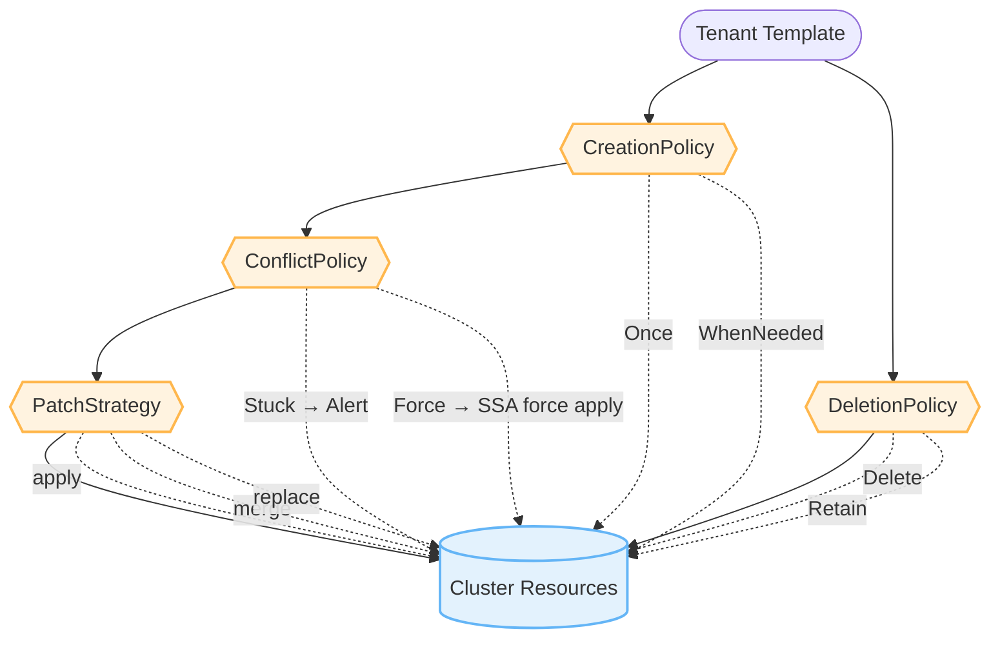
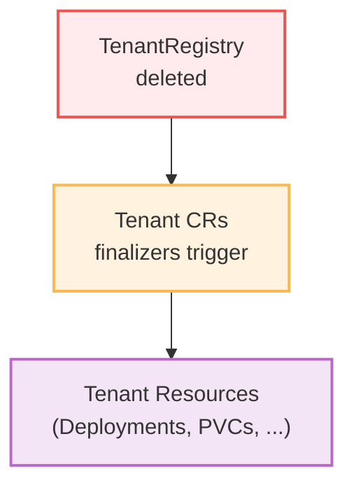
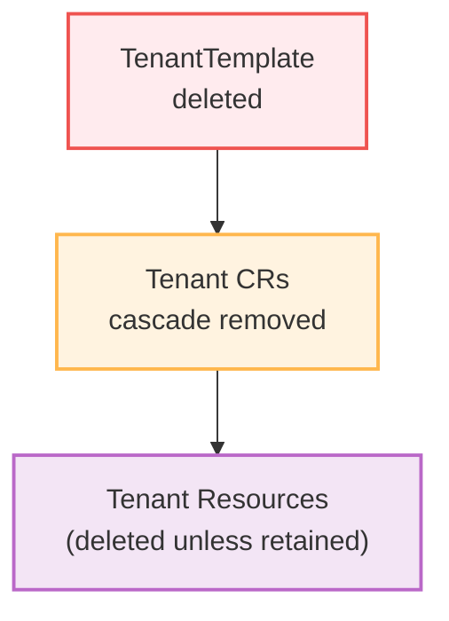
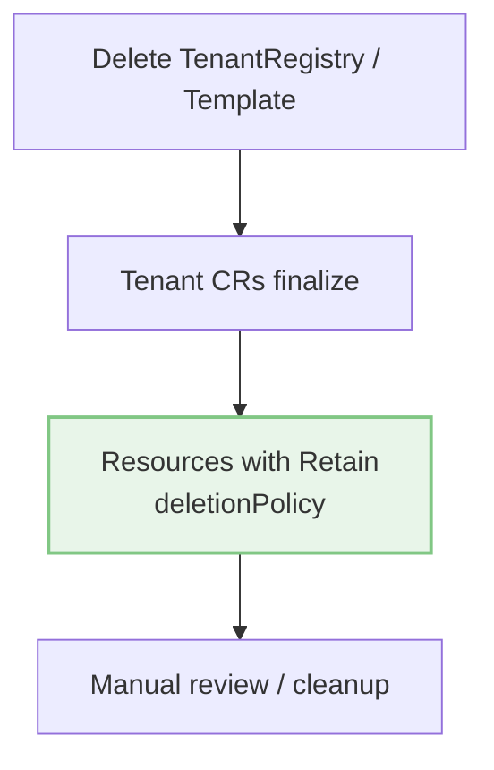

# Policies Guide

Tenant Operator provides fine-grained control over resource lifecycle through various policies. This guide explains each policy type and when to use them.

[[toc]]

## Policy Types Overview

| Policy | Controls | Default | Options |
|--------|----------|---------|---------|
| CreationPolicy | When resources are created | `WhenNeeded` | `Once`, `WhenNeeded` |
| DeletionPolicy | What happens on delete | `Delete` | `Delete`, `Retain` |
| ConflictPolicy | Ownership conflict handling | `Stuck` | `Stuck`, `Force` |
| PatchStrategy | How resources are updated | `apply` | `apply`, `merge`, `replace` |



## CreationPolicy

Controls when a resource is created or re-applied.

### `WhenNeeded` (Default)

Resource is created and updated whenever the spec changes.

```yaml
deployments:
  - id: app
    creationPolicy: WhenNeeded  # Default
    nameTemplate: "{{ .uid }}-app"
    spec:
      # ... deployment spec
```

**Behavior:**
- ✅ Creates resource if it doesn't exist
- ✅ Updates resource when spec changes
- ✅ Re-applies if manually deleted
- ✅ Maintains desired state continuously

**Use when:**
- Resources should stay synchronized with templates
- You want drift correction
- Resource state should match database

**Example:** Application deployments, services, configmaps

### `Once`

Resource is created only once and never updated, even if spec changes.

```yaml
jobs:
  - id: init-job
    creationPolicy: Once
    nameTemplate: "{{ .uid }}-init"
    spec:
      apiVersion: batch/v1
      kind: Job
      spec:
        template:
          spec:
            containers:
            - name: init
              image: busybox
              command: ["sh", "-c", "echo Initializing tenant {{ .uid }}"]
            restartPolicy: Never
```

**Behavior:**
- ✅ Creates resource on first reconciliation
- ❌ Never updates resource, even if template changes
- ✅ Skips if resource already exists with `kubernetes-tenants.org/created-once` annotation
- ✅ Re-creates if manually deleted

**Use when:**
- One-time initialization tasks
- Security resources that shouldn't change
- Database migrations
- Initial setup jobs

**Example:** Init Jobs, security configurations, bootstrap scripts

**Annotation Added:**
```yaml
metadata:
  annotations:
    kubernetes-tenants.org/created-once: "true"
```

## DeletionPolicy

Controls what happens to resources when a Tenant CR is deleted.

### `Delete` (Default)

Resources are deleted when the Tenant is deleted.

```yaml
deployments:
  - id: app
    deletionPolicy: Delete  # Default
    nameTemplate: "{{ .uid }}-app"
    spec:
      # ... deployment spec
```

**Behavior:**
- ✅ Removes resource from cluster
- ✅ Cleans up automatically
- ✅ No orphaned resources

**Use when:**
- Resources are tenant-specific and should be removed
- You want complete cleanup
- Resources have no value after tenant deletion

**Example:** Deployments, Services, ConfigMaps, Secrets

### `Retain`

Resources are kept in the cluster and **never have ownerReference set** (use label-based tracking instead).

```yaml
persistentVolumeClaims:
  - id: data-pvc
    deletionPolicy: Retain
    nameTemplate: "{{ .uid }}-data"
    spec:
      apiVersion: v1
      kind: PersistentVolumeClaim
      spec:
        accessModes: ["ReadWriteOnce"]
        resources:
          requests:
            storage: 10Gi
```

**Behavior:**
- ✅ **No ownerReference** (label-based tracking only)
- ✅ Resource stays in cluster even when Tenant is deleted
- ✅ Orphan labels added on deletion for identification
- ❌ No automatic cleanup by Kubernetes garbage collector
- ⚠️  Manual deletion required

**Why no ownerReference?**

Setting ownerReference would cause Kubernetes garbage collector to automatically delete the resource when the Tenant CR is deleted, regardless of DeletionPolicy. The operator evaluates DeletionPolicy **at resource creation time** and uses label-based tracking (`kubernetes-tenants.org/tenant`, `kubernetes-tenants.org/tenant-namespace`) instead of ownerReference for Retain resources.

**Use when:**
- Data must survive tenant deletion
- Resources are expensive to recreate
- Regulatory/compliance requirements
- Debugging or forensics needed

**Example:** PersistentVolumeClaims, backup resources, audit logs

### Orphan Resource Cleanup

::: tip Dynamic Template Evolution
DeletionPolicy applies not only when a Tenant CR is deleted, but also when resources are **removed from the TenantTemplate**.
:::

**How it works:**

The operator tracks all applied resources in `status.appliedResources` with keys in format `kind/namespace/name@id`. During each reconciliation:

1. **Detect Orphans**: Compares current template resources with previously applied resources
2. **Respect Policy**: Applies the resource's `deletionPolicy` setting:
   - `Delete`: Removes the orphaned resource from cluster (ownerReference enables automatic deletion)
   - `Retain`: Removes tracking labels and adds orphan labels, but keeps the resource
3. **Update Status**: Tracks the new set of applied resources

**Example scenario:**

```yaml
# Initial template
deployments:
  - id: web
    nameTemplate: "{{ .uid }}-web"
    deletionPolicy: Delete  # Will be removed when deleted from template
  - id: worker
    nameTemplate: "{{ .uid }}-worker"
    deletionPolicy: Retain  # Will be kept when deleted from template
```

After removing the `worker` deployment from template:
- `web` deployment: Still managed normally
- `worker` deployment: **Retained in cluster** (ownerReference removed, resource kept)

After removing the `web` deployment from template:
- `web` deployment: **Deleted from cluster** automatically

**Orphan Markers:**

When resources are retained (DeletionPolicy=Retain), they are automatically marked for easy identification:

```yaml
metadata:
  labels:
    kubernetes-tenants.org/orphaned: "true"  # Label for selector queries
  annotations:
    kubernetes-tenants.org/orphaned-at: "2025-01-15T10:30:00Z"  # RFC3339 timestamp
    kubernetes-tenants.org/orphaned-reason: "RemovedFromTemplate"
```

**Why split label/annotation?**
- **Label** `orphaned: "true"`: Simple boolean for selector queries (Kubernetes labels have strict RFC 1123 format requirements - no colons allowed in values)
- **Annotations**: Detailed metadata like timestamps (no format restrictions)

**Orphan Lifecycle - Re-adoption:**

If you re-add a previously removed resource to the template, the operator automatically:
1. Removes all orphan markers (label + annotations)
2. Re-applies tracking labels or ownerReferences based on current DeletionPolicy
3. Resumes full management of the resource

This means you can safely experiment with template changes:
- Remove a resource → It becomes orphaned (if Retain policy)
- Re-add the same resource → It's cleanly re-adopted into management
- No manual cleanup or label management needed!

**Finding orphaned resources:**

```bash
# Find all orphaned resources (using label selector)
kubectl get all -A -l kubernetes-tenants.org/orphaned=true

# Find resources orphaned due to template changes (filter by annotation)
kubectl get all -A -l kubernetes-tenants.org/orphaned=true -o jsonpath='{range .items[?(@.metadata.annotations.kubernetes-tenants\.org/orphaned-reason=="RemovedFromTemplate")]}{.kind}/{.metadata.name}{"\n"}{end}'

# Find resources orphaned due to tenant deletion (filter by annotation)
kubectl get all -A -l kubernetes-tenants.org/orphaned=true -o jsonpath='{range .items[?(@.metadata.annotations.kubernetes-tenants\.org/orphaned-reason=="TenantDeleted")]}{.kind}/{.metadata.name}{"\n"}{end}'
```

**Benefits:**
- ✅ Safe template evolution without manual cleanup
- ✅ No orphaned resources accumulation (Delete policy)
- ✅ Easy identification of retained orphans (Retain policy)
- ✅ DeletionPolicy consistency across all deletion scenarios
- ✅ Automatic detection during normal reconciliation
- ✅ Tracking of orphan timestamp and reason

## Protecting Tenants from Cascade Deletion

::: danger Cascading deletions are immediate
Deleting a TenantRegistry or TenantTemplate cascades to all Tenant CRs, which in turn deletes managed resources unless retention policies are set.
:::

### The Problem





### Recommended Solution: Use `Retain` DeletionPolicy

**Before deleting TenantRegistry or TenantTemplate**, ensure all resources in your templates use `deletionPolicy: Retain`:



```yaml
apiVersion: operator.kubernetes-tenants.org/v1
kind: TenantTemplate
metadata:
  name: my-template
spec:
  registryId: my-registry

  # Set Retain for ALL resources
  deployments:
    - id: app
      deletionPolicy: Retain  # ✅ Keeps deployment
      nameTemplate: "{{ .uid }}-app"
      spec:
        # ... deployment spec

  services:
    - id: svc
      deletionPolicy: Retain  # ✅ Keeps service
      nameTemplate: "{{ .uid }}-svc"
      spec:
        # ... service spec

  persistentVolumeClaims:
    - id: data
      deletionPolicy: Retain  # ✅ Keeps PVC and data
      nameTemplate: "{{ .uid }}-data"
      spec:
        # ... PVC spec
```

### Why This Works

With `deletionPolicy: Retain`:
1. **At creation time**: Resources are created with label-based tracking only (NO ownerReference)
2. Even if TenantRegistry/TenantTemplate is deleted → Tenant CRs are deleted
3. When Tenant CRs are deleted → Resources stay in cluster (no ownerReference = no automatic deletion)
4. Finalizer adds orphan labels for easy identification
5. **Resources stay in the cluster** because Kubernetes garbage collector never marks them for deletion

**Key insight**: DeletionPolicy is evaluated when creating resources, not when deleting them. This prevents the Kubernetes garbage collector from auto-deleting Retain resources.

### When to Use This Strategy

✅ **Use `Retain` when:**
- You need to delete/recreate TenantRegistry for migration
- You're updating TenantTemplate with breaking changes
- You're testing registry configuration changes
- You have production tenants that must not be interrupted
- You're performing maintenance on operator components

❌ **Don't use `Retain` when:**
- You actually want to clean up all tenant resources
- Testing in development environments
- You have backup/restore procedures in place

### Alternative: Update Instead of Delete

Instead of deleting and recreating, consider:

```bash
# ❌ DON'T: Delete and recreate (causes cascade deletion)
kubectl delete tenantregistry my-registry
kubectl apply -f updated-registry.yaml

# ✅ DO: Update in place
kubectl apply -f updated-registry.yaml
```

### Recovery After Accidental Deletion

If you accidentally deleted TenantRegistry/TenantTemplate without `Retain`:

1. **Check if resources still exist:**
   ```bash
   kubectl get all -n <tenant-namespace>
   ```

2. **If deleted:** Resources are gone. You need to:
   - Restore from backups
   - Recreate TenantRegistry/TenantTemplate
   - Operator will recreate resources based on database

3. **If retained:** Manually clean up ownerless resources:
   ```bash
   # Find resources without owners
   kubectl get pods,svc,deploy -A -o json | \
     jq '.items[] | select(.metadata.ownerReferences == null) | .metadata.name'
   ```

### Best Practice Checklist

When planning to modify TenantRegistry or TenantTemplate:

- [ ] Review current `deletionPolicy` settings in all templates
- [ ] Set `deletionPolicy: Retain` for critical resources
- [ ] Test changes in non-production environment first
- [ ] Create backups of TenantRegistry/TenantTemplate YAML
- [ ] Document the change and expected impact
- [ ] Prefer `kubectl apply` (update) over delete/recreate
- [ ] Monitor Tenant CR status after changes

### Example: Safe Template Update

```bash
# 1. Backup current configuration
kubectl get tenanttemplate my-template -o yaml > backup-template.yaml
kubectl get tenantregistry my-registry -o yaml > backup-registry.yaml

# 2. Update template with Retain policies
cat <<EOF | kubectl apply -f -
apiVersion: operator.kubernetes-tenants.org/v1
kind: TenantTemplate
metadata:
  name: my-template
spec:
  registryId: my-registry
  # Add deletionPolicy: Retain to all resources
  deployments:
    - id: app
      deletionPolicy: Retain
      # ... rest of config
EOF

# 3. Verify templates are updated
kubectl get tenanttemplate my-template -o yaml | grep deletionPolicy

# 4. Now safe to update registry if needed
kubectl apply -f updated-registry.yaml
```

## ConflictPolicy

Controls what happens when a resource already exists with a different owner or field manager.

### `Stuck` (Default)

Reconciliation stops if ownership conflict is detected.

```yaml
services:
  - id: app-svc
    conflictPolicy: Stuck  # Default
    nameTemplate: "{{ .uid }}-app"
    spec:
      # ... service spec
```

**Behavior:**
- ✅ Fails safe - doesn't overwrite existing resources
- ❌ Stops reconciliation on conflict
- 📢 Emits `ResourceConflict` event
- ⚠️  Marks Tenant as Degraded

**Use when:**
- Safety is paramount
- You want to investigate conflicts manually
- Resources might be managed by other controllers
- Default case (most conservative)

**Example:** Any resource where safety > availability

**Error Event:**
```
ResourceConflict: Resource conflict detected for default/acme-app (Kind: Deployment, Policy: Stuck).
Another controller or user may be managing this resource.
Consider using ConflictPolicy=Force to take ownership or resolve the conflict manually.
```

### `Force`

Attempts to take ownership using Server-Side Apply with `force=true`.

```yaml
deployments:
  - id: app
    conflictPolicy: Force
    nameTemplate: "{{ .uid }}-app"
    spec:
      # ... deployment spec
```

**Behavior:**
- ✅ Takes ownership forcefully
- ⚠️  May overwrite other controllers' changes
- ✅ Reconciliation continues
- 📢 Emits events on success/failure

**Use when:**
- Tenant Operator should be the source of truth
- Conflicts are expected and acceptable
- You're migrating from another management system
- Availability > safety

**Example:** Resources exclusively managed by Tenant Operator

**Warning:** This can override changes from other controllers or users!

## PatchStrategy

Controls how resources are updated.

### `apply` (Default - Server-Side Apply)

Uses Kubernetes Server-Side Apply for declarative updates.

```yaml
deployments:
  - id: app
    patchStrategy: apply  # Default
    nameTemplate: "{{ .uid }}-app"
    spec:
      # ... deployment spec
```

**Behavior:**
- ✅ Declarative updates
- ✅ Conflict detection
- ✅ Preserves fields managed by other controllers
- ✅ Field-level ownership tracking
- ✅ Most efficient

**Use when:**
- Multiple controllers manage the same resource
- You want Kubernetes-native updates
- Default case (best practice)

**Field Manager:** `tenant-operator`

### `merge` (Strategic Merge Patch)

Uses strategic merge patch for updates.

```yaml
services:
  - id: app-svc
    patchStrategy: merge
    nameTemplate: "{{ .uid }}-app"
    spec:
      # ... service spec
```

**Behavior:**
- ✅ Merges changes with existing resource
- ✅ Preserves unspecified fields
- ⚠️  Less precise conflict detection
- ✅ Works with older Kubernetes versions

**Use when:**
- Partial updates needed
- Compatibility with legacy systems
- Strategic merge semantics preferred

### `replace` (Full Replacement)

Completely replaces the resource.

```yaml
configMaps:
  - id: config
    patchStrategy: replace
    nameTemplate: "{{ .uid }}-config"
    spec:
      # ... configmap spec
```

**Behavior:**
- ⚠️  Replaces entire resource
- ❌ Loses fields not in template
- ✅ Guarantees exact match
- ✅ Handles resourceVersion conflicts

**Use when:**
- Exact resource state required
- No other controllers manage the resource
- Complete replacement is intentional

**Warning:** This removes any fields not in your template!

## Policy Combinations

### Example 1: Stateful Data (PVC)

```yaml
persistentVolumeClaims:
  - id: data
    creationPolicy: Once        # Create only once
    deletionPolicy: Retain      # Keep data after tenant deletion
    conflictPolicy: Stuck       # Don't overwrite existing PVCs
    patchStrategy: apply        # Standard SSA
    nameTemplate: "{{ .uid }}-data"
    spec:
      # ... PVC spec
```

**Rationale:**
- `Once`: PVC spec shouldn't change (size immutable in many storage classes)
- `Retain`: Data survives tenant deletion
- `Stuck`: Safety - don't overwrite someone else's PVC

### Example 2: Init Job

```yaml
jobs:
  - id: init
    creationPolicy: Once        # Run only once
    deletionPolicy: Delete      # Clean up after tenant deletion
    conflictPolicy: Force       # Re-create if needed
    patchStrategy: replace      # Exact job spec
    nameTemplate: "{{ .uid }}-init"
    spec:
      # ... job spec
```

**Rationale:**
- `Once`: Initialization runs only once
- `Delete`: No need to keep after tenant deletion
- `Force`: Operator owns this resource exclusively

### Example 3: Application Deployment

```yaml
deployments:
  - id: app
    creationPolicy: WhenNeeded  # Keep updated
    deletionPolicy: Delete      # Clean up on deletion
    conflictPolicy: Stuck       # Safe default
    patchStrategy: apply        # Kubernetes best practice
    nameTemplate: "{{ .uid }}-app"
    spec:
      # ... deployment spec
```

**Rationale:**
- `WhenNeeded`: Always keep deployment in sync
- `Delete`: Standard cleanup
- `Stuck`: Safe, investigate conflicts
- `apply`: SSA best practice

### Example 4: Shared Infrastructure

```yaml
configMaps:
  - id: shared-config
    creationPolicy: WhenNeeded  # Maintain config
    deletionPolicy: Retain      # Keep config for investigation
    conflictPolicy: Force       # Operator manages configs
    patchStrategy: apply        # SSA
    nameTemplate: "{{ .uid }}-shared-config"
    spec:
      # ... configmap spec
```

**Rationale:**
- `WhenNeeded`: Keep configmap data updated
- `Retain`: ConfigMap might be referenced by other resources
- `Force`: Operator is authoritative for this config

## Default Values

If policies are not specified, these defaults apply:

```yaml
resources:
  - id: example
    creationPolicy: WhenNeeded  # ✅ Default
    deletionPolicy: Delete      # ✅ Default
    conflictPolicy: Stuck       # ✅ Default
    patchStrategy: apply        # ✅ Default
```

## Policy Decision Matrix

| Resource Type | CreationPolicy | DeletionPolicy | ConflictPolicy | PatchStrategy |
|---------------|----------------|----------------|----------------|---------------|
| Deployment | WhenNeeded | Delete | Stuck | apply |
| Service | WhenNeeded | Delete | Stuck | apply |
| ConfigMap | WhenNeeded | Delete | Stuck | apply |
| Secret | WhenNeeded | Delete | Force | apply |
| PVC | Once | Retain | Stuck | apply |
| Init Job | Once | Delete | Force | replace |
| Namespace | WhenNeeded | Retain | Force | apply |
| Ingress | WhenNeeded | Delete | Stuck | apply |

## Observability

### Events

Policies trigger various events:

```bash
# View Tenant events
kubectl describe tenant <tenant-name>
```

**Conflict Events:**
```
ResourceConflict: Resource conflict detected for default/acme-app (Kind: Deployment, Policy: Stuck)
```

**Deletion Events:**
```
TenantDeleting: Deleting Tenant 'acme-prod-template' (template: prod-template, uid: acme)
TenantDeleted: Successfully deleted Tenant 'acme-prod-template'
```

### Metrics

```promql
# Count apply attempts by policy
apply_attempts_total{kind="Deployment",result="success",conflict_policy="Stuck"}

# Failed reconciliations
tenant_reconcile_duration_seconds{result="error"}
```

## Troubleshooting

### Conflict Stuck

**Symptom:** Tenant shows `Degraded` condition

**Cause:** Resource exists with different owner

**Solution:**
1. Check who owns the resource:
   ```bash
   kubectl get <resource-type> <resource-name> -o yaml | grep -A5 managedFields
   ```

2. Either:
   - Delete the conflicting resource
   - Change to `conflictPolicy: Force`
   - Use unique `nameTemplate`

### Resource Not Updating

**Symptom:** Changes to template don't apply

**Cause:** `creationPolicy: Once` is set

**Solution:**
- Change to `creationPolicy: WhenNeeded`, or
- Delete the resource to force recreation, or
- This is expected behavior for `Once` policy

### Resource Not Deleted

**Symptom:** Resource remains after Tenant deletion

**Cause:** `deletionPolicy: Retain` is set

**Solution:**
- Manually delete: `kubectl delete <resource-type> <resource-name>`
- This is expected behavior for `Retain` policy

## See Also

- [Template Guide](templates.md) - Template syntax and functions
- [Dependencies Guide](dependencies.md) - Resource ordering
- [Troubleshooting](troubleshooting.md) - Common issues
