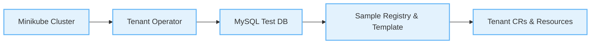

# Quick Start with Minikube

Get Tenant Operator running on Minikube in under 5 minutes using automated scripts.

[[toc]]

## Overview

This guide uses automated scripts to set up a complete local environment:
1. **Minikube cluster** with **cert-manager** (automatically installed)
2. **Tenant Operator** deployed and running with webhooks enabled
3. **MySQL test database** for tenant data
4. **Sample TenantRegistry** and **TenantTemplate**
5. **Live tenant provisioning** from database



::: tip Time required
Full setup typically completes in around 5 minutes.
:::

::: info cert-manager Included
cert-manager is **automatically installed** by the setup script. It's required for webhook validation and defaulting in all environments (including local development).
:::

## Prerequisites

### Required Tools

| Tool | Version | Install on macOS | Install on Linux |
| --- | --- | --- | --- |
| Minikube | v1.28.0+ | `brew install minikube` | [Installation Guide](https://minikube.sigs.k8s.io/docs/start/) |
| kubectl | v1.28.0+ | `brew install kubectl` | [Installation Guide](https://kubernetes.io/docs/tasks/tools/) |
| Docker (driver) | Latest | Docker Desktop | Docker Engine |

### System Requirements

- **CPU**: 1+ core
- **Memory**: 1+ GB RAM
- **Disk**: 5+ GB free space

## Step-by-Step Setup

### Step 1: Setup Minikube Cluster

Create a Minikube cluster with all prerequisites:

```bash
cd /path/to/tenant-operator
./scripts/setup-minikube.sh
```

**What this does:**
- ✅ Creates Minikube cluster (2 CPUs, 2GB RAM)
- ✅ **Installs cert-manager v1.13.2** (required for webhooks)
- ✅ Installs Tenant Operator CRDs
- ✅ Creates namespaces: `tenant-operator-system`, `tenant-operator-test`

::: warning cert-manager is Essential
cert-manager provides webhook TLS certificates for validation and defaulting. It's no longer optional, even for local development, to ensure consistency with production environments.
:::

**Time:** ~2 minutes

---

### Step 2: Deploy Tenant Operator

Build and deploy the operator to Minikube:

```bash
./scripts/deploy-to-minikube.sh
```

**What this does:**
- ✅ Builds operator Docker image with timestamp tag
- ✅ Loads image into Minikube's internal registry
- ✅ Deploys operator to `tenant-operator-system` namespace
- ✅ Waits for operator to be ready

**Time:** ~2 minutes

---

### Step 3: Deploy MySQL Test Database

Deploy a MySQL database with sample tenant data:

```bash
./scripts/deploy-mysql.sh
```

**What this does:**
- ✅ Deploys MySQL 8.0 to `tenant-operator-test` namespace
- ✅ Creates `tenants` database and `tenant_configs` table
- ✅ Inserts 3 sample tenant rows
- ✅ Creates read-only user `tenant_reader`
- ✅ Creates Kubernetes Secret with credentials

**Sample data inserted:**
```sql
tenant_id       tenant_url                      is_active   subscription_plan
-----------     -----------------------------   ---------   -----------------
acme-corp       https://acme.example.com        1           enterprise
beta-inc        https://beta.example.com        1           startup
gamma-llc       https://gamma.example.com       0           trial
```

**Time:** ~1 minute

---

### Step 4: Deploy TenantRegistry

Create a TenantRegistry that connects to the MySQL database:

```bash
./scripts/deploy-tenantregistry.sh
```

**What this does:**
- ✅ Creates TenantRegistry CR named `test-registry`
- ✅ Configures MySQL connection to test database
- ✅ Sets up column mappings (uid, hostOrUrl, activate)
- ✅ Starts syncing every 30 seconds

**Time:** ~30 seconds

---

### Step 5: Deploy TenantTemplate

Create a TenantTemplate that provisions resources for each tenant:

```bash
./scripts/deploy-tenanttemplate.sh
```

**What this does:**
- ✅ Creates TenantTemplate CR named `test-template`
- ✅ Defines resource blueprints (Deployment, Service)
- ✅ Links to `test-registry`
- ✅ Triggers automatic tenant provisioning

**Time:** ~30 seconds

## 🎉 Success! You're Running Tenant Operator

You now have:
- ✅ **Minikube cluster** with **cert-manager** (for webhook TLS)
- ✅ **Tenant Operator** managing tenants with **webhooks enabled**
- ✅ **MySQL database** with 3 tenant rows
- ✅ **2 Active Tenants** (acme-corp, beta-inc) fully provisioned
- ✅ **Live sync** between database and Kubernetes
- ✅ **Admission validation** catching errors at apply time

### What Was Created?

For each active tenant (acme-corp, beta-inc):
```
Tenant CR: acme-corp-test-template
├── Deployment: acme-corp-app
└── Service: acme-corp-app
```

**Verify your setup:**
```bash
# Check Tenant CRs
kubectl get tenants

# Check tenant resources
kubectl get deployments,services -l kubernetes-tenants.org/tenant

# View operator logs
kubectl logs -n tenant-operator-system -l control-plane=controller-manager -f
```

## Real-World Example

Let's see the complete lifecycle of a tenant from database to Kubernetes.

### Adding a Tenant

Insert a new row into the database:

```sql
INSERT INTO tenant_configs (tenant_id, tenant_url, is_active, subscription_plan)
VALUES ('acme-corp', 'https://acme.example.com', 1, 'enterprise');
```

**What happens automatically:**

Within 30 seconds (syncInterval), the operator creates:

```bash
# 1. Tenant CR
kubectl get tenant acme-corp-test-template

# 2. Namespace (if configured)
kubectl get namespace acme-corp-namespace

# 3. Deployment
kubectl get deployment acme-corp-app

# 4. Service
kubectl get service acme-corp-app

# 5. Ingress (if configured)
kubectl get ingress acme-corp-ingress
```

All without writing any YAML files. The template defines the blueprint, the database row provides the variables.

### Deactivating a Tenant

Update the database:

```sql
UPDATE tenant_configs SET is_active = 0 WHERE tenant_id = 'acme-corp';
```

**What happens automatically:**

Within 30 seconds:
- Tenant CR is deleted
- All associated resources are cleaned up (based on `DeletionPolicy`)
- Namespace is removed (if created)

No manual `kubectl delete` commands needed. The database is your source of truth.

---

## Explore the System

### Test Tenant Lifecycle

#### 1. Add a New Tenant

Add a row to the database:

```bash
# Connect to MySQL
kubectl exec -it deployment/mysql -n tenant-operator-test -- \
  mysql -u root -p$(kubectl get secret mysql-root-password -n tenant-operator-test -o jsonpath='{.data.password}' | base64 -d) tenants

# Insert new tenant
INSERT INTO tenant_configs (tenant_id, tenant_url, is_active, subscription_plan)
VALUES ('delta-co', 'https://delta.example.com', 1, 'enterprise');

exit
```

**Wait 30 seconds** (syncInterval), then verify:

```bash
kubectl get tenant delta-co-test-template
kubectl get deployment delta-co-app
```

#### 2. Deactivate a Tenant

```bash
# Update database
kubectl exec -it deployment/mysql -n tenant-operator-test -- \
  mysql -u root -p$(kubectl get secret mysql-root-password -n tenant-operator-test -o jsonpath='{.data.password}' | base64 -d) -e \
  "UPDATE tenants.tenant_configs SET is_active = 0 WHERE tenant_id = 'acme-corp';"
```

**Wait 30 seconds**, then verify resources are cleaned up:

```bash
kubectl get tenant acme-corp-test-template  # Not found
kubectl get deployment acme-corp-app        # Not found
```

#### 3. Modify Template

Edit the template to add more resources:

```bash
kubectl edit tenanttemplate test-template
```

Changes automatically apply to all tenants. Monitor reconciliation:

```bash
kubectl get tenants --watch
```

### View Metrics

```bash
# Port-forward metrics endpoint
kubectl port-forward -n tenant-operator-system deployment/tenant-operator-controller-manager 8080:8080

# View metrics
curl http://localhost:8080/metrics | grep tenant_
```

## Cleanup

### Option 1: Clean Resources Only

Keep the cluster, remove operator and tenants:

```bash
kubectl delete tenants --all
kubectl delete tenanttemplate test-template
kubectl delete tenantregistry test-registry
kubectl delete deployment,service,pvc mysql -n tenant-operator-test
kubectl delete deployment tenant-operator-controller-manager -n tenant-operator-system
```

### Option 2: Full Cleanup

Delete everything including Minikube cluster:

```bash
./scripts/cleanup-minikube.sh
```

This script interactively prompts for MySQL, operator, cluster, context, and image cache cleanup. Answer 'y' to all prompts for complete cleanup.

## Troubleshooting

### Quick Diagnostics

```bash
# Check operator status
kubectl get pods -n tenant-operator-system
kubectl logs -n tenant-operator-system -l control-plane=controller-manager

# Check registry sync
kubectl get tenantregistry test-registry -o yaml

# Check tenant status
kubectl get tenant <tenant-name> -o yaml

# Check database connection
kubectl exec -it deployment/mysql -n tenant-operator-test -- \
  mysql -u tenant_reader -p$(kubectl get secret mysql-credentials -n tenant-operator-test -o jsonpath='{.data.password}' | base64 -d) \
  -e "SELECT * FROM tenants.tenant_configs;"
```

**Common issues:**
- **Operator not starting**: Check cert-manager is ready (`kubectl get pods -n cert-manager`)
- **Tenants not created**: Verify MySQL is ready and `is_active = 1` in database
- **Resources missing**: Check Tenant CR status and operator logs

::: tip Detailed Troubleshooting
For comprehensive troubleshooting, see [Troubleshooting Guide](troubleshooting.md).
:::

## Customizing Scripts

All scripts support environment variables for customization:

```bash
# Example: Custom cluster configuration
MINIKUBE_CPUS=8 MINIKUBE_MEMORY=16384 ./scripts/setup-minikube.sh

# Example: Custom image tag
IMG=tenant-operator:my-tag ./scripts/deploy-to-minikube.sh

# Example: Custom namespace
MYSQL_NAMESPACE=my-test-ns ./scripts/deploy-mysql.sh
```

Run any script with `--help` for full options.

## What's Next?

Now that you have Tenant Operator running, explore these topics:

### Concepts & Configuration

- [**Templates Guide**](templates.md) - Template syntax and 200+ functions
- [**Policies Guide**](policies.md) - CreationPolicy, DeletionPolicy, ConflictPolicy, PatchStrategy
- [**DataSource Guide**](datasource.md) - MySQL configuration, VIEWs, and extraValueMappings
- [**Dependencies**](dependencies.md) - Resource ordering with dependency graphs

### Operations

- [**Installation Guide**](installation.md) - Deploy to production clusters
- [**Security Guide**](security.md) - RBAC and secrets management
- [**Performance Guide**](performance.md) - Scaling and optimization
- [**Monitoring Guide**](monitoring.md) - Prometheus metrics, alerts, and Grafana dashboards

### Advanced Topics

- [**Local Development**](local-development-minikube.md) - Development workflow and debugging
- [**Integration with External DNS**](integration-external-dns.md) - Automatic DNS per tenant
- [**Integration with Terraform Operator**](integration-terraform-operator.md) - Cloud resource provisioning

## Summary

You've successfully:
- ✅ Set up Minikube with Tenant Operator in ~5 minutes
- ✅ Deployed MySQL with sample tenant data
- ✅ Created TenantRegistry and TenantTemplate
- ✅ Provisioned tenants automatically from database
- ✅ Tested tenant lifecycle (create, update, delete)

**Next:** Experiment with templates, policies, and template functions to build your multi-tenant platform!

## Need Help?

- 📖 **Documentation**: See [documentation site](.) for detailed guides
- 🐛 **Issues**: [GitHub Issues](https://github.com/kubernetes-tenants/tenant-operator/issues)
- 💬 **Discussions**: [GitHub Discussions](https://github.com/kubernetes-tenants/tenant-operator/discussions)
