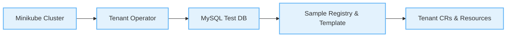

# Quick Start with Minikube

Get Tenant Operator running on Minikube in under 5 minutes using automated scripts.

[[toc]]

## Overview

This guide uses automated scripts to set up a complete local environment:
1. **Minikube cluster** with **cert-manager** (automatically installed)
2. **Tenant Operator** deployed and running with webhooks enabled
3. **MySQL test database** for tenant data
4. **Sample TenantRegistry** and **TenantTemplate**
5. **Live tenant provisioning** from database



::: tip Time required
Full setup typically completes in around 5 minutes.
:::

::: info cert-manager Included
cert-manager is **automatically installed** by the setup script. It's required for webhook validation and defaulting in all environments (including local development).
:::

## Prerequisites

### Required Tools

| Tool | Version | Install on macOS | Install on Linux |
| --- | --- | --- | --- |
| Minikube | v1.28.0+ | `brew install minikube` | [Installation Guide](https://minikube.sigs.k8s.io/docs/start/) |
| kubectl | v1.28.0+ | `brew install kubectl` | [Installation Guide](https://kubernetes.io/docs/tasks/tools/) |
| Docker (driver) | Latest | Docker Desktop | Docker Engine |

### System Requirements

- **CPU**: 1+ core
- **Memory**: 1+ GB RAM
- **Disk**: 5+ GB free space

## Step-by-Step Setup

### Step 1: Setup Minikube Cluster

Create a Minikube cluster with all prerequisites:

```bash
cd /path/to/tenant-operator

# Run setup script
./scripts/setup-minikube.sh
```

**What this does:**
- ✅ Creates Minikube cluster with 2 CPUs, 2GB RAM
- ✅ **Installs cert-manager v1.13.2** (REQUIRED for webhooks)
- ✅ Installs Tenant Operator CRDs
- ✅ Creates namespaces: `tenant-operator-system`, `tenant-operator-test`

::: warning cert-manager is Essential
cert-manager provides webhook TLS certificates for validation and defaulting. It's no longer optional, even for local development, to ensure consistency with production environments.
:::

**Expected output:**
```
=== Minikube Setup Script for Tenant Operator ===

Configuration:
  Profile:        tenant-operator
  Driver:         docker
  CPUs:           2
  Memory:         2048 MB
  Disk Size:      5g
  K8s Version:    v1.28.3

Continue with these settings? (Y/n): y

✓ Minikube cluster started
✓ Kubectl context set to 'tenant-operator'
✓ Cluster is ready
✓ cert-manager is ready
✓ CRDs installed
✓ Namespaces created

=== Setup Complete ===
```

**Time:** ~2 minutes

---

### Step 2: Deploy Tenant Operator

Build and deploy the operator to Minikube:

```bash
./scripts/deploy-to-minikube.sh
```

**What this does:**
- ✅ Builds operator Docker image with timestamp tag
- ✅ Loads image into Minikube's internal registry
- ✅ Deploys operator to `tenant-operator-system` namespace
- ✅ Waits for operator to be ready

**Expected output:**
```
=== Deploy Tenant Operator to Minikube ===

Generated development image tag: tenant-operator:dev-20250130-143022

Configuration:
  Profile:    tenant-operator
  Context:    tenant-operator
  Image:      tenant-operator:dev-20250130-143022
  Namespace:  tenant-operator-system

✓ Old images cleaned up
✓ Image built: tenant-operator:dev-20250130-143022
✓ Image loaded into minikube
✓ CRDs installed
✓ Operator deployed
✓ Operator is ready!

Deployment Status:
NAME                                     READY   UP-TO-DATE   AVAILABLE   AGE
tenant-operator-controller-manager       1/1     1            1           30s

=== Deployment Complete ===
```

**Time:** ~2 minutes

**Verify deployment:**
```bash
# Check operator pod
kubectl get pods -n tenant-operator-system

# View operator logs
kubectl logs -n tenant-operator-system -l control-plane=controller-manager -f
```

---

### Step 3: Deploy MySQL Test Database

Deploy a MySQL database with sample tenant data:

```bash
./scripts/deploy-mysql.sh
```

**What this does:**
- ✅ Deploys MySQL 8.0 to `tenant-operator-test` namespace
- ✅ Creates `tenants` database and `tenant_configs` table
- ✅ Inserts 3 sample tenant rows
- ✅ Creates read-only user `tenant_reader`
- ✅ Creates Kubernetes Secret with credentials

**Sample data inserted:**
```sql
tenant_id       tenant_url                      is_active   subscription_plan
-----------     -----------------------------   ---------   -----------------
acme-corp       https://acme.example.com        1           enterprise
beta-inc        https://beta.example.com        1           startup
gamma-llc       https://gamma.example.com       0           trial
```

**Expected output:**
```
=== Deploy MySQL for Tenant Operator Testing ===

Configuration:
  Namespace:     tenant-operator-test
  Service:       mysql.tenant-operator-test.svc.cluster.local:3306
  Database:      tenants
  Table:         tenant_configs
  Root Password: randomly generated

✓ MySQL deployment created
✓ MySQL service created
✓ MySQL is ready
✓ Database 'tenants' created
✓ Table 'tenant_configs' created
✓ Sample data inserted (3 rows)
✓ Read-only user 'tenant_reader' created
✓ Kubernetes secret 'mysql-credentials' created

MySQL Connection Details:
  Host:     mysql.tenant-operator-test.svc.cluster.local
  Port:     3306
  Username: tenant_reader
  Password: (stored in secret mysql-credentials)
  Database: tenants
  Table:    tenant_configs

=== MySQL Deployment Complete ===
```

**Time:** ~1 minute

**Verify MySQL:**
```bash
# Check MySQL pod
kubectl get pods -n tenant-operator-test

# Connect to MySQL
kubectl run mysql-client --rm -it --image=mysql:8 -n tenant-operator-test -- \
  mysql -h mysql -u tenant_reader -p
# Password is in secret: kubectl get secret mysql-credentials -n tenant-operator-test -o jsonpath='{.data.password}' | base64 -d

# Query tenant data
SELECT * FROM tenants.tenant_configs;
```

---

### Step 4: Deploy TenantRegistry

Create a TenantRegistry that connects to the MySQL database:

```bash
./scripts/deploy-tenantregistry.sh
```

**What this does:**
- ✅ Creates TenantRegistry CR named `test-registry`
- ✅ Configures MySQL connection to test database
- ✅ Sets up column mappings (uid, hostOrUrl, activate)
- ✅ Starts syncing every 30 seconds

**Expected output:**
```
=== Deploy TenantRegistry for Testing ===

Configuration:
  Registry Name:  test-registry
  MySQL Host:     mysql.tenant-operator-test.svc.cluster.local
  Database:       tenants
  Table:          tenant_configs
  Sync Interval:  30s

✓ TenantRegistry created
✓ Waiting for registry to sync...
✓ Registry synced successfully

Registry Status:
  Desired: 2
  Ready:   0
  Failed:  0

Active tenants found: acme-corp, beta-inc

=== TenantRegistry Deployment Complete ===
```

**Time:** ~30 seconds

**Verify registry:**
```bash
# Check registry status
kubectl get tenantregistry test-registry -o yaml

# Watch registry sync
kubectl get tenantregistry test-registry --watch
```

---

### Step 5: Deploy TenantTemplate

Create a TenantTemplate that provisions resources for each tenant:

```bash
./scripts/deploy-tenanttemplate.sh
```

**What this does:**
- ✅ Creates TenantTemplate CR named `test-template`
- ✅ Defines resource blueprints (Deployment, Service)
- ✅ Links to `test-registry`
- ✅ Triggers automatic tenant provisioning

**Expected output:**
```
=== Deploy TenantTemplate for Testing ===

Configuration:
  Template Name:  test-template
  Registry ID:    test-registry
  Resources:      Deployment, Service

✓ TenantTemplate created
✓ Waiting for tenants to be created...
✓ Tenants created successfully

Tenant Status:
NAME                            READY   AGE
acme-corp-test-template         True    15s
beta-inc-test-template          True    15s

=== TenantTemplate Deployment Complete ===
```

**Time:** ~30 seconds

**Verify tenants:**
```bash
# Check Tenant CRs
kubectl get tenants

# Check tenant resources (all in default namespace)
kubectl get deployments,services -l kubernetes-tenants.org/tenant

# View tenant logs
kubectl logs deployment/acme-corp-app
```

## 🎉 Success! You're Running Tenant Operator

You now have:
- ✅ **Minikube cluster** with **cert-manager** (for webhook TLS)
- ✅ **Tenant Operator** managing tenants with **webhooks enabled**
- ✅ **MySQL database** with 3 tenant rows
- ✅ **2 Active Tenants** (acme-corp, beta-inc) fully provisioned
- ✅ **Live sync** between database and Kubernetes
- ✅ **Admission validation** catching errors at apply time

### What Was Created?

For each active tenant (acme-corp, beta-inc):
```
Tenant CR: acme-corp-test-template
├── Deployment: acme-corp-app
└── Service: acme-corp-app
```

## Next Steps

### Test Tenant Lifecycle

#### 1. Add a New Tenant

Add a row to the database:

```bash
# Connect to MySQL
kubectl exec -it deployment/mysql -n tenant-operator-test -- \
  mysql -u root -p$(kubectl get secret mysql-root-password -n tenant-operator-test -o jsonpath='{.data.password}' | base64 -d) tenants

# Insert new tenant
INSERT INTO tenant_configs (tenant_id, tenant_url, is_active, subscription_plan)
VALUES ('delta-co', 'https://delta.example.com', 1, 'enterprise');

exit
```

**Wait 30 seconds** (syncInterval), then:

```bash
# New Tenant CR appears
kubectl get tenant delta-co-test-template

# New resources created
kubectl get deployments,services delta-co-app delta-co-app
```

#### 2. Deactivate a Tenant

```bash
# Connect to MySQL
kubectl exec -it deployment/mysql -n tenant-operator-test -- mysql -u root -p tenants

# Deactivate tenant
UPDATE tenant_configs SET is_active = 0 WHERE tenant_id = 'acme-corp';

exit
```

**Wait 30 seconds**, then:

```bash
# Tenant CR is deleted
kubectl get tenant acme-corp-test-template
# Error: NotFound

# Resources are cleaned up
kubectl get deployment acme-corp-app
# Error: NotFound
```

#### 3. Modify a Tenant

```bash
# Change subscription plan
UPDATE tenant_configs SET subscription_plan = 'enterprise' WHERE tenant_id = 'beta-inc';
```

::: v-pre
Template can use `{{ .planId }}` to apply different configurations.
:::

### View Operator Logs

```bash
# Follow operator logs
kubectl logs -n tenant-operator-system -l control-plane=controller-manager -f

# Search for specific tenant
kubectl logs -n tenant-operator-system -l control-plane=controller-manager | grep acme-corp
```

### Check Metrics

```bash
# Port-forward metrics endpoint
kubectl port-forward -n tenant-operator-system deployment/tenant-operator-controller-manager 8080:8080

# View metrics
curl http://localhost:8080/metrics | grep tenant
```

### Modify the Template

Edit the template to add more resources:

```bash
kubectl edit tenanttemplate test-template
```

Add an Ingress resource, ConfigMap, or adjust the Deployment spec. Changes automatically apply to all tenants.

## Cleanup

### Option 1: Clean Resources Only

Keep the cluster, remove operator and tenants:

```bash
# Delete tenants
kubectl delete tenants --all

# Delete template and registry
kubectl delete tenanttemplate test-template
kubectl delete tenantregistry test-registry

# Delete MySQL
kubectl delete deployment,service,pvc mysql -n tenant-operator-test

# Delete operator
kubectl delete deployment tenant-operator-controller-manager -n tenant-operator-system
```

### Option 2: Full Cleanup

Delete everything including Minikube cluster:

```bash
./scripts/cleanup-minikube.sh
```

This script interactively prompts for:
- MySQL cleanup
- Operator cleanup
- Cluster deletion
- Context cleanup
- Image cache cleanup

**Answer 'y' to all prompts for complete cleanup.**

## Troubleshooting

### Operator Not Starting

```bash
# Check operator pod
kubectl get pods -n tenant-operator-system

# Check logs
kubectl logs -n tenant-operator-system -l control-plane=controller-manager

# Check cert-manager
kubectl get pods -n cert-manager
kubectl get certificate -n tenant-operator-system
```

**Common issues:**
- cert-manager not ready → Wait or restart: `kubectl rollout restart deployment -n cert-manager`
- Image not loaded → Re-run: `./scripts/deploy-to-minikube.sh`

### Tenants Not Created

```bash
# Check registry status
kubectl get tenantregistry test-registry -o yaml

# Check template status
kubectl get tenanttemplate test-template -o yaml

# Check database connection
kubectl exec -it deployment/mysql -n tenant-operator-test -- \
  mysql -u tenant_reader -p$(kubectl get secret mysql-credentials -n tenant-operator-test -o jsonpath='{.data.password}' | base64 -d) -e "SELECT * FROM tenants.tenant_configs;"
```

**Common issues:**
- MySQL not ready → Wait or check pod: `kubectl get pods -n tenant-operator-test`
- Wrong credentials → Check secret: `kubectl get secret mysql-credentials -n tenant-operator-test -o yaml`
- Inactive tenants → Verify `is_active = 1` in database

### Resources Not Appearing

```bash
# Check Tenant CR status
kubectl get tenant <tenant-name> -o yaml

# Check events
kubectl get events --sort-by='.lastTimestamp' | grep <tenant-name>

# Check operator logs
kubectl logs -n tenant-operator-system -l control-plane=controller-manager | grep <tenant-name>
```

## Script Reference

### Environment Variables

All scripts support customization via environment variables:

#### setup-minikube.sh
```bash
MINIKUBE_PROFILE=my-cluster \
MINIKUBE_CPUS=8 \
MINIKUBE_MEMORY=16384 \
./scripts/setup-minikube.sh
```

#### deploy-to-minikube.sh
```bash
IMG=tenant-operator:my-tag \
MINIKUBE_PROFILE=my-cluster \
./scripts/deploy-to-minikube.sh
```

#### deploy-mysql.sh
```bash
MYSQL_NAMESPACE=my-test-ns \
MYSQL_ROOT_PASSWORD=mypassword \
./scripts/deploy-mysql.sh
```

#### deploy-tenantregistry.sh
```bash
REGISTRY_NAME=my-registry \
MYSQL_NAMESPACE=my-test-ns \
SYNC_INTERVAL=1m \
./scripts/deploy-tenantregistry.sh
```

#### deploy-tenanttemplate.sh
```bash
TEMPLATE_NAME=my-template \
REGISTRY_NAME=my-registry \
./scripts/deploy-tenanttemplate.sh
```

### Script Locations

All scripts are in the `scripts/` directory:

```bash
scripts/
├── setup-minikube.sh          # Step 1: Cluster setup
├── deploy-to-minikube.sh      # Step 2: Operator deployment
├── deploy-mysql.sh            # Step 3: MySQL database
├── deploy-tenantregistry.sh   # Step 4: TenantRegistry CR
├── deploy-tenanttemplate.sh   # Step 5: TenantTemplate CR
└── cleanup-minikube.sh        # Cleanup
```

## What's Next?

Now that you have Tenant Operator running:

1. **Customize Templates** - Modify `test-template` to add more resources
2. **Add More Tenants** - Insert rows into MySQL and watch automatic provisioning
3. **Explore Policies** - Try different `creationPolicy`, `deletionPolicy`, `conflictPolicy`

::: v-pre
4. **Use Template Functions** - Add logic with `{{ if }}`, `{{ range }}`, filters
:::

5. **Multiple Templates** - Create multiple templates referencing the same registry

### Learn More

- [**Templates Guide**](templates.md) - Template syntax and 200+ functions
- [**DataSource Guide**](datasource.md) - MySQL configuration and VIEWs
- [**Policies Guide**](policies.md) - Lifecycle policies and best practices
- [**Local Development**](local-development-minikube.md) - Development workflow

### Production Deployment

For production use:
- [**Installation Guide**](installation.md) - Deploy to production clusters
- [**Security Guide**](security.md) - RBAC and secrets management
- [**Performance Guide**](performance.md) - Scaling and optimization
- [**Monitoring Guide**](monitoring.md) - Metrics and observability

## Summary

You've successfully:
- ✅ Set up Minikube with Tenant Operator
- ✅ Deployed MySQL with sample tenant data
- ✅ Created TenantRegistry and TenantTemplate
- ✅ Provisioned tenants automatically from database
- ✅ Tested tenant lifecycle (create, update, delete)

**Total time:** ~5 minutes

**Next:** Experiment with templates, policies, and template functions to build your multi-tenant platform!

## Need Help?

- 📖 **Documentation**: See [docs/](.) for detailed guides
- 🐛 **Issues**: [GitHub Issues](https://github.com/kubernetes-tenants/tenant-operator/issues)
- 💬 **Discussions**: [GitHub Discussions](https://github.com/kubernetes-tenants/tenant-operator/discussions)
