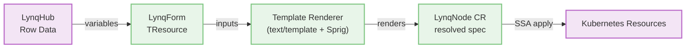

# Template Guide

Templates are the core of Lynq's resource generation system. This guide covers template syntax, available functions, and best practices.

[[toc]]

## Template Basics

Lynq uses Go's `text/template` engine with the Sprig function library, providing 200+ built-in functions.



::: v-pre

### Template Syntax

```yaml
# Basic variable substitution
nameTemplate: "{{ .uid }}-app"

# With function
nameTemplate: "{{ .uid | trunc63 }}"

# Conditional
nameTemplate: "{{ if .region }}{{ .region }}-{{ end }}{{ .uid }}"

# Default value
nameTemplate: "{{ .uid }}-{{ .planId | default \"basic\" }}"
```

:::

::: v-pre

## Available Variables

### Required Variables

These are always available from the template context:

```yaml
.uid         # Tenant unique identifier (from uid mapping)
.hostOrUrl   # Original URL/host from registry (from hostOrUrl mapping)
.host        # Auto-extracted host from .hostOrUrl
.activate    # Activation status (from activate mapping)
```

### Context Variables

Automatically provided:

```yaml
.registryId   # LynqHub name
.templateRef  # LynqForm name
```

### Custom Variables

From `extraValueMappings` in LynqHub:

```yaml
spec:
  extraValueMappings:
    planId: subscription_plan
    region: deployment_region
    dbHost: database_host
```

Access in templates:
```yaml
.planId   # Maps to subscription_plan column
.region   # Maps to deployment_region column
.dbHost   # Maps to database_host column
```

## Template Functions

### Built-in Custom Functions

#### `toHost(url)` ✅
Extract hostname from URL:
```yaml
# Input: https://acme.example.com:8080/path
# Output: acme.example.com
env:
- name: HOST
  value: "{{ .hostOrUrl | toHost }}"
```

#### `trunc63(s)` ✅
Truncate to 63 characters (Kubernetes name limit):
```yaml
# Ensures name fits K8s limits
nameTemplate: "{{ .uid }}-{{ .region }}-deployment | trunc63 }}"
```

#### `sha1sum(s)` ✅
Generate SHA1 hash:
```yaml
# Create unique, stable resource names
nameTemplate: "app-{{ .uid | sha1sum | trunc 8 }}"
```

#### `fromJson(s)` ✅
Parse JSON string:
```yaml
# Parse JSON configuration from database
env:
- name: API_KEY
  value: "{{ (.config | fromJson).apiKey }}"
- name: ENDPOINT
  value: "{{ (.config | fromJson).endpoint }}"
```

### Sprig Functions (200+)

Full documentation: https://masterminds.github.io/sprig/

#### String Functions

```yaml
# Uppercase/lowercase
nameTemplate: "{{ .uid | upper }}"
nameTemplate: "{{ .uid | lower }}"

# Trim whitespace
value: "{{ .name | trim }}"

# Replace
value: "{{ .uid | replace \".\" \"-\" }}"

# Quote
value: "{{ .name | quote }}"
```

#### Encoding Functions

```yaml
# Base64 encode/decode
value: "{{ .secret | b64enc }}"
value: "{{ .encoded | b64dec }}"

# URL encoding
value: "{{ .param | urlquery }}"

# SHA256
value: "{{ .data | sha256sum }}"
```

#### Default Values

```yaml
# Provide default if variable is empty
image: "{{ .deployImage | default \"nginx:stable\" }}"
port: "{{ .appPort | default \"8080\" }}"
region: "{{ .region | default \"us-east-1\" }}"
```

#### Conditionals

```yaml
# If/else
env:
- name: DEBUG
  value: "{{ if eq .planId \"enterprise\" }}true{{ else }}false{{ end }}"

# Ternary
replicas: {{ ternary 5 2 (eq .planId "enterprise") }}
```

#### Lists and Iteration

```yaml
# Join
annotations:
  tags: "{{ list \"app\" .uid .region | join \",\" }}"

# Iterate (in ConfigMap data)
data:
  config.json: |
    {
      "tenants": [
        {{- range $i, $id := list \"tenant1\" \"tenant2\" }}
        {{ if $i }},{{ end }}
        "{{ $id }}"
        {{- end }}
      ]
    }
```

#### Math Functions

```yaml
# Arithmetic
value: "{{ add .basePort 1000 }}"
value: "{{ mul .cpuLimit 2 }}"

# Min/max
value: "{{ max .minReplicas 3 }}"
```

## Template Examples

### Example 1: Multi-Region Deployment

```yaml
deployments:
  - id: app
    nameTemplate: "{{ .uid }}-{{ .region | default \"default\" }}"
    spec:
      apiVersion: apps/v1
      kind: Deployment
      spec:
        replicas: {{ if eq .planId "enterprise" }}5{{ else }}2{{ end }}
        template:
          spec:
            containers:
            - name: app
              image: "{{ .deployImage | default \"myapp:latest\" }}"
              env:
              - name: TENANT_ID
                value: "{{ .uid }}"
              - name: REGION
                value: "{{ .region | default \"us-east-1\" }}"
              - name: DATABASE_HOST
                value: "{{ .dbHost }}"
```

### Example 2: Secure Resource Names

```yaml
# Use SHA1 to create short, unique, stable names
nameTemplate: "{{ .uid | sha1sum | trunc 8 }}-app"

# Ensures:
# - Fixed length (8 chars + "-app")
# - Unique per tenant
# - Stable across reconciliations
# - URL-safe
```

### Example 3: JSON Configuration

Database column contains JSON:
```json
{
  "apiKey": "sk-abc123",
  "features": ["feature-a", "feature-b"],
  "limits": {"requests": 1000}
}
```

Template usage:
```yaml
env:
- name: API_KEY
  value: "{{ (.config | fromJson).apiKey }}"
- name: RATE_LIMIT
  value: "{{ (.config | fromJson).limits.requests }}"
```

### Example 4: Conditional Resources

```yaml
# Only create Redis for premium plans
{{- if or (eq .planId "premium") (eq .planId "enterprise") }}
deployments:
  - id: redis
    nameTemplate: "{{ .uid }}-redis"
    spec:
      apiVersion: apps/v1
      kind: Deployment
      spec:
        replicas: 1
        template:
          spec:
            containers:
            - name: redis
              image: redis:7-alpine
{{- end }}
```

### Example 5: Dynamic Labels

```yaml
labelsTemplate:
  app: "{{ .uid }}"
  tenant: "{{ .uid }}"
  plan: "{{ .planId | default \"basic\" }}"
  region: "{{ .region | default \"global\" }}"
  managed-by: "lynq"
  version: "{{ .appVersion | default \"v1.0.0\" }}"
```

## Template Best Practices

### 1. Use Default Values

Always provide defaults for optional variables:

```yaml
# Good
image: "{{ .deployImage | default \"nginx:stable\" }}"

# Bad (fails if deployImage is empty)
image: "{{ .deployImage }}"
```

### 2. Respect Kubernetes Naming Limits

Always truncate names that might exceed 63 characters:

```yaml
# Good
nameTemplate: "{{ .uid }}-{{ .region }}-deployment | trunc63 }}"

# Bad (can exceed 63 chars)
nameTemplate: "{{ .uid }}-{{ .region }}-deployment"
```

### 3. Quote String Values in YAML

```yaml
# Good
value: "{{ .uid }}"

# Bad (can cause YAML parsing errors)
value: {{ .uid }}
```

### 4. Handle Missing Variables Gracefully

```yaml
# Good - provides default and checks existence
{{- if .optionalField }}
value: "{{ .optionalField }}"
{{- else }}
value: "default-value"
{{- end }}

# Or simpler
value: "{{ .optionalField | default \"default-value\" }}"
```

### 5. Use Comments for Complex Logic

```yaml
# Calculate replicas based on plan tier
# enterprise: 5, premium: 3, basic: 2
replicas: {{- if eq .planId "enterprise" }}5{{- else if eq .planId "premium" }}3{{- else }}2{{- end }}
```

## Template Rendering Process

### 1. Variable Collection

Registry controller collects variables from database row:
```
uid = "acme-corp"
hostOrUrl = "https://acme.example.com"
activate = true
planId = "enterprise"
```

### 2. Auto-Processing

Operator automatically extracts `.host`:
```
.host = "acme.example.com"  # extracted from .hostOrUrl
```

### 3. Template Evaluation

For each resource in the template:
- Render `nameTemplate` → resource name
- Render `labelsTemplate` → labels
- Render `annotationsTemplate` → annotations
- Render `spec` → recursively render all string values in the resource

### 4. Resource Creation

Rendered resource is applied to Kubernetes using Server-Side Apply.

## Debugging Templates

### Check Rendered Values

View rendered LynqNode CR to see evaluated templates:

```bash
# Get LynqNode CR
kubectl get lynqnode <lynqnode-name> -o yaml

# Check spec (contains rendered resources)
kubectl get lynqnode <lynqnode-name> -o jsonpath='{.spec.deployments[0].nameTemplate}'
```

### Watch for Rendering Errors

```bash
# Check operator logs
kubectl logs -n lynq-system deployment/lynq-controller-manager -f | grep "render"

# Check Tenant events
kubectl describe lynqnode <lynqnode-name>
```

### Common Errors

**Error:** `template: tmpl:1: function "unknownFunc" not defined`
- **Cause:** Using a function that doesn't exist
- **Fix:** Check [Sprig docs](https://masterminds.github.io/sprig/) or [Custom Functions](#built-in-custom-functions)

**Error:** `template: tmpl:1:10: executing "tmpl" at <.missingVar>: map has no entry for key "missingVar"`
- **Cause:** Referencing a variable that doesn't exist
- **Fix:** Use `default` function or check `extraValueMappings`

**Error:** `yaml: line 10: mapping values are not allowed in this context`
- **Cause:** Missing quotes around template
- **Fix:** Always quote templates: `"{{ .value }}"`

## Advanced Template Techniques

### Nested Templates

```yaml
# Define reusable template values
{{- $appName := printf "%s-app" .uid }}

nameTemplate: "{{ $appName }}"
```

### Range Over Lists

```yaml
# In ConfigMap data field
data:
  endpoints.txt: |
    {{- range $i, $region := list "us-east-1" "us-west-2" "eu-west-1" }}
    {{ $region }}.example.com
    {{- end }}
```

### Complex JSON Parsing

```yaml
# Database field: config = '{"db":{"host":"localhost","port":5432}}'
env:
- name: DB_HOST
  value: "{{ ((.config | fromJson).db).host }}"
- name: DB_PORT
  value: "{{ ((.config | fromJson).db).port }}"
```

:::

## Template Evolution

::: tip Dynamic Updates
LynqForms can be safely modified at runtime. The operator automatically handles resource additions, modifications, and removals.
:::

### Adding Resources

New resources are automatically created during the next reconciliation:

```yaml
# Add a new service to existing template
services:
  - id: api-service
    nameTemplate: "{{ .uid }}-api"
    spec:
      apiVersion: v1
      kind: Service
      # ... service spec
```

**Result:** Service is created for all existing Tenants using this template.

### Modifying Resources

Existing resources are updated according to their `patchStrategy`:

```yaml
deployments:
  - id: web
    patchStrategy: apply  # SSA updates managed fields only
    spec:
      # Modified spec here
```

**Result:** Resources are updated while preserving unmanaged fields.

### Removing Resources

::: warning Orphan Cleanup
Removed resources are automatically deleted or retained based on their `deletionPolicy`.
:::

**Example:**

```yaml
# Before: Template has 3 deployments
deployments:
  - id: web
    deletionPolicy: Delete
  - id: worker
    deletionPolicy: Retain
  - id: cache
    deletionPolicy: Delete

# After: Removed worker and cache
deployments:
  - id: web
    deletionPolicy: Delete
```

**Result:**
- `worker` deployment: **Retained** in cluster with orphan labels (no ownerReference was set initially)
- `cache` deployment: **Deleted** from cluster (via ownerReference)
- `web` deployment: Continues to be managed normally

**Orphan markers added to retained resources:**

```yaml
metadata:
  labels:
    lynq.sh/orphaned: "true"  # Label for selector queries
  annotations:
    lynq.sh/orphaned-at: "2025-01-15T10:30:00Z"  # RFC3339 timestamp
    lynq.sh/orphaned-reason: "RemovedFromTemplate"
```

**Why label + annotation?**
- Label values must be RFC 1123 compliant (no colons), so we use simple `"true"` for selectors
- Annotations can store detailed metadata like timestamps without format restrictions

**Re-adoption of Orphaned Resources:**

When you re-add a previously removed resource back to the template:
- Operator automatically detects and removes all orphan markers
- Resource smoothly transitions back to managed state
- No manual intervention needed

This enables safe experimentation:
```yaml
# Day 1: Remove worker deployment
deployments:
  - id: web  # worker removed

# Day 2: Re-add worker deployment
deployments:
  - id: web
  - id: worker  # Re-added! Orphan markers auto-removed
```

You can easily find these orphaned resources later:

```bash
# Find all orphaned resources (using label selector)
kubectl get all -A -l lynq.sh/orphaned=true

# Find resources orphaned due to template changes (filter by annotation)
kubectl get all -A -l lynq.sh/orphaned=true -o jsonpath='{range .items[?(@.metadata.annotations.k8s-lynq\.org/orphaned-reason=="RemovedFromTemplate")]}{.kind}/{.metadata.name}{"\n"}{end}'
```

**How it works:**

1. Operator tracks applied resources in `Tenant.status.appliedResources`
2. During reconciliation, compares current template with previous state
3. Detects orphaned resources (in status but not in template)
4. Applies each resource's `deletionPolicy`:
   - `Delete`: Removes from cluster (automatic via ownerReference)
   - `Retain`: Removes tracking labels, adds orphan labels, keeps resource (no ownerReference to remove)

**Benefits:**
- ✅ Safe template evolution without manual intervention
- ✅ No accumulation of orphaned resources
- ✅ Consistent behavior across all deletion scenarios
- ✅ Automatic during normal reconciliation (no special operation needed)

### Best Practices for Template Changes

1. **Test in non-production first**: Validate template changes in dev/staging
2. **Use appropriate deletion policies**:
   - `Delete` for stateless resources (Deployments, Services)
   - `Retain` for stateful resources (PVCs, databases)
3. **Review `appliedResources` status**: Check what resources are currently tracked
4. **Monitor reconciliation**: Watch operator logs during template updates
5. **Use `creationPolicy: Once`** for resources that shouldn't be updated

**Example workflow:**

```bash
# 1. Check current applied resources
kubectl get lynqnode -o jsonpath='{.status.appliedResources}'

# 2. Update template
kubectl apply -f updated-template.yaml

# 3. Monitor reconciliation
kubectl logs -n lynq-system deployment/lynq-controller-manager -f

# 4. Verify changes
kubectl get lynqnode -o yaml
```

## See Also

- [Policies Guide](policies.md) - Creation/deletion/conflict policies
- [Dependencies Guide](dependencies.md) - Resource ordering
- [API Reference](api.md) - Complete CRD schema
