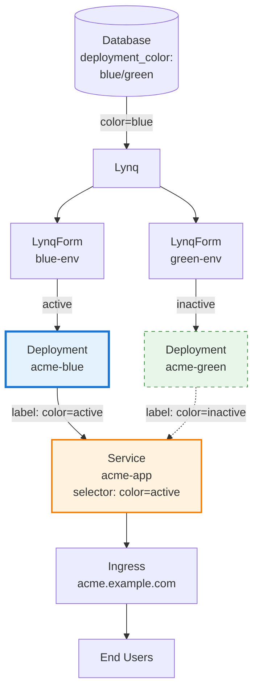

# Blue-Green Deployment Pattern

::: info Multi-Tenancy Example
This guide uses **Multi-Tenancy** (SaaS application with multiple customers) as an example, which is the most common use case for Lynq. The pattern shown here can be adapted for any database-driven infrastructure automation scenario.
:::

## Overview

Implement zero-downtime deployments by maintaining two complete environments (blue and green) and switching traffic between them.

This pattern is useful when:
- You need instant rollback capability
- You want to test new versions in production before switching traffic
- You need to validate deployments with real production load
- Zero-downtime is critical for your SLA

## Architecture



## Database Schema

```sql
CREATE TABLE nodes (
  node_id VARCHAR(63) PRIMARY KEY,
  domain VARCHAR(255) NOT NULL,
  is_active BOOLEAN DEFAULT TRUE,

  -- Blue-Green deployment control
  active_color VARCHAR(10) DEFAULT 'blue',   -- 'blue' or 'green'
  blue_version VARCHAR(20) DEFAULT 'v1.0.0',
  green_version VARCHAR(20) DEFAULT 'v1.0.0',

  -- Deployment status tracking
  deployment_status VARCHAR(20) DEFAULT 'stable',  -- stable, deploying, testing, rolling-back
  last_deployment_at TIMESTAMP
);

-- Deployment workflow:
-- 1. Update inactive color's version (e.g., green_version = 'v2.0.0')
-- 2. Set deployment_status = 'deploying'
-- 3. Operator creates/updates green deployment
-- 4. Run smoke tests against green
-- 5. Switch active_color from 'blue' to 'green'
-- 6. Set deployment_status = 'stable'
-- 7. Blue environment now becomes next deployment target
```

## LynqHub

```yaml
apiVersion: operator.lynq.sh/v1
kind: LynqHub
metadata:
  name: blue-green-nodes
  namespace: lynq-system
spec:
  source:
    type: mysql
    syncInterval: 1m
    mysql:
      host: mysql.database.svc.cluster.local
      port: 3306
      database: nodes_db
      username: node_reader
      passwordRef:
        name: mysql-credentials
        key: password
      table: nodes

  valueMappings:
    uid: node_id
    hostOrUrl: domain
    activate: is_active

  extraValueMappings:
    activeColor: active_color
    blueVersion: blue_version
    greenVersion: green_version
    deploymentStatus: deployment_status
```

## LynqForm

```yaml
apiVersion: operator.lynq.sh/v1
kind: LynqForm
metadata:
  name: blue-green-app
  namespace: lynq-system
spec:
  hubId: blue-green-nodes

  deployments:
    # Blue Deployment
    - id: blue-deployment
      nameTemplate: "{{ .uid }}-blue"
      labelsTemplate:
        app: "{{ .uid }}"
        color: "blue"
        active: "{{ if eq .activeColor \"blue\" }}true{{ else }}false{{ end }}"
      spec:
        replicas: "{{ if eq .activeColor \"blue\" }}3{{ else }}1{{ end }}"  # Scale down inactive
        selector:
          matchLabels:
            app: "{{ .uid }}"
            color: "blue"
        template:
          metadata:
            labels:
              app: "{{ .uid }}"
              color: "blue"
              version: "{{ .blueVersion }}"
          spec:
            containers:
              - name: app
                image: "registry.example.com/app:{{ .blueVersion }}"
                env:
                  - name: ENVIRONMENT_COLOR
                    value: "blue"
                  - name: NODE_ID
                    value: "{{ .uid }}"
                ports:
                  - containerPort: 8080
                resources:
                  requests:
                    cpu: 500m
                    memory: 1Gi

    # Green Deployment
    - id: green-deployment
      nameTemplate: "{{ .uid }}-green"
      labelsTemplate:
        app: "{{ .uid }}"
        color: "green"
        active: "{{ if eq .activeColor \"green\" }}true{{ else }}false{{ end }}"
      spec:
        replicas: "{{ if eq .activeColor \"green\" }}3{{ else }}1{{ end }}"
        selector:
          matchLabels:
            app: "{{ .uid }}"
            color: "green"
        template:
          metadata:
            labels:
              app: "{{ .uid }}"
              color: "green"
              version: "{{ .greenVersion }}"
          spec:
            containers:
              - name: app
                image: "registry.example.com/app:{{ .greenVersion }}"
                env:
                  - name: ENVIRONMENT_COLOR
                    value: "green"
                  - name: NODE_ID
                    value: "{{ .uid }}"
                ports:
                  - containerPort: 8080
                resources:
                  requests:
                    cpu: 500m
                    memory: 1Gi

  # Service routing to active color
  services:
    - id: main-service
      nameTemplate: "{{ .uid }}-app"
      dependIds: ["blue-deployment", "green-deployment"]
      spec:
        selector:
          app: "{{ .uid }}"
          color: "{{ .activeColor }}"  # Dynamic selector based on active color
        ports:
          - port: 80
            targetPort: 8080

    # Dedicated services for testing inactive environment
    - id: blue-test-service
      nameTemplate: "{{ .uid }}-blue-test"
      spec:
        selector:
          app: "{{ .uid }}"
          color: "blue"
        ports:
          - port: 80
            targetPort: 8080

    - id: green-test-service
      nameTemplate: "{{ .uid }}-green-test"
      spec:
        selector:
          app: "{{ .uid }}"
          color: "green"
        ports:
          - port: 80
            targetPort: 8080

  # Main ingress (routes to active)
  ingresses:
    - id: main-ingress
      nameTemplate: "{{ .uid }}-ingress"
      dependIds: ["main-service"]
      spec:
        ingressClassName: nginx
        rules:
          - host: "{{ .host }}"
            http:
              paths:
                - path: /
                  pathType: Prefix
                  backend:
                    service:
                      name: "{{ .uid }}-app"
                      port:
                        number: 80

    # Test ingresses for pre-production validation
    - id: blue-test-ingress
      nameTemplate: "{{ .uid }}-blue-test"
      dependIds: ["blue-test-service"]
      spec:
        ingressClassName: nginx
        rules:
          - host: "{{ .uid }}-blue.test.example.com"
            http:
              paths:
                - path: /
                  pathType: Prefix
                  backend:
                    service:
                      name: "{{ .uid }}-blue-test"
                      port:
                        number: 80

    - id: green-test-ingress
      nameTemplate: "{{ .uid }}-green-test"
      dependIds: ["green-test-service"]
      spec:
        ingressClassName: nginx
        rules:
          - host: "{{ .uid }}-green.test.example.com"
            http:
              paths:
                - path: /
                  pathType: Prefix
                  backend:
                    service:
                      name: "{{ .uid }}-green-test"
                      port:
                        number: 80
```

## Deployment Workflow

### Step 1: Deploy to Inactive Environment

```sql
-- Current state: blue is active with v1.0.0
-- Deploy v2.0.0 to green (inactive)

UPDATE nodes
SET green_version = 'v2.0.0',
    deployment_status = 'deploying',
    last_deployment_at = NOW()
WHERE node_id = 'acme-corp';
```

Lynq automatically updates green deployment with new version.

### Step 2: Test Inactive Environment

```bash
# Smoke test against green environment
curl https://acme-corp-green.test.example.com/healthz
curl https://acme-corp-green.test.example.com/api/test

# Run integration tests
kubectl run test-runner --rm -it --image=curlimages/curl -- \
  curl -f https://acme-corp-green.test.example.com/api/comprehensive-test
```

### Step 3: Switch Traffic (Blue → Green)

```sql
-- Switch active environment
UPDATE nodes
SET active_color = 'green',
    deployment_status = 'stable'
WHERE node_id = 'acme-corp';
```

Lynq updates Service selector from `color: blue` to `color: green`. Traffic instantly switches.

### Step 4: Rollback (if needed)

```sql
-- Instant rollback by switching back
UPDATE nodes
SET active_color = 'blue',
    deployment_status = 'rolled-back'
WHERE node_id = 'acme-corp';
```

### Step 5: Cleanup Old Version

```sql
-- After confirming green is stable, update blue to match
UPDATE nodes
SET blue_version = 'v2.0.0'
WHERE node_id = 'acme-corp';
```

## Monitoring

```promql
# Track active deployment color per node
lynqnode_deployment_color{lynqnode="acme-corp"} == 1  # 1=blue, 2=green

# Monitor deployment status
lynqnode_deployment_status{status="deploying"}

# Alert on prolonged deployment
ALERT DeploymentStuck
  FOR 30m
  WHERE lynqnode_deployment_status{status="deploying"} == 1
  ANNOTATIONS {
    summary = "Deployment stuck for node {{ $labels.lynqnode }}"
  }
```

## Benefits

1. **Zero Downtime**: Instant traffic switch between environments
2. **Safe Testing**: Validate new version before exposing to users
3. **Instant Rollback**: Switch back to previous version in seconds
4. **Resource Efficiency**: Inactive environment can run with minimal replicas
5. **Database-Driven**: All orchestration via database updates

## Limitations

1. **Resource Cost**: Requires running two environments (though inactive can be scaled down)
2. **Database Compatibility**: Schema changes must be backward compatible during transition
3. **State Management**: Stateful applications require careful session handling
4. **Cost**: Double resource usage during active deployment periods

## Related Documentation

- [Templates Guide](/templates) - Template syntax and conditionals
- [Policies](/policies) - Resource lifecycle management
- [Monitoring](/monitoring) - Metrics and alerting
- [Advanced Use Cases](/advanced-use-cases) - Other deployment patterns

## Next Steps

- Implement automated smoke tests
- Set up deployment pipeline
- Configure monitoring and alerts
- Test rollback procedures
