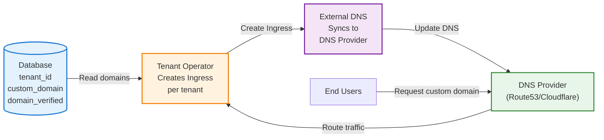

# Custom Domain Provisioning with External DNS

## Overview

Enable each tenant to have their own custom domain with automatic DNS and SSL certificate management using **Let's Encrypt** and **cert-manager**.

**Key Features:**
- Automatic DNS record creation via External DNS
- Automatic SSL certificate provisioning with Let's Encrypt
- Domain verification workflows
- CNAME delegation support

## Architecture



## Database Schema

```sql
CREATE TABLE tenants (
  tenant_id VARCHAR(63) PRIMARY KEY,
  subdomain VARCHAR(255) NOT NULL,           -- mycompany.saas.example.com
  custom_domain VARCHAR(255),                -- custom.com
  domain_verified BOOLEAN DEFAULT FALSE,
  cname_target VARCHAR(255),                 -- What tenant should CNAME to
  is_active BOOLEAN DEFAULT TRUE,
  plan_type VARCHAR(20) DEFAULT 'basic'      -- basic, pro, enterprise
);

-- Example data
INSERT INTO tenants VALUES
  ('acme-corp', 'acme', 'acme.com', TRUE, 'acme-corp.saas.example.com', TRUE, 'enterprise'),
  ('startup-x', 'startupx', 'startup-x.com', TRUE, 'startupx.saas.example.com', TRUE, 'pro'),
  ('demo-user', 'demo', NULL, FALSE, NULL, TRUE, 'basic');
```

## TenantRegistry Configuration

```yaml
apiVersion: operator.kubernetes-tenants.org/v1
kind: TenantRegistry
metadata:
  name: domain-enabled-tenants
  namespace: tenant-operator-system
spec:
  source:
    type: mysql
    syncInterval: 1m
    mysql:
      host: mysql.database.svc.cluster.local
      port: 3306
      database: tenants_db
      username: tenant_reader
      passwordRef:
        name: mysql-credentials
        key: password
      table: tenants

  valueMappings:
    uid: tenant_id
    hostOrUrl: subdomain                    # Default subdomain
    activate: is_active

  extraValueMappings:
    customDomain: custom_domain
    domainVerified: domain_verified
    cnameTarget: cname_target
    planType: plan_type
```

## Prerequisites

```bash
# Install cert-manager
kubectl apply -f https://github.com/cert-manager/cert-manager/releases/download/v1.13.2/cert-manager.yaml

# Create ClusterIssuer for Let's Encrypt
kubectl apply -f - <<EOF
apiVersion: cert-manager.io/v1
kind: ClusterIssuer
metadata:
  name: letsencrypt-prod
spec:
  acme:
    server: https://acme-v02.api.letsencrypt.org/directory
    email: admin@example.com
    privateKeySecretRef:
      name: letsencrypt-prod
    solvers:
      - http01:
          ingress:
            class: nginx
EOF

# Install External DNS
helm repo add external-dns https://kubernetes-sigs.github.io/external-dns/
helm install external-dns external-dns/external-dns \
  --set provider=aws \
  --set domainFilters[0]=saas.example.com \
  --set policy=sync \
  --set registry=txt \
  --set txtOwnerId=tenant-operator-cluster
```

## TenantTemplate Configuration

```yaml
apiVersion: operator.kubernetes-tenants.org/v1
kind: TenantTemplate
metadata:
  name: custom-domain-tenants
  namespace: tenant-operator-system
spec:
  registryId: domain-enabled-tenants

  # Create namespace per tenant for better isolation
  manifests:
    - id: tenant-namespace
      spec:
        apiVersion: v1
        kind: Namespace
        metadata:
          name: "tenant-{{ .uid }}"
          labels:
            tenant-id: "{{ .uid }}"
            plan-type: "{{ .planType }}"

  # ServiceAccount in tenant's namespace
  serviceAccounts:
    - id: app-sa
      nameTemplate: "{{ .uid }}-app"
      targetNamespace: "tenant-{{ .uid }}"
      dependIds: ["tenant-namespace"]
      spec:
        automountServiceAccountToken: true

  # Main application deployment
  deployments:
    - id: web-app
      nameTemplate: "{{ .uid }}-web"
      targetNamespace: "tenant-{{ .uid }}"
      dependIds: ["tenant-namespace", "app-sa"]
      waitForReady: true
      timeoutSeconds: 600
      spec:
        replicas: 2
        selector:
          matchLabels:
            app: "{{ .uid }}-web"
            tenant-id: "{{ .uid }}"
        template:
          metadata:
            labels:
              app: "{{ .uid }}-web"
              tenant-id: "{{ .uid }}"
          spec:
            serviceAccountName: "{{ .uid }}-app"
            containers:
              - name: app
                image: "registry.example.com/tenant-app:v1.2.3"
                env:
                  - name: TENANT_ID
                    value: "{{ .uid }}"
                  - name: TENANT_DOMAIN
                    value: "{{ if and .customDomain (eq .domainVerified \"true\") }}{{ .customDomain }}{{ else }}{{ .uid }}.saas.example.com{{ end }}"
                  - name: PLAN_TYPE
                    value: "{{ .planType }}"
                ports:
                  - containerPort: 8080
                    name: http
                resources:
                  requests:
                    cpu: "{{ if eq .planType \"enterprise\" }}1000m{{ else if eq .planType \"pro\" }}500m{{ else }}200m{{ end }}"
                    memory: "{{ if eq .planType \"enterprise\" }}2Gi{{ else if eq .planType \"pro\" }}1Gi{{ else }}512Mi{{ end }}"
                  limits:
                    cpu: "{{ if eq .planType \"enterprise\" }}2000m{{ else if eq .planType \"pro\" }}1000m{{ else }}400m{{ end }}"
                    memory: "{{ if eq .planType \"enterprise\" }}4Gi{{ else if eq .planType \"pro\" }}2Gi{{ else }}1Gi{{ end }}"
                livenessProbe:
                  httpGet:
                    path: /healthz
                    port: http
                  initialDelaySeconds: 10
                  periodSeconds: 10
                readinessProbe:
                  httpGet:
                    path: /ready
                    port: http
                  initialDelaySeconds: 5
                  periodSeconds: 5

  # Service for the deployment
  services:
    - id: web-svc
      nameTemplate: "{{ .uid }}-web"
      targetNamespace: "tenant-{{ .uid }}"
      dependIds: ["web-app"]
      waitForReady: false
      spec:
        selector:
          app: "{{ .uid }}-web"
          tenant-id: "{{ .uid }}"
        ports:
          - port: 80
            targetPort: http
            name: http

  # Ingress with default subdomain
  ingresses:
    - id: default-ingress
      nameTemplate: "{{ .uid }}-default"
      targetNamespace: "tenant-{{ .uid }}"
      dependIds: ["web-svc"]
      annotationsTemplate:
        cert-manager.io/cluster-issuer: "letsencrypt-prod"
        external-dns.alpha.kubernetes.io/hostname: "{{ .uid }}.saas.example.com"
        external-dns.alpha.kubernetes.io/ttl: "300"
        nginx.ingress.kubernetes.io/ssl-redirect: "true"
        nginx.ingress.kubernetes.io/force-ssl-redirect: "true"
      spec:
        ingressClassName: nginx
        tls:
          - hosts:
              - "{{ .uid }}.saas.example.com"
            secretName: "{{ .uid }}-default-tls"
        rules:
          - host: "{{ .uid }}.saas.example.com"
            http:
              paths:
                - path: /
                  pathType: Prefix
                  backend:
                    service:
                      name: "{{ .uid }}-web"
                      port:
                        number: 80
```

::: tip How It Works
- **External DNS**: Reads `external-dns.alpha.kubernetes.io/hostname` annotation and creates DNS records automatically
- **cert-manager**: Reads `cert-manager.io/cluster-issuer` annotation and provisions Let's Encrypt certificates
- **Automatic Renewal**: cert-manager renews certificates 30 days before expiration
:::

## Custom Domain Support

For tenants with verified custom domains, add additional Ingress resources:

```yaml
  # Custom domain Ingress (for verified domains)
  ingresses:
    - id: custom-ingress
      nameTemplate: "{{ .uid }}-custom"
      targetNamespace: "tenant-{{ .uid }}"
      dependIds: ["web-svc"]
      annotationsTemplate:
        cert-manager.io/cluster-issuer: "letsencrypt-prod"
        external-dns.alpha.kubernetes.io/hostname: "{{ .customDomain }}"
        external-dns.alpha.kubernetes.io/ttl: "300"
      spec:
        ingressClassName: nginx
        tls:
          - hosts:
              - "{{ .customDomain }}"
            secretName: "{{ .uid }}-custom-tls"
        rules:
          - host: "{{ .customDomain }}"
            http:
              paths:
                - path: /
                  pathType: Prefix
                  backend:
                    service:
                      name: "{{ .uid }}-web"
                      port:
                        number: 80
```

**Note:** Filter tenants with verified domains using a database view:

```sql
CREATE VIEW tenants_with_custom_domains AS
SELECT * FROM tenants WHERE custom_domain IS NOT NULL AND domain_verified = TRUE;
```

Create a separate TenantRegistry and Template for custom domains to avoid creating Ingress for unverified domains.

## Domain Verification Workflow

1. **Tenant Requests Custom Domain**: User enters `custom.com` in your SaaS portal
2. **Database Update**: Portal updates `tenants.custom_domain` but keeps `domain_verified=FALSE`
3. **CNAME Target Provided**: Show user: "Point CNAME for `custom.com` to `acme-corp.saas.example.com`"
4. **Background Verification**: Your verification service checks DNS periodically
5. **Mark as Verified**: Once CNAME is detected, update `domain_verified=TRUE`
6. **Automatic Deployment**: Tenant Operator creates Ingress with cert-manager annotation
7. **DNS Propagation**: External DNS creates Route53/Cloudflare records
8. **SSL Certificate**: cert-manager issues Let's Encrypt certificate via HTTP-01 or DNS-01 challenge
9. **Certificate Storage**: cert-manager stores certificate in Secret `<tenant>-custom-tls`

## Monitoring

```promql
# Count tenants with custom domains
sum(tenant_resources_ready{resource_name=~".*-ingress"})

# Alert on ingress failures
ALERT CustomDomainIngressFailed
  FOR 10m
  WHERE tenant_resources_failed{resource_name=~".*-ingress"} > 0
  ANNOTATIONS {
    summary = "Ingress failed for tenant {{ $labels.tenant }}"
  }
```

## Best Practices

1. **Domain Verification**: Always verify domain ownership before creating Ingress
2. **Rate Limiting**: Implement rate limits for domain addition per tenant
3. **DNS TTL**: Use low TTL (300s) during initial setup for faster propagation
4. **Certificate Monitoring**: Monitor cert-manager for SSL provisioning issues
5. **Fallback Strategy**: Keep default subdomain active even with custom domain
6. **Wildcard Support**: For enterprise plans, support `*.custom.com` patterns

## Related Documentation

- [External DNS Integration](/integration-external-dns) - Detailed DNS configuration
- [Templates Guide](/templates) - Template syntax and functions
- [Policies](/policies) - Resource lifecycle management
- [Advanced Use Cases](/advanced-use-cases) - Other patterns

## Next Steps

- Implement domain verification service
- Set up monitoring and alerting
- Configure rate limiting
- Test SSL certificate provisioning
