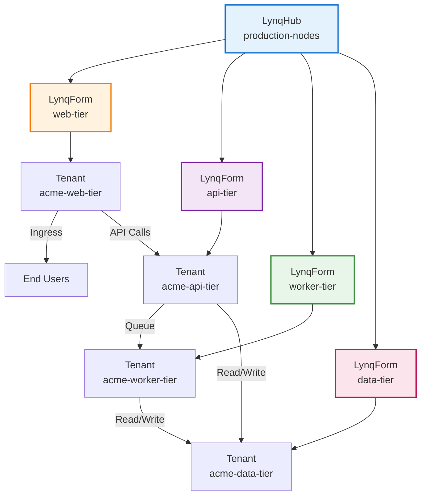

# Multi-Tier Application Stack

## Overview

Deploy complex applications spanning multiple services (web, API, workers, caches) using multiple templates per tenant. Each template handles a specific tier of the stack.

## Architecture



## Database Schema

```sql
CREATE TABLE tenants (
  tenant_id VARCHAR(63) PRIMARY KEY,
  domain VARCHAR(255) NOT NULL,
  is_active BOOLEAN DEFAULT TRUE,

  -- Resource allocation per tier
  web_replicas INT DEFAULT 2,
  api_replicas INT DEFAULT 3,
  worker_replicas INT DEFAULT 2,

  -- Database configuration
  db_size VARCHAR(10) DEFAULT 'small',      -- small, medium, large

  -- Feature flags
  enable_analytics BOOLEAN DEFAULT FALSE,
  enable_notifications BOOLEAN DEFAULT TRUE,

  created_at TIMESTAMP DEFAULT CURRENT_TIMESTAMP,
  updated_at TIMESTAMP DEFAULT CURRENT_TIMESTAMP ON UPDATE CURRENT_TIMESTAMP
);
```

## LynqHub

```yaml
apiVersion: operator.lynq.sh/v1
kind: LynqHub
metadata:
  name: multi-tier-nodes
  namespace: lynq-system
spec:
  source:
    type: mysql
    syncInterval: 1m
    mysql:
      host: mysql.database.svc.cluster.local
      port: 3306
      database: tenants_db
      username: tenant_reader
      passwordRef:
        name: mysql-credentials
        key: password
      table: tenants

  valueMappings:
    uid: tenant_id
    hostOrUrl: domain
    activate: is_active

  extraValueMappings:
    webReplicas: web_replicas
    apiReplicas: api_replicas
    workerReplicas: worker_replicas
    dbSize: db_size
    enableAnalytics: enable_analytics
    enableNotifications: enable_notifications
```

## Template 1: Data Tier

```yaml
apiVersion: operator.lynq.sh/v1
kind: LynqForm
metadata:
  name: data-tier
  namespace: lynq-system
spec:
  registryId: multi-tier-nodes

  # Create tenant namespace
  manifests:
    - id: tenant-namespace
      spec:
        apiVersion: v1
        kind: Namespace
        metadata:
          name: "tenant-{{ .uid }}"
          labels:
            tenant-id: "{{ .uid }}"
            tier: data

  # PostgreSQL StatefulSet
  statefulSets:
    - id: postgres
      nameTemplate: "{{ .uid }}-postgres"
      targetNamespace: "tenant-{{ .uid }}"
      dependIds: ["tenant-namespace"]
      creationPolicy: Once  # Database should be created once
      deletionPolicy: Retain  # Keep data even if tenant deleted
      waitForReady: true
      timeoutSeconds: 600
      spec:
        serviceName: "{{ .uid }}-postgres"
        replicas: 1
        selector:
          matchLabels:
            app: "{{ .uid }}-postgres"
        template:
          metadata:
            labels:
              app: "{{ .uid }}-postgres"
              tier: data
          spec:
            containers:
              - name: postgres
                image: postgres:15-alpine
                env:
                  - name: POSTGRES_DB
                    value: "{{ .uid }}"
                  - name: POSTGRES_USER
                    value: "{{ .uid }}"
                  - name: POSTGRES_PASSWORD
                    valueFrom:
                      secretKeyRef:
                        name: "{{ .uid }}-db-credentials"
                        key: password
                  - name: PGDATA
                    value: /var/lib/postgresql/data/pgdata
                ports:
                  - containerPort: 5432
                    name: postgres
                volumeMounts:
                  - name: data
                    mountPath: /var/lib/postgresql/data
                resources:
                  requests:
                    cpu: "{{ if eq .dbSize \"large\" }}2000m{{ else if eq .dbSize \"medium\" }}1000m{{ else }}500m{{ end }}"
                    memory: "{{ if eq .dbSize \"large\" }}4Gi{{ else if eq .dbSize \"medium\" }}2Gi{{ else }}1Gi{{ end }}"
        volumeClaimTemplates:
          - metadata:
              name: data
            spec:
              accessModes: ["ReadWriteOnce"]
              resources:
                requests:
                  storage: "{{ if eq .dbSize \"large\" }}100Gi{{ else if eq .dbSize \"medium\" }}50Gi{{ else }}20Gi{{ end }}"

  # PostgreSQL Service
  services:
    - id: postgres-svc
      nameTemplate: "{{ .uid }}-postgres"
      targetNamespace: "tenant-{{ .uid }}"
      dependIds: ["postgres"]
      spec:
        clusterIP: None  # Headless service for StatefulSet
        selector:
          app: "{{ .uid }}-postgres"
        ports:
          - port: 5432
            targetPort: postgres

  # Redis cache deployment
  deployments:
    - id: redis
      nameTemplate: "{{ .uid }}-redis"
      targetNamespace: "tenant-{{ .uid }}"
      dependIds: ["tenant-namespace"]
      waitForReady: true
      spec:
        replicas: 1
        selector:
          matchLabels:
            app: "{{ .uid }}-redis"
        template:
          metadata:
            labels:
              app: "{{ .uid }}-redis"
              tier: cache
          spec:
            containers:
              - name: redis
                image: redis:7-alpine
                ports:
                  - containerPort: 6379
                    name: redis
                resources:
                  requests:
                    cpu: 200m
                    memory: 512Mi
                  limits:
                    cpu: 400m
                    memory: 1Gi

  # Redis Service
  services:
    - id: redis-svc
      nameTemplate: "{{ .uid }}-redis"
      targetNamespace: "tenant-{{ .uid }}"
      dependIds: ["redis"]
      spec:
        selector:
          app: "{{ .uid }}-redis"
        ports:
          - port: 6379
            targetPort: redis

  # Database credentials secret
  secrets:
    - id: db-credentials
      nameTemplate: "{{ .uid }}-db-credentials"
      targetNamespace: "tenant-{{ .uid }}"
      dependIds: ["tenant-namespace"]
      creationPolicy: Once  # Generate password once
      spec:
        stringData:
          password: "{{ randAlphaNum 32 }}"
          connection-string: "postgresql://{{ .uid }}:REPLACE_WITH_PASSWORD@{{ .uid }}-postgres:5432/{{ .uid }}"
```

::: tip Secret Generation
The `randAlphaNum` function generates a random password. In production, consider using External Secrets Operator to fetch secrets from a vault.
:::

## Template 2: API Tier

```yaml
apiVersion: operator.lynq.sh/v1
kind: LynqForm
metadata:
  name: api-tier
  namespace: lynq-system
spec:
  registryId: multi-tier-nodes

  deployments:
    - id: api
      nameTemplate: "{{ .uid }}-api"
      targetNamespace: "tenant-{{ .uid }}"
      waitForReady: true
      timeoutSeconds: 600
      spec:
        replicas: {{ .apiReplicas }}
        strategy:
          type: RollingUpdate
          rollingUpdate:
            maxSurge: 1
            maxUnavailable: 0
        selector:
          matchLabels:
            app: "{{ .uid }}-api"
            tier: api
        template:
          metadata:
            labels:
              app: "{{ .uid }}-api"
              tier: api
          spec:
            containers:
              - name: api
                image: registry.example.com/tenant-api:v2.0.0
                env:
                  - name: TENANT_ID
                    value: "{{ .uid }}"
                  - name: DATABASE_URL
                    valueFrom:
                      secretKeyRef:
                        name: "{{ .uid }}-db-credentials"
                        key: connection-string
                  - name: REDIS_URL
                    value: "redis://{{ .uid }}-redis:6379"
                  - name: ENABLE_ANALYTICS
                    value: "{{ .enableAnalytics }}"
                ports:
                  - containerPort: 8080
                    name: http
                resources:
                  requests:
                    cpu: 500m
                    memory: 1Gi
                  limits:
                    cpu: 1000m
                    memory: 2Gi
                livenessProbe:
                  httpGet:
                    path: /healthz
                    port: http
                  initialDelaySeconds: 30
                  periodSeconds: 10
                readinessProbe:
                  httpGet:
                    path: /ready
                    port: http
                  initialDelaySeconds: 10
                  periodSeconds: 5

  services:
    - id: api-svc
      nameTemplate: "{{ .uid }}-api"
      targetNamespace: "tenant-{{ .uid }}"
      dependIds: ["api"]
      spec:
        selector:
          app: "{{ .uid }}-api"
        ports:
          - port: 8080
            targetPort: http
```

## Template 3: Web Tier

```yaml
apiVersion: operator.lynq.sh/v1
kind: LynqForm
metadata:
  name: web-tier
  namespace: lynq-system
spec:
  registryId: multi-tier-nodes

  deployments:
    - id: web
      nameTemplate: "{{ .uid }}-web"
      targetNamespace: "tenant-{{ .uid }}"
      waitForReady: true
      spec:
        replicas: {{ .webReplicas }}
        selector:
          matchLabels:
            app: "{{ .uid }}-web"
            tier: web
        template:
          metadata:
            labels:
              app: "{{ .uid }}-web"
              tier: web
          spec:
            containers:
              - name: web
                image: registry.example.com/tenant-web:v2.0.0
                env:
                  - name: TENANT_ID
                    value: "{{ .uid }}"
                  - name: API_URL
                    value: "http://{{ .uid }}-api:8080"
                ports:
                  - containerPort: 3000
                    name: http
                resources:
                  requests:
                    cpu: 200m
                    memory: 512Mi

  services:
    - id: web-svc
      nameTemplate: "{{ .uid }}-web"
      targetNamespace: "tenant-{{ .uid }}"
      dependIds: ["web"]
      spec:
        selector:
          app: "{{ .uid }}-web"
        ports:
          - port: 80
            targetPort: http

  ingresses:
    - id: web-ingress
      nameTemplate: "{{ .uid }}-ingress"
      targetNamespace: "tenant-{{ .uid }}"
      dependIds: ["web-svc"]
      spec:
        ingressClassName: nginx
        rules:
          - host: "{{ .host }}"
            http:
              paths:
                - path: /
                  pathType: Prefix
                  backend:
                    service:
                      name: "{{ .uid }}-web"
                      port:
                        number: 80
```

## Template 4: Worker Tier

```yaml
apiVersion: operator.lynq.sh/v1
kind: LynqForm
metadata:
  name: worker-tier
  namespace: lynq-system
spec:
  registryId: multi-tier-nodes

  deployments:
    - id: worker
      nameTemplate: "{{ .uid }}-worker"
      targetNamespace: "tenant-{{ .uid }}"
      waitForReady: true
      spec:
        replicas: {{ .workerReplicas }}
        selector:
          matchLabels:
            app: "{{ .uid }}-worker"
            tier: worker
        template:
          metadata:
            labels:
              app: "{{ .uid }}-worker"
              tier: worker
          spec:
            containers:
              - name: worker
                image: registry.example.com/tenant-worker:v2.0.0
                env:
                  - name: TENANT_ID
                    value: "{{ .uid }}"
                  - name: DATABASE_URL
                    valueFrom:
                      secretKeyRef:
                        name: "{{ .uid }}-db-credentials"
                        key: connection-string
                  - name: REDIS_URL
                    value: "redis://{{ .uid }}-redis:6379"
                  - name: QUEUE_URL
                    value: "redis://{{ .uid }}-redis:6379"
                  - name: ENABLE_NOTIFICATIONS
                    value: "{{ .enableNotifications }}"
                resources:
                  requests:
                    cpu: 300m
                    memory: 768Mi
                livenessProbe:
                  exec:
                    command: ["pgrep", "-f", "worker"]
                  initialDelaySeconds: 30
                  periodSeconds: 30
```

## Deployment Verification

```bash
# Check all tiers for a tenant
kubectl get lynqnodes -n lynq-system | grep acme-corp

# Expected output:
# acme-corp-data-tier     True    5/5     0       10m
# acme-corp-api-tier      True    3/3     0       10m
# acme-corp-web-tier      True    2/2     0       10m
# acme-corp-worker-tier   True    2/2     0       10m

# Verify resources in tenant namespace
kubectl get all -n tenant-acme-corp
```

## Benefits

1. **Separation of Concerns**: Each tier managed independently
2. **Flexible Scaling**: Scale web, API, workers independently per tenant
3. **Gradual Updates**: Update one tier at a time
4. **Resource Policies**: Different creation/deletion policies per tier
5. **Dependency Management**: Implicit via service discovery, explicit via health checks

## Related Documentation

- [Architecture](/architecture) - System design overview
- [Dependencies](/dependencies) - Resource ordering and dependencies
- [Policies](/policies) - Lifecycle management
- [Advanced Use Cases](/advanced-use-cases) - Other patterns

## Next Steps

- Implement health checks for all tiers
- Set up monitoring per tier
- Configure auto-scaling for web and API tiers
- Implement backup strategy for data tier
